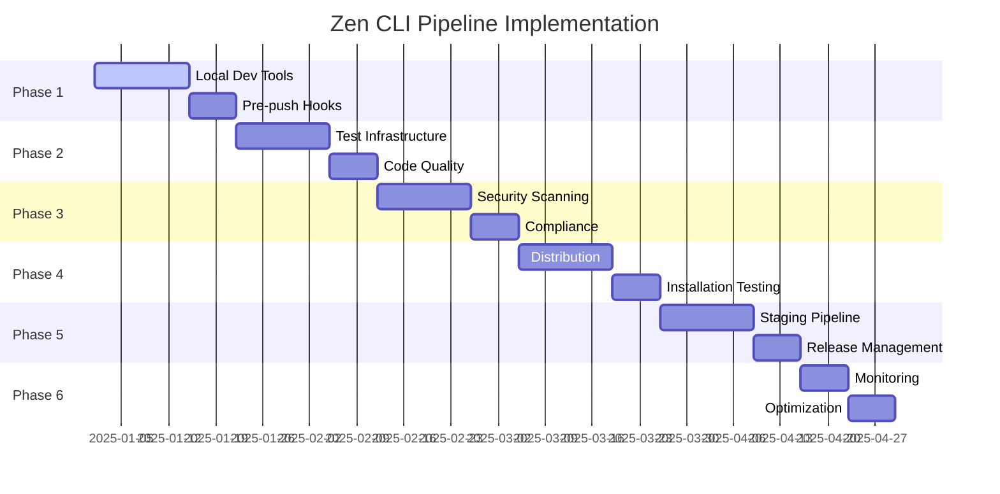

# Zen CLI CI/CD Pipeline Implementation Plan

## Phased Implementation Strategy for Comprehensive CI/CD Pipeline

## Executive Summary

This implementation plan transforms the Zen CLI from its current solid CI/CD foundation into the comprehensive, production-ready pipeline outlined in the design document. The plan is structured in **6 phases** over **12-16 weeks**, ensuring minimal disruption to development velocity while systematically building towards a world-class CI/CD pipeline.

**Current State Assessment:**

- ✅ **Strong Foundation**: Comprehensive test pyramid with unit/integration/e2e/performance tests
- ✅ **Multi-Platform Builds**: Cross-platform compilation with GoReleaser integration
- ✅ **Basic Security**: gosec integration and SARIF reporting
- ✅ **Quality Gates**: Coverage reporting and lint integration
- ⚠️ **Enhancement Opportunities**: Local development tools, advanced security, distribution channels, monitoring

---

## Implementation Philosophy

1. **Velocity Preservation**: Each phase delivers value without disrupting active development
2. **Incremental Enhancement**: Build on existing strengths rather than replacing
3. **Developer Experience**: Prioritize tools that improve day-to-day development workflow
4. **Release Readiness**: Align timeline with product release milestones
5. **Automation First**: Minimize manual processes and maximize automated quality gates

---

## Phase Overview

| Phase | Duration | Focus Area | Key Deliverables |
|-------|----------|------------|------------------|
| **Phase 1** | Week 1-2 | Foundation Strengthening | Enhanced local development, pre-push hooks |
| **Phase 2** | Week 3-5 | Development Efficiency | Advanced testing, code quality automation |
| **Phase 3** | Week 6-8 | Security & Compliance | Supply chain security, vulnerability management |
| **Phase 4** | Week 9-11 | Distribution Preparation | Multi-channel publishing, package management |
| **Phase 5** | Week 12-14 | Production Pipeline | Staging environments, approval workflows |
| **Phase 6** | Week 15-16 | Monitoring & Optimization | Analytics, performance monitoring, optimization |

---

## Phase 1: Foundation Strengthening (Weeks 1-2)
*Goal: Enhance developer productivity while maintaining current development speed*

### 1.1 Local Development Enhancement

**Deliverables:**

- [ ] **Pre-commit hooks setup** via `.githooks/`
- [ ] **Local development environment** configuration
- [ ] **Make target optimization** for development workflows
- [ ] **Documentation synchronization** automation

**Implementation Tasks:**

```bash
# Week 1: Pre-commit Hooks
.githooks/
├── pre-commit           # Format validation, basic tests
├── pre-push            # Full test suite, security scans
└── install.sh          # Hook installation script

# New Make targets
make dev-setup          # Install development tools
make pre-push-check     # Replicate pre-push validation locally
make quick-test         # Fast development testing
```

**Quality Gates:**

- [ ] Pre-push hooks prevent broken builds (target: 0 broken pushes)
- [ ] Local test execution < 30s for quick feedback
- [ ] Documentation stays synchronized with CLI changes

**Migration Strategy:**

- **No disruption**: Hooks are opt-in initially
- **Gradual adoption**: Team members enable hooks individually
- **Fallback**: CI pipeline remains primary quality gate

### 1.2 Development Workflow Optimization

**Implementation:**

```yaml
# Enhanced .github/workflows/ci.yml additions
jobs:
  quick-feedback:
    name: Quick Feedback
    runs-on: ubuntu-latest
    timeout-minutes: 5
    steps:
      - name: Fast unit tests
        run: make test-unit-fast
      - name: Quick lint
        run: make lint-fast
```

**Benefits:**

- Faster feedback loop for developers
- Reduced CI queue time during active development
- Maintained comprehensive validation for PR/merge

---

## Phase 2: Development Efficiency (Weeks 3-5)
*Goal: Advanced testing capabilities and automated code quality*

### 2.1 Advanced Testing Infrastructure

**Deliverables:**
- [ ] **Test execution optimization** with parallel processing
- [ ] **Test categorization** and selective execution
- [ ] **Performance baseline** establishment
- [ ] **Flaky test detection** and remediation

**Implementation Tasks:**

```bash
# Week 3: Test Infrastructure
test/
│ ├── unit/            # < 30s execution
│ ├── integration/     # < 1min execution  
│ ├── e2e/            # < 2min execution
│ └── performance/    # Benchmark baselines
├── fixtures/         # Shared test data
└── testutil/         # Test helpers and utilities

# New Make targets
make test-fast          # Changed code only
make test-category      # Specific test category
make test-parallel      # Maximum parallelization
make test-baseline      # Performance baselines
```

**Quality Improvements:**
- [ ] **Test Execution Time**: Reduce by 40% through parallelization
- [ ] **Test Reliability**: Eliminate flaky tests (target: 0 flaky tests)
- [ ] **Coverage Accuracy**: Separate coverage tracking by test type

### 2.2 Automated Code Quality

**Implementation:**
```yaml
# New .github/workflows/quality.yml
name: Code Quality

jobs:
  code-analysis:
    name: Deep Code Analysis
    steps:
      - name: DeepSource Analysis
        uses: deepsource/cli@v1
        with:
          token: ${{ secrets.DEEPSOURCE_DSN }}
      
      - name: Code complexity analysis
        run: |
          # Cyclomatic complexity analysis
          # Technical debt assessment
          # Maintainability index calculation
```

**Quality Gates:**
- [ ] Automated code review comments on PRs
- [ ] Technical debt tracking and alerts
- [ ] Code complexity monitoring

---

## Phase 3: Security & Compliance (Weeks 6-8)
*Goal: Enterprise-grade security and supply chain protection*

### 3.1 Advanced Security Scanning

**Deliverables:**
- [ ] **Multi-layer security scanning** with Snyk integration
- [ ] **Supply chain protection** with dependency vulnerability tracking
- [ ] **Secret detection** across all file types
- [ ] **Binary security analysis** for released artifacts

**Implementation Tasks:**

```yaml
# New .github/workflows/security.yml
name: Security

jobs:
  supply-chain-security:
    name: Supply Chain Security
    steps:
      - name: Dependency vulnerability scan
        uses: snyk/actions/golang@master
        with:
          args: --severity-threshold=high
      
      - name: Go module security audit
        run: |
          go list -json -deps ./... | nancy sleuth
          govulncheck ./...
      
      - name: SBOM Generation
        run: |
          syft . -o spdx-json > zen-sbom.json
          grype zen-sbom.json
```

**Security Enhancements:**
- [ ] **Vulnerability Database**: Daily updates and automated notifications
- [ ] **SBOM Generation**: Software Bill of Materials for supply chain transparency
- [ ] **Container Security**: Base image vulnerability scanning
- [ ] **Binary Signing**: Prepare infrastructure for artifact signing

### 3.2 Compliance and Governance

**Implementation:**
```bash
# Security policy files
.github/
├── SECURITY.md          # Security reporting policy
├── CODEOWNERS          # Code review requirements
└── security/
    ├── policies.yml    # Security policies
    └── exemptions.yml  # Approved security exemptions

# Compliance tracking
docs/compliance/
├── security-assessment.md
├── vulnerability-report.md
└── audit-trail.md
```

**Governance Framework:**
- [ ] **Automated Security Reviews**: Security team notification for high-severity findings
- [ ] **Compliance Reporting**: Weekly security posture reports
- [ ] **Incident Response**: Automated security incident workflows

---

## Phase 4: Distribution Preparation (Weeks 9-11)
*Goal: Multi-channel distribution infrastructure and package management*

### 4.1 Enhanced Release Pipeline

**Deliverables:**
- [ ] **Multi-channel publishing** with package managers
- [ ] **Release automation** with approval workflows
- [ ] **Rollback capabilities** for failed releases
- [ ] **Installation experience validation**

**Implementation Tasks:**

```yaml
# Enhanced goreleaser.yml
brews:
  - name: zen
    tap:
      owner: jonathandaddia
      name: homebrew-zen
    # Enhanced with beta tap support

nfpms:
  - formats:
      - deb
      - rpm
      - apk
    # Enhanced with package manager integration

publishers:
  - name: package-registries
    # Multiple package registry publishing
```

**Distribution Channels:**
- [ ] **GitHub Releases**: Enhanced with installation validation
- [ ] **Homebrew**: Main and beta tap management
- [ ] **APT/YUM**: Debian and Red Hat package repositories
- [ ] **Container Registry**: Multi-architecture container images
- [ ] **Chocolatey/Scoop**: Windows package managers

### 4.2 Installation Experience Validation

**Implementation:**
```yaml
# New .github/workflows/installation.yml
name: Installation Testing

jobs:
  installation-matrix:
    strategy:
      matrix:
        os: [ubuntu-20.04, ubuntu-22.04, macos-12, macos-13, windows-2019, windows-2022]
        method: [direct, homebrew, apt, rpm, chocolatey]
    steps:
      - name: Test installation method
        run: |
          # Install via specified method
          # Validate binary functionality
          # Test upgrade scenarios
          # Verify uninstall process
```

**Quality Assurance:**
- [ ] **Cross-Platform Validation**: All major OS versions and architectures
- [ ] **Package Manager Integration**: Native installation experience
- [ ] **Upgrade Testing**: Seamless version migration validation
- [ ] **Documentation Accuracy**: Installation instructions validation

---

## Phase 5: Production Pipeline (Weeks 12-14)
*Goal: Production-ready pipeline with staging environments and approval workflows*

### 5.1 Staging Environment Implementation

**Deliverables:**
- [ ] **Development distribution channel** for alpha testing
- [ ] **Beta distribution channel** for pre-release validation
- [ ] **Approval workflows** for production releases
- [ ] **Rollback mechanisms** for quick recovery

**Implementation Tasks:**

```bash
# Staging infrastructure
.github/environments/
├── development/         # Alpha channel
├── staging/            # Beta channel
└── production/         # Stable release channel

# Environment-specific workflows
.github/workflows/
├── deploy-dev.yml      # Development deployment
├── deploy-staging.yml  # Staging deployment
└── deploy-prod.yml     # Production deployment
```

**Approval Framework:**
```yaml
# Production deployment with approvals
jobs:
  production-release:
    environment:
      name: production
      url: https://github.com/daddia/zen/releases
    needs: [staging-validation]
    steps:
      - name: Production release
        run: goreleaser release --clean
```

### 5.2 Advanced Release Management

**Implementation:**
- [ ] **Semantic Versioning**: Automated version calculation based on commits
- [ ] **Change Log Generation**: Automated release notes with categorized changes
- [ ] **Release Validation**: Comprehensive testing in staging environment
- [ ] **Canary Releases**: Gradual rollout with monitoring

**Quality Gates:**
- [ ] **Staging Validation**: All tests pass in staging environment
- [ ] **Performance Benchmarks**: No regression in performance metrics
- [ ] **Security Clearance**: All security scans pass
- [ ] **Documentation Review**: Release notes and migration guides approved

---

## Phase 6: Monitoring & Optimization (Weeks 15-16)
*Goal: Comprehensive monitoring, analytics, and continuous improvement*

### 6.1 Release Monitoring Infrastructure

**Deliverables:**
- [ ] **Distribution analytics** tracking
- [ ] **User adoption monitoring** (privacy-respecting)
- [ ] **Performance metrics** collection
- [ ] **Issue detection and alerting**

**Implementation Tasks:**

```yaml
# Post-release monitoring
.github/workflows/monitoring.yml
name: Release Monitoring

jobs:
  distribution-analytics:
    name: Distribution Analytics
    steps:
      - name: Download metrics
        run: |
          # GitHub release download stats
          # Package manager installation stats
          # Container registry pull stats
      
      - name: Performance monitoring
        run: |
          # Command execution time tracking
          # Memory usage analysis
          # Error rate monitoring
```

**Monitoring Dashboard:**
- [ ] **Release Health**: Installation success rates, error reports
- [ ] **Performance Metrics**: Command execution times, resource usage
- [ ] **Security Posture**: Vulnerability scan results, compliance status
- [ ] **User Satisfaction**: GitHub issues analysis, community feedback

### 6.2 Continuous Improvement Framework

**Implementation:**
```bash
# Analytics and reporting
docs/analytics/
├── release-metrics.md      # Release performance analysis
├── user-feedback.md        # Community feedback compilation
├── performance-trends.md   # Long-term performance analysis
└── security-posture.md     # Security assessment reports

# Automation for insights
scripts/
├── analyze-downloads.sh    # Download pattern analysis
├── performance-report.sh   # Performance regression detection
└── security-summary.sh     # Security posture summary
```

**Optimization Areas:**
- [ ] **Build Performance**: Reduce build times through caching and parallelization
- [ ] **Test Efficiency**: Optimize test execution based on usage patterns
- [ ] **Distribution Speed**: Improve release-to-availability time
- [ ] **Developer Experience**: Streamline development workflow based on metrics

---

## Implementation Timeline and Milestones

### Critical Path Dependencies



### Milestone Alignment with Product Development

**Week 4 (End of Phase 1)**: Enhanced local development experience
- **Product Benefit**: Increased developer productivity, fewer broken builds
- **Risk Mitigation**: Improved code quality before CI

**Week 8 (End of Phase 2)**: Advanced testing and quality automation
- **Product Benefit**: Faster feedback loops, higher code quality
- **Release Readiness**: Comprehensive test coverage for beta releases

**Week 11 (End of Phase 3)**: Enterprise security posture
- **Product Benefit**: Security compliance for enterprise adoption
- **Release Readiness**: Security audit preparation

**Week 14 (End of Phase 4)**: Multi-channel distribution
- **Product Benefit**: Easy installation across all platforms
- **Release Readiness**: Production distribution channels ready

**Week 16 (End of Phase 5-6)**: Production-ready pipeline
- **Product Benefit**: Automated, reliable release process
- **Release Readiness**: Full production pipeline with monitoring

---

## Risk Management and Mitigation Strategies

### High-Risk Areas and Mitigation

| Risk Area | Impact | Probability | Mitigation Strategy |
|-----------|---------|-------------|-------------------|
| **Development Velocity** | High | Medium | Gradual rollout, opt-in features, comprehensive testing |
| **Tool Integration** | Medium | Medium | Proof-of-concept validation, fallback options |
| **Security Tool Setup** | Medium | Low | Early testing, vendor support engagement |
| **Package Repository** | High | Low | Manual fallback processes, multiple distribution channels |

### Rollback and Recovery Plans

**Phase Rollback Strategy:**
- Each phase maintains backward compatibility
- Previous phase functionality remains available
- Gradual migration with parallel systems
- Quick rollback to previous stable state

**Critical Failure Recovery:**
- **CI Failure**: Maintain current CI as fallback during transition
- **Release Failure**: Manual release process backup
- **Security Tool Failure**: Manual security review process
- **Distribution Failure**: Direct GitHub release fallback

---

## Success Metrics and KPIs

### Phase-Specific Success Metrics

**Phase 1: Foundation**
- [ ] Pre-push hook adoption: >80% of team
- [ ] Broken build reduction: >50%
- [ ] Developer satisfaction: Survey score >8/10

**Phase 2: Development Efficiency**
- [ ] Test execution time: <3min total pipeline
- [ ] Test flakiness: 0 flaky tests
- [ ] Code coverage: >90% business logic

**Phase 3: Security & Compliance**
- [ ] Security scan coverage: 100% of codebase
- [ ] Vulnerability detection time: <24h
- [ ] False positive rate: <5%

**Phase 4: Distribution Preparation**
- [ ] Installation success rate: >95% across platforms
- [ ] Distribution channel coverage: 5+ channels
- [ ] Installation time: <60s average

**Phase 5: Production Pipeline**
- [ ] Release automation: 100% automated releases
- [ ] Approval workflow efficiency: <4h approval time
- [ ] Rollback capability: <5min rollback time

**Phase 6: Monitoring & Optimization**
- [ ] Monitoring coverage: 100% of release metrics
- [ ] Issue detection time: <1h for critical issues
- [ ] Performance regression detection: 100% accuracy

### Overall Pipeline Success KPIs

**Quality Metrics:**
- **Defect Escape Rate**: <1% of releases with critical issues
- **Build Success Rate**: >95% successful builds
- **Test Coverage**: >90% business logic, >60% overall
- **Security Posture**: Zero high-severity vulnerabilities in production

**Efficiency Metrics:**
- **Lead Time**: Commit to production <4h for patches, <24h for features
- **Deployment Frequency**: Multiple deployments per day capability
- **Recovery Time**: <15min mean time to recovery
- **Change Failure Rate**: <5% of changes require immediate fixes

**Developer Experience Metrics:**
- **Build Speed**: <5min CI pipeline execution
- **Feedback Speed**: <30s local validation
- **Developer Satisfaction**: >8/10 developer experience survey
- **Onboarding Time**: <30min new developer setup

---

## Resource Requirements and Team Coordination

### Required Skills and Resources

**Technical Skills Needed:**
- **DevOps Engineering**: CI/CD pipeline design and implementation
- **Security Engineering**: Security scanning and compliance setup
- **Go Development**: CLI-specific testing and optimization
- **Package Management**: Distribution channel setup and management

**External Service Requirements:**
- **Security Scanning**: Snyk/Veracode/DeepSource subscriptions
- **Package Repositories**: Homebrew tap, APT repository hosting
- **Container Registry**: GitHub Container Registry configuration
- **Monitoring**: Analytics and monitoring service setup

**Time Investment per Phase:**
- **Phase 1**: 20-30 hours (1-2 days engineering time)
- **Phase 2**: 40-50 hours (1 week engineering time)  
- **Phase 3**: 30-40 hours (3-4 days engineering time)
- **Phase 4**: 50-60 hours (1.5 weeks engineering time)
- **Phase 5**: 40-50 hours (1 week engineering time)
- **Phase 6**: 20-30 hours (2-3 days engineering time)

**Total Investment**: ~220 hours (5-6 weeks of focused engineering effort spread over 16 weeks)

### Team Coordination Strategy

**Cross-Team Collaboration:**
- **Weekly Progress Reviews**: Pipeline implementation status
- **Security Team Coordination**: Security tool configuration and policy setup
- **Product Team Alignment**: Feature release coordination with pipeline readiness
- **Documentation Team**: User-facing documentation updates for installation

**Change Management:**
- **Gradual Rollout**: Team-by-team adoption of new tools
- **Training Sessions**: Tool usage and troubleshooting workshops
- **Documentation**: Comprehensive setup and usage guides
- **Support Channels**: Dedicated pipeline support in team communication

---

## Conclusion and Next Steps

This phased implementation plan provides a roadmap for transforming Zen CLI's already strong CI/CD foundation into a comprehensive, production-ready pipeline. The approach balances ambitious goals with practical constraints, ensuring minimal disruption to development velocity while systematically building world-class automation.

### Immediate Next Steps (Week 1)

1. **[ ] Team Alignment**: Review and approve implementation plan
2. **[ ] Resource Allocation**: Assign primary implementation engineer
3. **[ ] External Service Evaluation**: Begin vendor evaluations for security scanning
4. **[ ] Phase 1 Kickoff**: Begin local development enhancement implementation

### Success Indicators

The implementation will be considered successful when:
- **Developer Productivity**: Measurably improved through faster feedback and fewer interruptions
- **Release Confidence**: 100% automated releases with comprehensive quality gates
- **Security Posture**: Enterprise-grade security scanning and compliance
- **Distribution Excellence**: Seamless installation experience across all platforms
- **Operational Visibility**: Complete monitoring and alerting for all release activities

By following this systematic approach, Zen CLI will achieve a CI/CD pipeline that not only meets current development needs but scales effectively as the product grows and matures into enterprise adoption.

---

*This implementation plan serves as a living document that should be updated based on team feedback, technical discoveries, and changing product requirements. Regular reviews and adjustments ensure the pipeline evolution stays aligned with product development priorities.*
