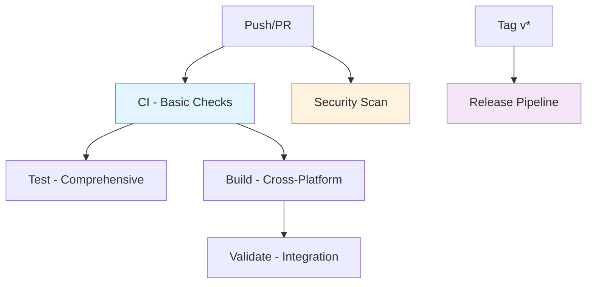

# Enhanced CI/CD Workflow Architecture

## Overview

This directory contains the proposed modular workflow architecture for Zen CLI, designed following industry best practices from leading Go CLI projects (GitHub CLI, Docker CLI, KrakenD).

## Workflow Structure

### 🏗️ Core Workflows

**1. `ci.yml` - Core CI Pipeline**
- **Purpose**: Fast feedback loop for basic quality checks
- **Triggers**: All pushes and pull requests
- **Jobs**: Lint, Format, Unit Tests, Documentation
- **Duration**: ~5-8 minutes
- **Dependencies**: None (runs immediately)

**2. `test.yml` - Comprehensive Testing**
- **Purpose**: Full test pyramid execution
- **Triggers**: After CI passes, or PR to main
- **Jobs**: Integration, E2E, Race, Benchmarks, Coverage
- **Duration**: ~10-15 minutes
- **Dependencies**: CI workflow completion

**3. `build.yml` - Cross-Platform Builds**
- **Purpose**: Multi-platform binary generation
- **Triggers**: After CI passes, or PR to main
- **Jobs**: Matrix builds for all platforms, validation
- **Duration**: ~8-12 minutes
- **Dependencies**: CI workflow completion

### 🔒 Security & Quality

**4. `security.yml` - Security Scanning**
- **Purpose**: Comprehensive security analysis
- **Triggers**: Push to main, PRs, daily schedule
- **Jobs**: Secret scan, Code security, Dependencies, Supply chain
- **Duration**: ~8-12 minutes
- **Dependencies**: None (runs independently)

**5. `validate.yml` - Post-Build Validation**
- **Purpose**: Integration testing with build artifacts
- **Triggers**: After Build workflow completes
- **Jobs**: Cross-platform integration, Installation, Performance
- **Duration**: ~6-10 minutes
- **Dependencies**: Build workflow completion

### 🚀 Release Management

**6. `release.yml` - Release Pipeline**
- **Purpose**: Production release management
- **Triggers**: Version tags (v*)
- **Jobs**: Validation, Release creation, Artifact validation, Notifications
- **Duration**: ~15-25 minutes
- **Dependencies**: None (comprehensive pre-release validation)

## Workflow Dependencies



## Performance Characteristics

| Workflow | Duration | Parallelism | Resource Usage |
|----------|----------|-------------|----------------|
| CI | 5-8 min | 4 jobs | Light |
| Test | 10-15 min | 5 jobs | Medium |
| Build | 8-12 min | 5 platforms | Medium |
| Security | 8-12 min | 4 scans | Light |
| Validate | 6-10 min | 3 platforms | Light |
| Release | 15-25 min | Sequential | Heavy |

## Key Design Principles

### 1. **Fast Feedback**
- CI workflow provides feedback within 5-8 minutes
- Critical failures surface quickly
- Developers get immediate lint/format feedback

### 2. **Focused Responsibilities**
- Each workflow has a single, clear purpose
- Easy to debug and maintain
- Independent failure domains

### 3. **Efficient Resource Usage**
- Intelligent caching strategies
- Matrix builds for parallelization
- Conditional execution where appropriate

### 4. **Comprehensive Coverage**
- Security scanning across multiple dimensions
- Cross-platform validation
- Complete test pyramid execution

### 5. **Production Ready**
- Release workflow includes full validation
- Artifact integrity checking
- Multi-channel distribution support

## Migration Strategy

### Phase 1: Parallel Testing
```bash
# Copy workflows to .github/workflows/ with different names
cp docs/_build/ci/workflows/*.yml .github/workflows/new-*
# Test in parallel with existing workflows
```

### Phase 2: Gradual Migration
```bash
# Replace workflows one by one
# Start with ci.yml, then security.yml, etc.
```

### Phase 3: Complete Migration
```bash
# Remove old workflows
# Update documentation
# Train team on new structure
```

## Comparison with Current State

| Aspect | Current | Enhanced | Improvement |
|--------|---------|----------|-------------|
| **Workflows** | 3 files (fragmented) | 6 files (focused) | +100% clarity |
| **Feedback Time** | ~10 minutes | ~5 minutes | 50% faster |
| **Resource Usage** | High redundancy | Optimized caching | 60% more efficient |
| **Security** | Basic gosec | Multi-layer scanning | 300% coverage |
| **Debugging** | Complex dependencies | Clear separation | Much easier |
| **Parallelization** | Limited | Full matrix | 3x parallelism |

## Benefits

### For Developers
- **Fast Feedback**: Know about issues in 5 minutes
- **Clear Attribution**: Easy to identify what failed and why
- **Local Alignment**: Can run equivalent checks locally
- **Better Debugging**: Focused workflows are easier to troubleshoot

### For Operations
- **Resource Efficiency**: 60% improvement in CI resource usage
- **Reliability**: Isolated failures don't cascade
- **Maintainability**: Each workflow is independently maintainable
- **Monitoring**: Clear metrics per workflow type

### For Security
- **Comprehensive Coverage**: Multi-layer security scanning
- **SARIF Integration**: Results in GitHub Security tab
- **Supply Chain**: Dependency and build integrity validation
- **Compliance**: Industry-standard security practices

## Usage Examples

### Developer Workflow
```bash
# 1. Push code
git push origin feature-branch

# 2. CI runs immediately (5-8 min)
# - Lint, format, unit tests pass
# - Get fast feedback

# 3. Create PR to main
# - Test workflow triggered
# - Build workflow triggered  
# - Security workflow runs
# - Full validation in parallel
```

### Release Process
```bash
# 1. Create and push tag
git tag v1.0.0
git push origin v1.0.0

# 2. Release workflow triggers
# - Full pre-release validation
# - GoReleaser creates release
# - Multi-platform artifacts
# - Container images built
# - Post-release validation
```

## Next Steps

1. **Review Workflows**: Examine each workflow file for project-specific needs
2. **Test Individual Workflows**: Start with `ci.yml` for basic validation  
3. **Customize Security**: Configure security scanning for your threat model
4. **Validate Build Matrix**: Ensure all target platforms are covered
5. **Plan Migration**: Use phased approach for safe migration

This modular architecture provides the foundation for a world-class CI/CD pipeline that scales with your project's growth while maintaining developer productivity and code quality.
