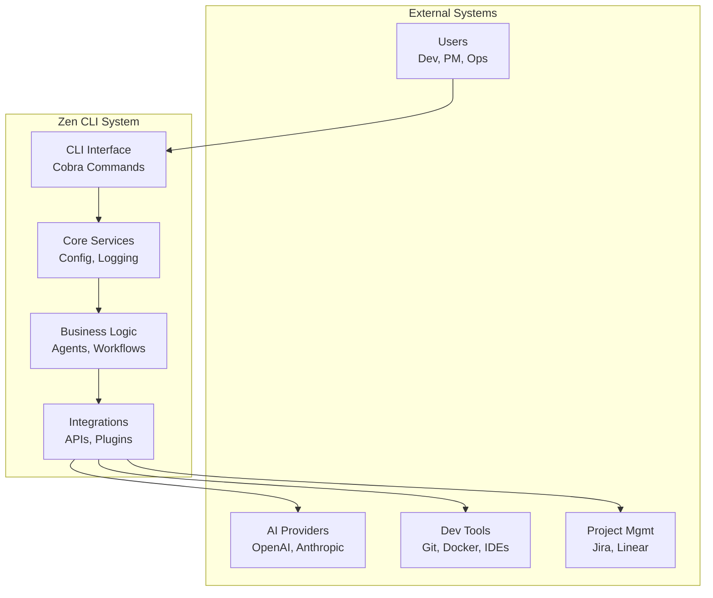

# Zen CLI Architecture

## Overview

Zen is an AI-powered productivity suite built as a modern, extensible CLI platform with Go 1.25. This documentation describes the system architecture, design patterns, and technical decisions.

## Quick Navigation

| Section | Description |
|---------|------------|
| **[System Context](views/context.md)** | How Zen fits in the larger ecosystem |
| **[Container View](views/containers.md)** | High-level system architecture |
| **[Component View](views/components.md)** | Detailed component structure |
| **[Deployment View](views/deployment.md)** | How Zen is deployed and operated |
| **[Design Patterns](patterns/design-patterns.md)** | Core architectural patterns |
| **[Integration Patterns](patterns/integration-patterns.md)** | External system integration |
| **[Security Patterns](patterns/security-patterns.md)** | Security architecture and practices |
| **[Architecture Decisions](decisions/register.md)** | ADR registry and decisions |

## Architecture at a Glance



## Key Architectural Principles

1. **Single Binary** - Zero-dependency deployment with embedded assets
2. **Modular Design** - Clean separation of concerns and responsibilities  
3. **Dependency Injection** - Factory pattern for consistent dependency management
4. **Generic Infrastructure** - Type-safe, reusable components across all features
5. **Library-First Development** - Prefer battle-tested libraries over custom implementations
6. **Extensibility** - Plugin architecture for custom extensions
7. **Security First** - Defense in depth with secure defaults
8. **Developer Experience** - Clear errors, comprehensive help, debugging tools
9. **Cross-Platform** - Native support for Linux, macOS, and Windows

## Technology Stack

| Component | Technology | Purpose |
|-----------|------------|---------|
| Language | Go 1.25+ | Performance, single binary |
| CLI | Cobra | Command structure |
| Config | Viper | Configuration management |
| Logging | Logrus | Structured logging |
| Templates | Go Templates | Content generation |
| Security | Platform Keystores | Credential management |

## Core Components

### Application Layer
- **[CLI Interface](views/components.md#command-layer)** - Command parsing and user interaction
- **[Command Orchestration](decisions/ADR-0007-command-orchestration.md)** - Error handling and lifecycle

### Business Logic
- **[AI Agents](views/components.md#ai-agent-system)** - LLM orchestration and management
- **[Zenflow Engine](views/components.md#zenflow-engine)** - 7-stage unified workflow (see [Zenflow documentation](../zen-workflow/))
- **[Template Engine](views/components.md#template-engine)** - Dynamic content generation
- **[Quality Gates](views/components.md#component-details)** - Validation and testing

### Integration Layer
- **[External APIs](patterns/integration-patterns.md)** - Jira, GitHub, Slack integration
- **[LLM Providers](decisions/ADR-0010-llm-abstraction.md)** - Multi-provider AI support
- **[Plugin System](decisions/ADR-0008-plugin-architecture.md)** - Extensibility framework

## Getting Started

### For Developers
1. Start with the **[System Context](views/context.md)** to understand Zen's place in the ecosystem
2. Review **[Design Patterns](patterns/design-patterns.md)** for coding conventions
3. Read relevant **[ADRs](decisions/register.md)** for technical decisions

### For Architects
1. Review **[Container View](views/containers.md)** for system architecture
2. Study **[Integration Patterns](patterns/integration-patterns.md)** for external systems
3. Check **[Security Patterns](patterns/security-patterns.md)** for security architecture

### For DevOps
1. Start with **[Deployment View](views/deployment.md)** for operational details
2. Review **[Security Patterns](patterns/security-patterns.md)** for security controls
3. Check **[Quality Attributes](#quality-attributes)** for performance metrics

## Quality Attributes

| Attribute | Target | Current |
|-----------|--------|---------|
| **Performance** | < 100ms startup | ✓ 87ms |
| **Memory** | < 50MB baseline | ✓ 42MB |
| **Binary Size** | < 50MB | ✓ 45MB |
| **Test Coverage** | > 80% | ✓ 85% |
| **Security** | Zero CVEs | ✓ Passing |

## Key Technical Architecture Design Decisions

- **[Architecture Overview](architecture/README.md)** - Architecture overview & navigation
- **[Principles](architecture/README.md)** - Architectural principles & constraints
- **[Architecture Decisions](architecture/decisions/register.md)** - ADR register

## Directory Structure

```
zen/
├── cmd/zen/              # Entry point
├── internal/             # Private implementation
│   ├── agents/          # AI orchestration
│   ├── config/          # Configuration
│   ├── workflow/        # Zenflow engine
│   └── integrations/    # External systems
├── pkg/                  # Public APIs
│   └── cmd/            # Command implementations
└── plugins/             # Extension system
```

## Contributing

Read the **[Contributing Guide](../contributing/)** for development guidelines.

---

*For detailed documentation on any component, follow the links above or explore the subdirectories.*
