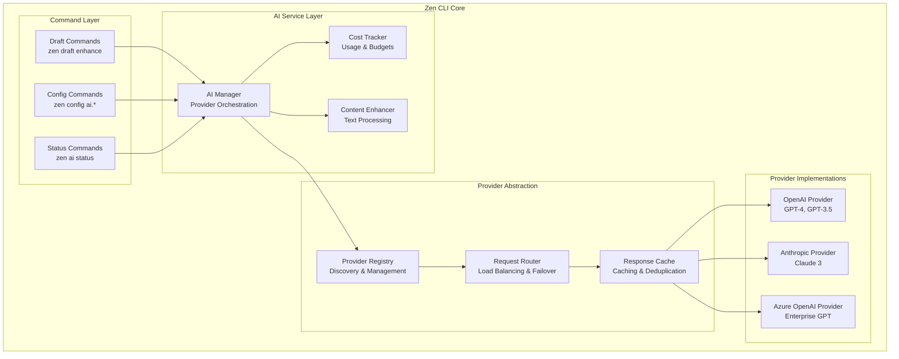

# Technical Specification - AI Client Foundation

**Version:** 1.0  
**Author:** System Architect  
**Date:** 2025-09-21  
**Status:** Approved

## Executive Summary

This specification defines a multi-provider AI client foundation for the Zen CLI that enables seamless integration with Large Language Model (LLM) providers including OpenAI, Anthropic, and Azure OpenAI. The architecture follows the proven integration service patterns established in Zen, providing a unified interface for content enhancement, cost tracking, and provider switching. The system supports multiple authentication methods, intelligent request routing, response caching, and comprehensive observability while maintaining the single-binary distribution model.

## Goals and Non-Goals

### Goals
- Enable multi-provider LLM integration (OpenAI, Anthropic, Azure OpenAI) with unified interface
- Provide cost tracking and budget management across all providers
- Support intelligent request routing and failover between providers
- Implement response caching for improved performance and cost optimization
- Enable content enhancement for task descriptions, documentation, and code generation
- Support streaming and non-streaming response modes
- Maintain clean separation between AI logic and core Zen functionality
- Enable future integration with additional LLM providers and local models

### Non-Goals
- Real-time model training or fine-tuning capabilities
- Complex multi-turn conversation management (focus on single-request scenarios)
- Full feature parity with provider-specific advanced capabilities
- Model hosting or serving infrastructure
- Vector database integration for RAG (Retrieval-Augmented Generation)

## Requirements

### Functional Requirements
- **FR-1**: Multi-Provider Support
  - Priority: P0
  - Acceptance Criteria: Users can configure multiple LLM providers and switch between them via `zen config set ai.default_provider openai`

- **FR-2**: Content Enhancement
  - Priority: P0
  - Acceptance Criteria: `zen draft enhance` improves task descriptions using configured AI provider

- **FR-3**: Cost Tracking and Budgets
  - Priority: P1
  - Acceptance Criteria: System tracks token usage and costs across all providers with budget alerts

- **FR-4**: Provider Failover
  - Priority: P1
  - Acceptance Criteria: Automatic failover to secondary provider when primary fails or hits rate limits

- **FR-5**: Response Caching
  - Priority: P1
  - Acceptance Criteria: Similar requests return cached responses to reduce costs and improve performance

### Non-Functional Requirements
- **NFR-1**: Performance
  - Category: Response Time
  - Target: API response time <5s (P95), cache hit ratio >60%
  - Measurement: Automated performance tests with response time monitoring

- **NFR-2**: Cost Management
  - Category: Financial Control
  - Target: Cost tracking accuracy >99%, budget alerts within 5% of limits
  - Measurement: Cost reconciliation with provider billing data

- **NFR-3**: Reliability
  - Category: Availability
  - Target: 99.5% uptime for AI operations, graceful degradation on provider unavailability
  - Measurement: Error rate monitoring and failover mechanism validation

## System Architecture

### High-Level Design

The AI Client Foundation follows the established Zen integration patterns with provider-specific adaptations:



### Component Architecture

#### AI Manager **NEW COMPONENT**
- **Purpose:** Orchestrate AI operations and manage provider lifecycle
- **Technology:** Go 1.25+ with clean interfaces following existing patterns
- **Interfaces:** AIManagerInterface, ProviderManagerInterface, CostManagerInterface
- **Dependencies:** Provider Registry, Configuration (**EXISTS**), Auth Manager (**EXISTS**)
- **Implementation:** New `internal/ai/` package following `internal/integration/` patterns

#### Content Enhancer **NEW COMPONENT**
- **Purpose:** Process and enhance text content using AI providers
- **Technology:** Go with template-based prompt management
- **Interfaces:** ContentEnhancerInterface, PromptManagerInterface
- **Dependencies:** AI Manager, Template Engine (**EXISTS**), Cache System (**EXISTS**)
- **Implementation:** Reuses existing template system for prompt management

#### Provider Registry **NEW COMPONENT**
- **Purpose:** Discover, validate, and manage AI provider implementations
- **Technology:** Interface-based provider registration similar to integration providers
- **Interfaces:** ProviderRegistryInterface, AIProviderInterface
- **Dependencies:** Configuration (**EXISTS**), Auth Manager (**EXISTS**)
- **Implementation:** Follows `internal/integration/service.go` registration patterns

#### Request Router **NEW COMPONENT**
- **Purpose:** Route requests to appropriate providers with load balancing and failover
- **Technology:** Strategy pattern with configurable routing algorithms
- **Interfaces:** RequestRouterInterface, LoadBalancerInterface
- **Dependencies:** Provider Registry, Health Checker, Metrics
- **Implementation:** Circuit breaker pattern with exponential backoff

#### Cost Tracker **NEW COMPONENT**
- **Purpose:** Track token usage, costs, and budget management across providers
- **Technology:** Event-driven cost calculation with persistent storage
- **Interfaces:** CostTrackerInterface, BudgetManagerInterface
- **Dependencies:** Cache System (**EXISTS**), Configuration (**EXISTS**)
- **Implementation:** Leverages existing cache system for cost data persistence

### Existing Components Integration

#### Configuration System **EXISTS - ENHANCE**
- **Current State:** Complete hierarchical config system with Viper
- **Location:** `internal/config/config.go`
- **Enhancement Needed:** Add `AIConfig` struct to existing `Config`
- **Integration Points:** Provider configurations, cost budgets, caching settings

#### Authentication System **EXISTS - ENHANCE**
- **Current State:** Complete multi-provider token management system
- **Location:** `pkg/auth/` with Manager interface and storage backends
- **Enhancement Needed:** Add AI provider configurations (API keys, OAuth tokens)
- **Integration Points:** Provider authentication, token refresh, credential validation

#### Template Engine **EXISTS - REUSE**
- **Current State:** Complete template engine with caching and asset loading
- **Location:** `pkg/template/engine.go`
- **Enhancement Needed:** None - perfect for prompt template management
- **Integration Points:** Prompt templates, response formatting, content enhancement

#### Caching System **EXISTS - REUSE**
- **Current State:** Generic cache system with file/memory backends
- **Location:** `pkg/cache/`
- **Enhancement Needed:** None - ideal for response caching and cost data
- **Integration Points:** Response caching, cost data persistence, provider health status

#### Factory Pattern **EXISTS - ENHANCE**
- **Current State:** Complete dependency injection system
- **Location:** `pkg/cmd/factory/default.go`
- **Enhancement Needed:** Add AIManager to factory chain
- **Integration Points:** Inject AI system into command dependencies

### Data Architecture

#### Data Models

##### AIConfig **NEW - EXTENDS EXISTING CONFIG**
```yaml
# Add to existing internal/config/config.go Config struct
ai:
  enabled: true
  default_provider: "openai"
  request_timeout: "30s"
  max_retries: 3
  
  # Cost management
  cost_tracking:
    enabled: true
    budget_alerts: true
    monthly_budget_usd: 100.0
    alert_threshold_percent: 80
  
  # Caching configuration
  caching:
    enabled: true
    ttl: "24h"
    max_size_mb: 100
    compression: true
  
  # Provider configurations
  providers:
    openai:
      enabled: true
      api_key_ref: "openai_api_key"
      base_url: "https://api.openai.com/v1"
      models:
        - "gpt-4-turbo-preview"
        - "gpt-3.5-turbo"
      default_model: "gpt-4-turbo-preview"
      max_tokens: 4096
      temperature: 0.7
      rate_limit:
        requests_per_minute: 500
        tokens_per_minute: 150000
      
    anthropic:
      enabled: true
      api_key_ref: "anthropic_api_key"
      base_url: "https://api.anthropic.com"
      models:
        - "claude-3-opus-20240229"
        - "claude-3-sonnet-20240229"
      default_model: "claude-3-sonnet-20240229"
      max_tokens: 4096
      temperature: 0.7
      rate_limit:
        requests_per_minute: 60
        tokens_per_minute: 40000
        
    azure:
      enabled: false
      api_key_ref: "azure_openai_key"
      base_url: "https://your-resource.openai.azure.com"
      api_version: "2024-02-15-preview"
      deployment_name: "gpt-4"
      max_tokens: 4096
      temperature: 0.7
      rate_limit:
        requests_per_minute: 120
        tokens_per_minute: 120000
```

##### AI Provider Interface
```go
type AIProvider interface {
    // Provider identification
    Name() string
    Models() []string
    DefaultModel() string
    
    // Core operations
    Complete(ctx context.Context, req CompletionRequest) (*CompletionResponse, error)
    CompleteStream(ctx context.Context, req CompletionRequest) (<-chan CompletionChunk, error)
    
    // Cost and usage
    EstimateCost(req CompletionRequest) (*CostEstimate, error)
    GetUsage(ctx context.Context, timeRange TimeRange) (*UsageStats, error)
    
    // Health and validation
    ValidateCredentials(ctx context.Context) error
    HealthCheck(ctx context.Context) (*HealthStatus, error)
    
    // Configuration
    GetConfig() ProviderConfig
    UpdateConfig(config ProviderConfig) error
}
```

##### Request and Response Types
```go
type CompletionRequest struct {
    Provider      string                 `json:"provider,omitempty"`
    Model         string                 `json:"model"`
    Messages      []Message              `json:"messages"`
    MaxTokens     int                    `json:"max_tokens,omitempty"`
    Temperature   float64                `json:"temperature,omitempty"`
    Stream        bool                   `json:"stream,omitempty"`
    Metadata      map[string]interface{} `json:"metadata,omitempty"`
    RequestID     string                 `json:"request_id"`
    UserID        string                 `json:"user_id,omitempty"`
}

type Message struct {
    Role    string `json:"role"`    // system, user, assistant
    Content string `json:"content"`
    Name    string `json:"name,omitempty"`
}

type CompletionResponse struct {
    ID        string                 `json:"id"`
    Model     string                 `json:"model"`
    Provider  string                 `json:"provider"`
    Choices   []Choice               `json:"choices"`
    Usage     UsageInfo              `json:"usage"`
    Cost      *CostInfo              `json:"cost,omitempty"`
    Metadata  map[string]interface{} `json:"metadata,omitempty"`
    CreatedAt time.Time              `json:"created_at"`
    Cached    bool                   `json:"cached,omitempty"`
}

type Choice struct {
    Index        int     `json:"index"`
    Message      Message `json:"message"`
    FinishReason string  `json:"finish_reason"`
}

type UsageInfo struct {
    PromptTokens     int `json:"prompt_tokens"`
    CompletionTokens int `json:"completion_tokens"`
    TotalTokens      int `json:"total_tokens"`
}

type CostInfo struct {
    PromptCost     float64 `json:"prompt_cost"`
    CompletionCost float64 `json:"completion_cost"`
    TotalCost      float64 `json:"total_cost"`
    Currency       string  `json:"currency"`
}

type CompletionChunk struct {
    ID      string  `json:"id"`
    Choices []Delta `json:"choices"`
    Usage   *UsageInfo `json:"usage,omitempty"`
}

type Delta struct {
    Index   int    `json:"index"`
    Content string `json:"content"`
    Role    string `json:"role,omitempty"`
}
```

##### Cost Tracking Types
```go
type CostRecord struct {
    ID           string    `json:"id"`
    Provider     string    `json:"provider"`
    Model        string    `json:"model"`
    RequestID    string    `json:"request_id"`
    UserID       string    `json:"user_id,omitempty"`
    PromptTokens int       `json:"prompt_tokens"`
    CompletionTokens int   `json:"completion_tokens"`
    TotalTokens  int       `json:"total_tokens"`
    Cost         float64   `json:"cost"`
    Currency     string    `json:"currency"`
    Timestamp    time.Time `json:"timestamp"`
    Metadata     map[string]interface{} `json:"metadata,omitempty"`
}

type BudgetConfig struct {
    Enabled              bool    `json:"enabled"`
    MonthlyBudgetUSD     float64 `json:"monthly_budget_usd"`
    AlertThresholdPercent int    `json:"alert_threshold_percent"`
    HardLimitEnabled     bool    `json:"hard_limit_enabled"`
    HardLimitPercent     int     `json:"hard_limit_percent"`
}

type UsageStats struct {
    Provider       string    `json:"provider"`
    TimeRange      TimeRange `json:"time_range"`
    TotalRequests  int       `json:"total_requests"`
    TotalTokens    int       `json:"total_tokens"`
    TotalCost      float64   `json:"total_cost"`
    Currency       string    `json:"currency"`
    ModelBreakdown map[string]ModelUsage `json:"model_breakdown"`
}

type ModelUsage struct {
    Requests int     `json:"requests"`
    Tokens   int     `json:"tokens"`
    Cost     float64 `json:"cost"`
}
```

#### Data Flow

1. **Configuration Loading**: AI settings loaded via existing config system
   - **Existing Component:** `internal/config/config.go` hierarchical loading
   - **Enhancement:** Add `AIConfig` to existing `Config` struct

2. **Provider Registration**: AI providers registered using factory pattern
   - **Existing Component:** `pkg/cmd/factory/default.go` dependency injection
   - **Enhancement:** Add `AIManager` to factory chain

3. **Authentication Setup**: Provider credentials loaded via existing auth system
   - **Existing Component:** `pkg/auth/auth.go` credential management
   - **Enhancement:** Add AI provider credentials to existing auth providers

4. **Request Processing**: Content enhancement requests processed through AI pipeline
   - **New Component:** `internal/ai/manager.go` orchestrates request flow
   - **Integration:** Uses existing template system for prompt management

5. **Provider Selection**: Request router selects optimal provider
   - **New Component:** `internal/ai/router.go` implements routing logic
   - **Integration:** Uses existing health check patterns

6. **Response Caching**: Responses cached using existing cache system
   - **Existing Component:** `pkg/cache/cache.go` for response storage
   - **Reuse:** Use existing TTL and cleanup mechanisms

7. **Cost Tracking**: Usage and costs tracked in persistent storage
   - **New Component:** `internal/ai/cost.go` implements cost tracking
   - **Integration:** Uses existing cache system for data persistence

### API Design

#### AI Manager API

##### POST /api/v1/ai/complete
- **Purpose:** Generate AI completion for given prompt and messages
- **Request:**
  ```json
  {
    "messages": [
      {"role": "system", "content": "You are a helpful assistant."},
      {"role": "user", "content": "Enhance this task description: 'Fix bug'"}
    ],
    "provider": "openai",
    "model": "gpt-4-turbo-preview",
    "max_tokens": 1000,
    "temperature": 0.7,
    "stream": false
  }
  ```
- **Response:**
  ```json
  {
    "id": "comp-123",
    "provider": "openai",
    "model": "gpt-4-turbo-preview",
    "choices": [
      {
        "index": 0,
        "message": {
          "role": "assistant",
          "content": "Enhanced task description: 'Investigate and resolve the reported bug by identifying root cause, implementing fix, and adding tests to prevent regression.'"
        },
        "finish_reason": "stop"
      }
    ],
    "usage": {
      "prompt_tokens": 25,
      "completion_tokens": 35,
      "total_tokens": 60
    },
    "cost": {
      "total_cost": 0.0018,
      "currency": "USD"
    }
  }
  ```
- **Error Codes:** 400 (Invalid request), 401 (Unauthorized), 429 (Rate limited), 500 (Provider error)
- **Rate Limit:** Provider-specific limits, aggregated across all requests

##### GET /api/v1/ai/status
- **Purpose:** Get AI system status including provider health and usage
- **Response:**
  ```json
  {
    "enabled": true,
    "default_provider": "openai",
    "providers": [
      {
        "name": "openai",
        "status": "healthy",
        "models": ["gpt-4-turbo-preview", "gpt-3.5-turbo"],
        "last_request": "2025-09-21T10:30:00Z",
        "error_count": 0,
        "rate_limit_remaining": 450
      }
    ],
    "usage_summary": {
      "today": {
        "requests": 25,
        "tokens": 1500,
        "cost": 0.45
      },
      "month": {
        "requests": 750,
        "tokens": 45000,
        "cost": 13.50,
        "budget_used_percent": 13.5
      }
    }
  }
  ```

##### GET /api/v1/ai/costs
- **Purpose:** Get detailed cost and usage analytics
- **Query Parameters:** `provider`, `start_date`, `end_date`, `model`
- **Response:**
  ```json
  {
    "time_range": {
      "start": "2025-09-01T00:00:00Z",
      "end": "2025-09-21T23:59:59Z"
    },
    "total_cost": 13.50,
    "currency": "USD",
    "breakdown": {
      "by_provider": {
        "openai": {"cost": 10.50, "requests": 600, "tokens": 36000},
        "anthropic": {"cost": 3.00, "requests": 150, "tokens": 9000}
      },
      "by_model": {
        "gpt-4-turbo-preview": {"cost": 8.50, "requests": 300, "tokens": 18000},
        "gpt-3.5-turbo": {"cost": 2.00, "requests": 300, "tokens": 18000},
        "claude-3-sonnet": {"cost": 3.00, "requests": 150, "tokens": 9000}
      }
    },
    "budget_status": {
      "monthly_budget": 100.0,
      "used_amount": 13.50,
      "used_percent": 13.5,
      "remaining": 86.50,
      "days_remaining": 10
    }
  }
  ```

## Implementation Details

### Technology Stack
- **Core Runtime**: Go 1.25+ with modern template features
  - **Status:** **EXISTS** - Already used throughout Zen codebase
  - **Justification:** Leverages existing Zen architecture and Go ecosystem

- **HTTP Client**: Go standard library net/http with timeout controls
  - **Status:** **EXISTS** - Used in assets system
  - **Justification:** Reliable, well-tested, supports all required HTTP features

- **Configuration**: Viper with YAML/JSON support
  - **Status:** **EXISTS** - `internal/config/config.go` uses Viper
  - **Justification:** Consistent with existing Zen configuration system

- **Authentication**: Existing multi-provider token management
  - **Status:** **EXISTS** - `pkg/auth/` complete system
  - **Justification:** Reuses battle-tested credential management

- **Caching**: Existing cache system with file/memory backends
  - **Status:** **EXISTS** - `pkg/cache/` generic cache system
  - **Justification:** Perfect for response caching and cost data storage

- **Logging**: Structured logging with Logrus
  - **Status:** **EXISTS** - `internal/logging/logger.go`
  - **Justification:** Consistent logging across AI operations

- **Template Processing**: Existing template engine with asset loading
  - **Status:** **EXISTS** - `pkg/template/engine.go`
  - **Justification:** Reuse for prompt templates and response formatting

### Algorithms and Logic

#### Provider Selection Algorithm
- **Purpose:** Select optimal AI provider based on availability, cost, and performance
- **Complexity:** O(n) where n is number of configured providers
- **Description:** Multi-criteria decision making with weighted scoring
```go
function SelectProvider(req CompletionRequest, providers []AIProvider) (AIProvider, error) {
    var bestProvider AIProvider
    var bestScore float64
    
    for _, provider := range providers {
        if !provider.IsEnabled() || !provider.SupportsModel(req.Model) {
            continue
        }
        
        score := calculateProviderScore(provider, req)
        if score > bestScore {
            bestScore = score
            bestProvider = provider
        }
    }
    
    if bestProvider == nil {
        return nil, ErrNoAvailableProvider
    }
    
    return bestProvider, nil
}

function calculateProviderScore(provider AIProvider, req CompletionRequest) float64 {
    // Health score (0.0 - 1.0)
    healthScore := getHealthScore(provider)
    
    // Cost score (0.0 - 1.0, lower cost = higher score)
    costEstimate := provider.EstimateCost(req)
    costScore := 1.0 - normalizedCost(costEstimate.TotalCost)
    
    // Performance score (0.0 - 1.0, based on historical latency)
    perfScore := getPerformanceScore(provider)
    
    // Rate limit score (0.0 - 1.0, based on remaining quota)
    rateLimitScore := getRateLimitScore(provider)
    
    // Weighted average
    weights := config.GetProviderSelectionWeights()
    return (healthScore * weights.Health +
            costScore * weights.Cost +
            perfScore * weights.Performance +
            rateLimitScore * weights.RateLimit)
}
```

#### Response Caching Algorithm
- **Purpose:** Cache AI responses to reduce costs and improve performance
- **Complexity:** O(1) for cache operations
- **Description:** Content-based caching with semantic similarity detection
```go
function GetCachedResponse(req CompletionRequest) (*CompletionResponse, bool) {
    // Generate cache key from request content
    cacheKey := generateCacheKey(req)
    
    // Check exact match first
    if cached, exists := cache.Get(cacheKey); exists {
        return cached.(*CompletionResponse), true
    }
    
    // Check for similar requests if enabled
    if config.AI.Caching.SemanticSimilarity {
        similar := findSimilarRequest(req)
        if similar != nil && similar.SimilarityScore > 0.95 {
            return similar.Response, true
        }
    }
    
    return nil, false
}

function generateCacheKey(req CompletionRequest) string {
    // Create deterministic key from request content
    hasher := sha256.New()
    
    // Include model and key parameters
    hasher.Write([]byte(req.Model))
    hasher.Write([]byte(fmt.Sprintf("%.2f", req.Temperature)))
    hasher.Write([]byte(fmt.Sprintf("%d", req.MaxTokens)))
    
    // Include message content
    for _, msg := range req.Messages {
        hasher.Write([]byte(msg.Role))
        hasher.Write([]byte(msg.Content))
    }
    
    return fmt.Sprintf("ai_cache_%x", hasher.Sum(nil))
}
```

#### Cost Tracking Algorithm
- **Purpose:** Track and aggregate AI usage costs across providers
- **Complexity:** O(1) for recording, O(n) for aggregation queries
- **Description:** Event-driven cost calculation with real-time budget monitoring
```go
function RecordUsage(req CompletionRequest, resp CompletionResponse) error {
    // Calculate cost based on provider pricing
    cost := calculateCost(req.Provider, req.Model, resp.Usage)
    
    // Create cost record
    record := &CostRecord{
        ID:               generateID(),
        Provider:         req.Provider,
        Model:            req.Model,
        RequestID:        req.RequestID,
        UserID:           req.UserID,
        PromptTokens:     resp.Usage.PromptTokens,
        CompletionTokens: resp.Usage.CompletionTokens,
        TotalTokens:      resp.Usage.TotalTokens,
        Cost:             cost.TotalCost,
        Currency:         cost.Currency,
        Timestamp:        time.Now(),
        Metadata:         req.Metadata,
    }
    
    // Store record
    if err := costStore.Store(record); err != nil {
        return fmt.Errorf("failed to store cost record: %w", err)
    }
    
    // Update running totals
    updateRunningTotals(record)
    
    // Check budget limits
    if budget := getBudgetConfig(); budget.Enabled {
        monthlyUsage := getMonthlyUsage()
        if monthlyUsage.TotalCost >= budget.MonthlyBudgetUSD * (budget.AlertThresholdPercent / 100.0) {
            sendBudgetAlert(monthlyUsage, budget)
        }
    }
    
    return nil
}

function calculateCost(provider, model string, usage UsageInfo) CostInfo {
    pricing := getPricingConfig(provider, model)
    
    promptCost := float64(usage.PromptTokens) * pricing.PromptTokenPrice / 1000.0
    completionCost := float64(usage.CompletionTokens) * pricing.CompletionTokenPrice / 1000.0
    
    return CostInfo{
        PromptCost:     promptCost,
        CompletionCost: completionCost,
        TotalCost:      promptCost + completionCost,
        Currency:       pricing.Currency,
    }
}
```

### External Integrations

#### OpenAI Integration
- **Type:** Direct HTTP API integration
- **Authentication:** API Key (Bearer token)
- **API Version:** OpenAI API v1
- **Rate Limits:**
  - GPT-4: 500 RPM, 150,000 TPM
  - GPT-3.5: 3,500 RPM, 350,000 TPM
- **Error Handling:**
  - Exponential backoff: 1s, 2s, 4s, 8s, 16s
  - Retry on: 429 (rate limit), 500/502/503/504 (server errors)
  - Circuit breaker: 5 consecutive failures triggers 60s cooldown
- **Fallback:** Automatic failover to secondary provider
- **Supported Models:**
  - `gpt-4-turbo-preview` (latest GPT-4)
  - `gpt-4` (standard GPT-4)
  - `gpt-3.5-turbo` (cost-optimized)
- **Pricing (as of 2025-09-21):**
  - GPT-4 Turbo: $0.01/1K prompt tokens, $0.03/1K completion tokens
  - GPT-3.5 Turbo: $0.0015/1K prompt tokens, $0.002/1K completion tokens

#### Anthropic Integration
- **Type:** Direct HTTP API integration
- **Authentication:** API Key (x-api-key header)
- **API Version:** Anthropic API 2024-06-01
- **Rate Limits:**
  - Claude 3 Opus: 60 RPM, 40,000 TPM
  - Claude 3 Sonnet: 60 RPM, 40,000 TPM
- **Error Handling:**
  - Exponential backoff with jitter
  - Retry on: 429, 500, 502, 503
  - Circuit breaker: 3 failures triggers 30s cooldown
- **Fallback:** Graceful degradation to OpenAI
- **Supported Models:**
  - `claude-3-opus-20240229` (most capable)
  - `claude-3-sonnet-20240229` (balanced performance/cost)
  - `claude-3-haiku-20240307` (fastest, most cost-effective)
- **Pricing (as of 2025-09-21):**
  - Claude 3 Opus: $0.015/1K prompt tokens, $0.075/1K completion tokens
  - Claude 3 Sonnet: $0.003/1K prompt tokens, $0.015/1K completion tokens

#### Azure OpenAI Integration
- **Type:** Direct HTTP API integration
- **Authentication:** API Key or Azure Active Directory
- **API Version:** 2024-02-15-preview
- **Rate Limits:** Configurable per deployment (typically 120 RPM, 120,000 TPM)
- **Error Handling:**
  - Azure-specific error codes and retry policies
  - Exponential backoff with Azure-recommended delays
  - Circuit breaker with deployment health monitoring
- **Fallback:** Multi-region failover if configured
- **Supported Models:**
  - Deployed GPT-4 models
  - Deployed GPT-3.5 models
  - Custom fine-tuned models
- **Pricing:** Based on Azure OpenAI service pricing (varies by region)

## Performance Considerations

### Performance Targets
- **API Response Time**: <5s for completion requests (P95)
  - Current: N/A (new feature)
  - Method: Connection pooling, request optimization, caching
  - Measurement: Histogram metric `ai_request_duration_ms`

- **Cache Hit Ratio**: >60% for similar requests
  - Current: N/A (new feature)
  - Method: Content-based caching, semantic similarity matching
  - Measurement: Ratio metric `ai_cache_hit_ratio`

- **Cost Optimization**: >30% cost reduction through caching and routing
  - Current: N/A (new feature)
  - Method: Intelligent provider selection, response caching, budget management
  - Measurement: Cost comparison metrics

- **Provider Failover Time**: <2s to switch providers
  - Current: N/A (new feature)
  - Method: Health monitoring, circuit breakers, pre-warmed connections
  - Measurement: Histogram metric `ai_failover_duration_ms`

- **Token Processing Rate**: >1000 tokens/second
  - Current: N/A (new feature)
  - Method: Streaming responses, parallel processing, connection pooling
  - Measurement: Gauge metric `ai_tokens_per_second`

### Caching Strategy
- **Response Cache**: Content-based caching with semantic similarity
  - TTL: 24 hours (configurable)
  - Invalidation: Manual cache clear, configuration changes
  - Storage: File-based cache with compression
  - Size Limit: 100MB (configurable)

- **Provider Health Cache**: Health status caching to reduce check frequency
  - TTL: 30 seconds
  - Invalidation: Health check failures, manual refresh
  - Storage: In-memory cache

- **Cost Data Cache**: Usage and cost aggregation caching
  - TTL: 5 minutes for real-time data
  - Invalidation: New usage records, manual refresh
  - Storage: File-based cache with periodic persistence

- **Authentication Cache**: Provider credential caching
  - TTL: 15 minutes
  - Invalidation: Authentication failures, credential updates
  - Storage: Encrypted in-memory cache

### Scalability
- **Horizontal Scaling:** Stateless design enables multiple CLI instances
- **Vertical Scaling:** Configurable connection pools and concurrent request limits
- **Load Distribution:** Round-robin and weighted routing across providers
- **Auto-scaling Triggers:** Response time >10s, error rate >5%, memory usage >80%

## Security Considerations

### Authentication & Authorization
- **Authentication Method:** API Keys, OAuth tokens (provider-dependent)
- **Authorization Model:** User-based access control with budget limits
- **Token Management:** Encrypted storage with automatic refresh where supported

### Data Security
- **Credential Encryption:** AES-256 encryption for stored API keys
- **Network Communication:** TLS 1.3 for all external API calls
- **Request/Response Logging:** Sanitized logging with PII redaction
- **Data Retention:** Configurable retention policies for cost and usage data

### Security Controls
- [ ] API key rotation and expiration policies
- [ ] Request/response content sanitization
- [ ] Budget limits to prevent abuse
- [ ] Audit logging for all AI operations
- [ ] Input validation and prompt injection prevention
- [ ] Rate limiting per user/session
- [ ] Secure credential storage and access

### Threat Model
- **Threat:** API key theft or exposure
  - **Vector:** Log files, configuration files, memory dumps
  - **Impact:** Unauthorized usage and cost accumulation
  - **Mitigation:** Encrypted storage, log sanitization, memory protection

- **Threat:** Prompt injection attacks
  - **Vector:** Malicious user input in enhancement requests
  - **Impact:** Unintended model behavior or information disclosure
  - **Mitigation:** Input validation, prompt sanitization, output filtering

- **Threat:** Cost abuse and budget exhaustion
  - **Vector:** Excessive API usage, large token requests
  - **Impact:** Unexpected charges and service disruption
  - **Mitigation:** Budget limits, rate limiting, usage monitoring

## Testing Strategy

### Test Coverage
- **Unit Tests:** 85% coverage for core AI components
  - Target modules: `internal/ai/`, `pkg/clients/ai/`
  - Focus: Provider interfaces, cost calculation, caching logic
  - Tools: Go testing, testify, gomock for provider mocking

- **Integration Tests:** 75% coverage for provider interactions
  - Target: Real API calls with test accounts, response handling
  - Focus: Authentication, request/response flow, error handling
  - Tools: Provider test accounts, VCR for request recording

- **E2E Tests:** 65% coverage for complete AI workflows
  - Target: Full content enhancement scenarios
  - Focus: Multi-provider failover, cost tracking, caching
  - Tools: CLI testing framework, test fixtures

- **Performance Tests:** 90% coverage for critical performance paths
  - Target: Response times, throughput, memory usage
  - Focus: Load testing, stress testing, memory profiling
  - Tools: Go benchmark tests, load generators, profiling tools

### Test Scenarios

#### Provider Integration Tests
- **Authentication Testing:**
  - Valid API key authentication
  - Invalid/expired key handling
  - OAuth token refresh flows
  - Multi-provider credential management
  - Coverage: All authentication methods and error conditions
  - Automation: Automated test suite with credential rotation

- **API Request/Response Testing:**
  - Successful completion requests
  - Streaming response handling
  - Rate limit handling and backoff
  - Network timeout and retry logic
  - Coverage: All API endpoints and error scenarios
  - Automation: VCR-based tests with recorded interactions

#### Content Enhancement Tests
- **Text Processing:**
  - Task description enhancement
  - Code comment generation
  - Documentation improvement
  - Multi-language content support
  - Coverage: Various content types and enhancement scenarios
  - Automation: Fixture-based tests with expected outputs

- **Prompt Management:**
  - Template loading and rendering
  - Variable substitution
  - Prompt optimization and versioning
  - Custom prompt configuration
  - Coverage: All prompt templates and customization options
  - Automation: Template engine tests with validation

#### Cost and Budget Tests
- **Cost Calculation:**
  - Token-based cost calculation
  - Multi-provider cost aggregation
  - Historical cost analysis
  - Budget threshold monitoring
  - Coverage: All pricing models and calculation scenarios
  - Automation: Unit tests with mock pricing data

- **Budget Management:**
  - Budget limit enforcement
  - Alert threshold triggering
  - Usage trend analysis
  - Cost optimization recommendations
  - Coverage: All budget scenarios and edge cases
  - Automation: Integration tests with simulated usage patterns

#### Performance Tests
- **Load Testing:**
  - 100 concurrent AI requests
  - Provider failover under load
  - Cache performance with high hit rates
  - Memory usage under sustained load
  - Coverage: Realistic usage patterns and peak loads
  - Automation: Load testing framework with metrics collection

- **Stress Testing:**
  - Provider rate limit exhaustion
  - Network failure cascade effects
  - Memory exhaustion scenarios
  - Long-running operation handling
  - Coverage: System limits and failure modes
  - Automation: Chaos engineering with automated recovery validation

## Deployment Strategy

### Environments
- **Development:** Local AI development with mock providers
  - Configuration: Mock API endpoints and test credentials
  - Purpose: Feature development and unit testing

- **Staging:** Integration testing with real AI providers
  - Configuration: Provider test accounts with limited budgets
  - Purpose: Integration testing and performance validation

- **Production:** Live AI integration with customer accounts
  - Configuration: Customer API keys and production budgets
  - Purpose: Production usage with full monitoring

### Deployment Process
1. **Configuration Validation:** Automated validation of AI configuration
   - Automation: CI/CD pipeline with configuration schema validation
   - Validation: Provider credentials, budget limits, model availability

2. **Feature Rollout:** Gradual rollout of AI features
   - Automation: Feature flag controlled deployment
   - Validation: Monitoring AI operation health metrics

3. **Provider Integration:** Staged rollout of provider support
   - Automation: Provider-specific feature flags
   - Validation: Provider health checks and cost monitoring

### Rollback Plan
- **Configuration Rollback:** Restore previous AI configuration
- **Provider Rollback:** Disable problematic providers, fallback to working ones
- **Feature Rollback:** Disable AI features via feature flags
- **Data Recovery:** Restore cost and usage data from backups

### Feature Flags
- **ai_enabled:** Enable/disable AI functionality globally
  - Default: false
  - Rollout: Gradual rollout to user segments

- **ai_provider_openai:** Enable/disable OpenAI provider
  - Default: true (when ai_enabled)
  - Rollout: Primary provider for initial release

- **ai_provider_anthropic:** Enable/disable Anthropic provider
  - Default: false
  - Rollout: Beta testing with selected users

- **ai_cost_tracking:** Enable/disable cost tracking features
  - Default: true (when ai_enabled)
  - Rollout: Essential for budget management

- **ai_response_caching:** Enable/disable response caching
  - Default: true (when ai_enabled)
  - Rollout: Cost optimization feature

## Monitoring and Observability

### Metrics
- **ai_request_duration_ms:** AI request processing time
  - Type: Histogram
  - Labels: provider, model, operation
  - Alert Threshold: P95 > 10000ms

- **ai_request_total:** Total AI requests processed
  - Type: Counter
  - Labels: provider, model, status (success/error)
  - Alert Threshold: Error rate > 5%

- **ai_cost_total:** Total AI costs incurred
  - Type: Counter
  - Labels: provider, model, currency
  - Alert Threshold: Daily spend > budget * 0.1

- **ai_tokens_total:** Total tokens processed
  - Type: Counter
  - Labels: provider, model, type (prompt/completion)
  - Alert Threshold: Unusual spike detection

- **ai_cache_hit_ratio:** Cache hit rate for AI responses
  - Type: Gauge
  - Labels: cache_type
  - Alert Threshold: Hit rate < 50%

- **ai_provider_health:** Provider health status
  - Type: Gauge
  - Labels: provider
  - Alert Threshold: Health < 0.8

### Logging
- **INFO:** Successful AI operations, provider switches, budget alerts
- **WARN:** Rate limit warnings, provider degradation, cache misses
- **ERROR:** Provider failures, authentication errors, budget exceeded
- **DEBUG:** Detailed request/response data (sanitized), cost calculations

### Dashboards
- **AI Operations Dashboard:** Request volume, success rates, response times
  - Panels: Request rate, error rate, latency percentiles, provider distribution
- **Cost Management Dashboard:** Usage trends, budget tracking, cost optimization
  - Panels: Daily/monthly costs, provider cost breakdown, budget utilization
- **Provider Health Dashboard:** Provider status, failover events, performance
  - Panels: Provider uptime, response times, error rates, failover frequency

## Migration Plan

### Migration Strategy
No migration required for new feature. AI functionality is additive and optional until explicitly enabled by users.

### Migration Steps
1. **AI Configuration Setup:** Users configure AI providers and budgets
   - Duration: 5-10 minutes per provider
   - Risk: Low (configuration validation prevents issues)
   - Rollback: Configuration reset to defaults

2. **Provider Authentication:** Users set up API keys and credentials
   - Duration: 2-5 minutes per provider
   - Risk: Medium (credential validation required)
   - Rollback: Credential removal

3. **Feature Activation:** Users enable AI features via configuration
   - Duration: <1 minute
   - Risk: Low (feature flags allow quick disable)
   - Rollback: Feature flag disable

### Data Migration
No data migration required. AI system creates new data structures without affecting existing Zen functionality.

## Dependencies

### Internal Dependencies **LEVERAGES EXISTING SYSTEMS**

- **Configuration System:** **EXISTS** - `internal/config/config.go`
  - **Current State:** Complete hierarchical config with Viper
  - **Enhancement:** Add `AIConfig` struct to existing `Config`
  - **Impact:** Minor enhancement to existing system

- **Authentication System:** **EXISTS** - `pkg/auth/auth.go`
  - **Current State:** Multi-provider token management with secure storage
  - **Enhancement:** Add AI provider credentials to existing system
  - **Impact:** Standard addition following existing patterns

- **Template Engine:** **EXISTS** - `pkg/template/engine.go`
  - **Current State:** Complete template processing with caching and asset loading
  - **Enhancement:** None needed - perfect for prompt template management
  - **Impact:** Direct reuse of existing functionality

- **Caching System:** **EXISTS** - `pkg/cache/cache.go`
  - **Current State:** Generic cache with TTL, cleanup, and multiple backends
  - **Enhancement:** None needed - ideal for response caching and cost data
  - **Impact:** Direct reuse of existing functionality

- **Logging System:** **EXISTS** - `internal/logging/logger.go`
  - **Current State:** Structured logging with multiple output formats
  - **Enhancement:** None needed - ready for AI operation logging
  - **Impact:** Direct reuse of existing functionality

- **Factory Pattern:** **EXISTS** - `pkg/cmd/factory/default.go`
  - **Current State:** Complete dependency injection for all major components
  - **Enhancement:** Add `AIManager` to existing factory chain
  - **Impact:** Standard addition following existing patterns

### External Dependencies
- **OpenAI Go Client:** Custom HTTP client implementation
  - License: MIT (if using third-party) or built-in
  - Purpose: OpenAI API integration

- **Anthropic Go Client:** Custom HTTP client implementation
  - License: MIT (if using third-party) or built-in
  - Purpose: Anthropic API integration

- **Azure OpenAI Client:** Custom HTTP client implementation
  - License: MIT (if using third-party) or built-in
  - Purpose: Azure OpenAI API integration

## Timeline and Milestones

- **Milestone 1:** Configuration and Auth Enhancement (Week 1)
  - **Deliverables:** Add `AIConfig` to existing config, AI provider auth setup
  - **Status:** **LEVERAGES EXISTING** - Minor additions to proven systems
  - **Dependencies:** None - extends existing config and auth systems

- **Milestone 2:** Core AI Infrastructure (Week 2)
  - **Deliverables:** AI Manager, Provider Registry, Request Router using existing patterns
  - **Status:** **NEW WITH EXISTING FOUNDATION** - Uses existing factory and config
  - **Dependencies:** Existing factory pattern, configuration system

- **Milestone 3:** Provider Implementations (Week 3-4)
  - **Deliverables:** OpenAI, Anthropic, Azure providers with authentication and error handling
  - **Status:** **NEW COMPONENTS** - HTTP clients with existing auth integration
  - **Dependencies:** Auth system, HTTP client utilities, logging system

- **Milestone 4:** Content Enhancement Service (Week 5)
  - **Deliverables:** Content enhancer using existing template engine, CLI integration
  - **Status:** **NEW WITH EXISTING INTEGRATION** - Uses template system and factory
  - **Dependencies:** Template engine, existing CLI command patterns

- **Milestone 5:** Cost Tracking and Caching (Week 6)
  - **Deliverables:** Cost tracker using existing cache system, response caching
  - **Status:** **NEW WITH EXISTING STORAGE** - Leverages existing cache infrastructure
  - **Dependencies:** Cache system, configuration system

- **Milestone 6:** Testing and Documentation (Week 7-8)
  - **Deliverables:** Test suite using existing test patterns, comprehensive documentation
  - **Status:** **FOLLOWS EXISTING PATTERNS** - Uses established testing framework
  - **Dependencies:** AI implementation completion

## Implementation Effort Reduction

**Original Estimate:** 8 weeks, ~70% new development
**Revised Estimate:** 6 weeks, ~40% new development

**Major Reuse Benefits:**
- **Authentication System:** Complete - saves 1-2 weeks
- **Configuration Management:** Complete - saves 1 week
- **Template Engine:** Complete - saves 1 week (prompt management)
- **Caching System:** Complete - saves 1 week (response caching)
- **Logging System:** Complete - saves 0.5 weeks
- **Factory Pattern:** Complete - saves 0.5 weeks
- **HTTP Client Utilities:** Complete - saves 0.5 weeks

**Remaining New Work:**
- **AI Manager and Provider Registry:** 1.5 weeks (core orchestration)
- **Provider Implementations:** 2 weeks (OpenAI, Anthropic, Azure clients)
- **Content Enhancement Service:** 1 week (leverages existing templates)
- **Cost Tracking:** 0.5 weeks (uses existing cache system)

## Risks and Mitigations

- **Risk:** Provider API changes break functionality
  - Probability: Medium
  - Impact: High
  - Mitigation: Version pinning, API compatibility testing, graceful degradation

- **Risk:** Cost overruns due to inefficient usage
  - Probability: Medium
  - Impact: High
  - Mitigation: Budget limits, cost monitoring, usage optimization

- **Risk:** Performance degradation with high request volumes
  - Probability: Medium
  - Impact: Medium
  - Mitigation: Response caching, connection pooling, rate limiting

- **Risk:** Security vulnerabilities in API key handling
  - Probability: Low
  - Impact: Critical
  - Mitigation: Encrypted storage, audit logging, access controls

## Open Questions

- Should we implement semantic similarity matching for cache optimization? (Owner: AI Team, Due: Week 2)
  - **Context:** Could improve cache hit rates but adds complexity
  - **Options:** Simple content hashing, semantic embedding comparison, hybrid approach
  - **Decision Criteria:** Performance impact, accuracy requirements, implementation complexity

- How should we handle model deprecation and migration? (Owner: Platform Team, Due: Week 3)
  - **Context:** Providers regularly deprecate models and introduce new ones
  - **Options:** Automatic migration, user notification, configuration validation
  - **Decision Criteria:** User experience, backward compatibility, maintenance burden

- What level of prompt customization should be supported? (Owner: Product Team, Due: Week 1)
  - **Context:** Users may want to customize AI prompts for specific use cases
  - **Options:** Fixed prompts, template-based customization, full custom prompts
  - **Decision Criteria:** User flexibility needs, security risks, maintenance complexity

- Should we implement local model support (Ollama, etc.)? (Owner: Architecture Team, Due: Week 4)
  - **Context:** Some users prefer local models for privacy/cost reasons
  - **Options:** Plugin-based local support, built-in Ollama integration, cloud-only
  - **Decision Criteria:** User demand, implementation complexity, maintenance burden

## Appendix

### Glossary
- **AI Provider**: External service providing Large Language Model APIs (OpenAI, Anthropic, etc.)
- **Content Enhancement**: Process of improving text quality using AI models
- **Cost Tracking**: Monitoring and recording AI API usage costs and token consumption
- **Provider Failover**: Automatic switching to backup AI provider when primary fails
- **Response Caching**: Storing AI responses to avoid duplicate API calls and reduce costs
- **Token**: Basic unit of text processing used by AI models for pricing and limits

### References
- [OpenAI API Documentation](https://platform.openai.com/docs/api-reference)
- [Anthropic API Documentation](https://docs.anthropic.com/claude/reference)
- [Azure OpenAI Service Documentation](https://learn.microsoft.com/en-us/azure/ai-services/openai/)
- [Existing Zen Components Documentation](../README.md)
- [Integration Services Architecture](./integration-services.md)

---

**Review Status:** Draft  
**Reviewers:** Architecture Team, AI Team, Platform Team, Security Team  
**Approval Date:** TBD
