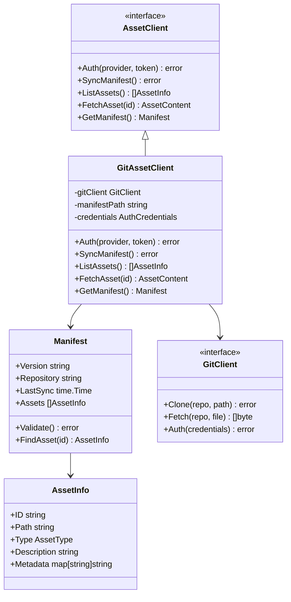

# Asset Management Component

## Overview

The Asset Management component provides secure access to private Git repositories containing templates, prompts, and other reusable content. This component implements a manifest-only synchronization strategy with dynamic asset fetching to optimize storage efficiency while maintaining secure access to private assets.

## Purpose

The asset management component addresses the critical need for accessing private, version-controlled assets while minimizing local storage overhead and synchronization complexity. It enables fast asset discovery through local manifest caching and secure, authenticated access to private repositories for on-demand asset fetching.

## Architecture



The asset management component follows a layered architecture with clear separation between manifest management and dynamic asset access. The interface layer defines a standard AssetClient interface that abstracts Git-specific operations while providing consistent asset management operations.

The implementation layer centers around manifest-only synchronization, where only the `manifest.yaml` file is stored locally in `.zen/assets/` directory. This approach minimizes storage overhead while enabling fast asset discovery and listing operations.

The Git integration layer leverages the Git CLI wrapper (per ADR-0023) for authenticated repository access, supporting both GitHub Personal Access Tokens and GitLab Project Access Tokens for secure private repository access.

## Key Features

The asset management component delivers **manifest-only synchronization** that stores only asset metadata locally while fetching content dynamically, providing optimal storage efficiency with fast discovery capabilities.

**Dynamic asset fetching** enables on-demand retrieval of assets from private repositories using authenticated Git operations, with session-based caching for performance optimization within CLI sessions.

**Secure authentication** supports multiple Git providers through proven authentication patterns from GitHub CLI reference implementation, maintaining secure credential handling throughout the system.

**Performance optimization** provides <100ms manifest access through local file system storage, <5s dynamic asset fetch through optimized Git operations (first access), <50ms cached asset access (session reuse), and <50ms asset listing through efficient manifest parsing.

## Storage Architecture

The component implements a minimal storage footprint approach:

```
.zen/
├── assets/
│   ├── manifest.yaml          # Asset metadata and discovery
│   └── .git-credentials       # Cached authentication tokens
└── cache/
    └── assets/                # Session-based asset cache
        ├── templates/         # Cached template files
        ├── prompts/           # Cached prompt files
        └── .cache-index       # Cache metadata and TTL
```

**Manifest Structure**:
```yaml
version: "1.0"
repository: "https://github.com/org/zen-assets"
last_sync: "2025-09-19T10:30:00Z"
assets:
  templates:
    - id: "task-template"
      path: "templates/task.md"
      type: "template"
      description: "Standard task template"
  prompts:
    - id: "code-review"
      path: "prompts/code-review.txt"
      type: "prompt"
      description: "Code review assistant prompt"
```

## Usage Patterns

The asset management component supports multiple usage patterns to accommodate different workflow requirements within the Zen ecosystem.

**Command-line asset management** enables users to authenticate with Git providers, sync manifests, and list available assets through dedicated CLI commands (`zen assets auth`, `zen assets sync`, `zen assets list`).

**Template engine integration** allows the template engine to discover available templates through manifest queries and fetch template content dynamically during template processing operations.

**Dynamic asset resolution** supports just-in-time asset fetching for workflows that need specific assets without pre-downloading all available content.

**Session-based caching** provides performance optimization by temporarily storing fetched assets during CLI sessions, eliminating repeated network requests for the same assets within a single workflow execution.

## Authentication Strategy

The component implements secure authentication using proven patterns from GitHub CLI reference implementation:

**Provider Support**:
- GitHub Personal Access Tokens (PAT)
- GitLab Project Access Tokens
- Environment variable support for CI/CD workflows

**Credential Management**:
- Secure token storage using platform keystores
- Credential caching to minimize authentication overhead
- No credential logging or exposure in error messages

**Authentication Flow**:
1. User provides credentials via `zen assets auth`
2. Credentials validated against Git provider
3. Tokens cached securely for subsequent operations
4. Automatic token refresh where supported

## Performance Characteristics

**Manifest Operations**:
- Manifest access: <100ms (local file system)
- Asset listing: <50ms (manifest parsing)
- Manifest sync: <2s (single file Git operation)

**Dynamic Asset Access**:
- Asset fetch (first access): <5s (Git CLI + network)
- Cached asset access: <50ms (session cache hit)
- Authenticated operations: <1s overhead (credential caching)
- Network retry: 3 attempts with exponential backoff

**Storage Efficiency**:
- Manifest size: ~1-10KB (metadata only)
- Session cache: Variable based on usage (cleared on exit)
- Minimal authentication cache (~1KB)

**Session Cache Management**:
- Cache TTL: Session lifetime (process duration)
- Cache cleanup: Automatic on CLI exit or timeout
- Cache key strategy: Asset ID from manifest for consistent lookup

## Error Handling Strategy

The asset management component implements comprehensive error handling with graceful degradation:

**Network Errors**:
- Automatic retry with exponential backoff
- Graceful degradation to cached manifest when available
- Clear error messages for connectivity issues

**Authentication Errors**:
- Token validation with specific error codes
- Secure error messages without credential exposure
- Automatic token refresh attempts

**Git Operation Errors**:
- Repository access validation
- File not found handling for missing assets
- Corruption detection and recovery

## Integration Points

**Factory Integration**: The asset management component is available through the cmdutil.Factory.AssetClient method, providing consistent configuration and authentication setup across all commands.

**Template Engine Integration**: Direct integration with the template engine for dynamic template discovery and fetching, enabling seamless template processing workflows.

**Command Integration**: Dedicated asset management commands provide user-friendly interfaces for authentication, synchronization, and asset discovery operations.

Usage examples:

  - command: "zen assets list --type=template"
    description: "List all available templates"
    
  - command: "zen assets list --category=planning"
    description: "List all planning-related assets"
    
  - command: "zen assets list --stage=01-align"
    description: "List assets for the Align stage"
    
  - command: "zen assets list --stream=i2d"
    description: "List assets for the I2D stream"
    
  - command: "zen assets search 'api design'"
    description: "Search for assets related to API design"
    
  - command: "zen template generate strategy.md.template"
    description: "Generate a new file from the strategy template"
    
  - command: "zen prompt run api-design.md"
    description: "Run the API design prompt"

## Security Considerations

**Credential Security**:
- Platform keystore integration for secure token storage
- No credentials in logs, error messages, or temporary files
- Secure credential transmission using HTTPS/TLS

**Repository Access**:
- Private repository support with authenticated access
- Repository validation to prevent unauthorized access
- Secure Git operations using proven CLI patterns

**Local Storage Security**:
- Minimal local data exposure (manifest metadata only)
- Secure file permissions for credential cache
- No sensitive asset content in local storage

## Testing Strategy

The asset management component maintains comprehensive testing coverage:

**Unit Testing**:
- Manifest parsing and validation logic
- Authentication flow testing with mock providers
- Error handling for all failure scenarios
- Git client integration with subprocess mocking

**Integration Testing**:
- End-to-end authentication with real Git providers
- Manifest synchronization with private repositories
- Dynamic asset fetching across different asset types
- Cross-platform compatibility testing

**Performance Testing**:
- Manifest access latency validation (<100ms)
- Dynamic asset fetch performance (<5s)
- Concurrent access patterns and thread safety

## Related Components

- [Cache Component](cache.md) - Provides manifest caching infrastructure
- [Factory Component](factory.md) - Provides asset client instances
- [Template Engine](../views/components.md#template-engine) - Consumes assets dynamically

## Related ADRs

- [ADR-0025: Manifest-Driven Asset Architecture](../decisions/ADR-0025-asset-architecture.md) - Core architectural decision
- [ADR-0023: Git Library Selection](../decisions/ADR-0023-git-library.md) - Git CLI wrapper approach
- [ADR-0015: Security Model](../decisions/ADR-0015-security-model.md) - Security and authentication
- [ADR-0020: Library-First Development](../decisions/ADR-0020-library-first.md) - Implementation philosophy
