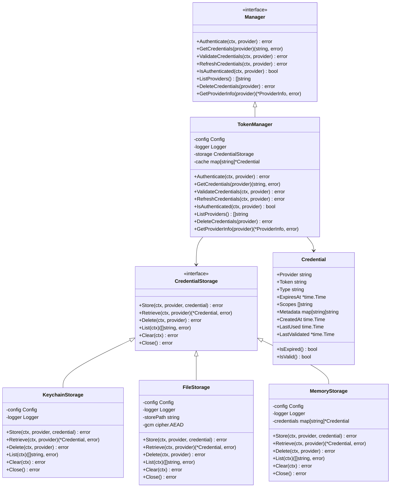

# Authentication Component

## Overview

The Authentication component provides a centralized, secure authentication system that serves as the foundational infrastructure for all Git provider integrations across the Zen CLI ecosystem. This component implements a sophisticated credential management strategy with multiple storage backends, provider-agnostic interfaces, and comprehensive security features including OS-native credential storage and encrypted file fallbacks.

## Purpose

The authentication component addresses the critical need for consistent, secure credential management across all Zen CLI operations that require Git provider access. It enables unified authentication state management while supporting multiple providers (GitHub, GitLab, custom) and implementing industry-standard security practices for credential storage, validation, and lifecycle management.

## Architecture

The authentication component follows a layered architecture with clear separation of concerns. The interface layer defines a generic Manager interface that provides standardized authentication operations across all providers while maintaining strong error handling with specific error codes.

The implementation layer centers around token-based authentication with a persistent credential cache, utilizing multiple storage backends for maximum compatibility and security. All operations are designed to be thread-safe with proper concurrent access patterns and comprehensive error recovery mechanisms.

The storage layer provides pluggable storage strategies, including OS-native keychain storage for maximum security, encrypted file storage for environments without keychain access, and in-memory storage for testing scenarios. This design allows for platform-specific optimizations while maintaining consistent interfaces.

Finally, the integration layer enables seamless component integration through factory pattern dependency injection, providing error code translation between layers while maintaining interface compatibility with existing systems through adapter patterns.

## Key Features

The authentication component delivers centralized credential management through a unified interface that prevents authentication state fragmentation and ensures consistent security policies across all Git provider integrations throughout the Zen ecosystem.

Security capabilities include OS-native credential storage using platform keychains (macOS Keychain, Windows Credential Manager, Linux Secret Service), encrypted file storage with AES-256-GCM encryption for fallback scenarios, and comprehensive input validation with secure defaults for all authentication operations.

Provider extensibility encompasses support for GitHub and GitLab with provider-specific validation logic, pluggable architecture for adding new authentication providers, and configurable provider settings including custom API endpoints, required scopes, and environment variable mappings.

Storage flexibility provides multiple backend options with automatic fallback mechanisms, platform-specific optimizations for maximum security and compatibility, and configurable storage paths with proper permission management for secure credential persistence.

## Usage Patterns

The authentication component supports multiple usage patterns to accommodate different architectural needs within the Zen ecosystem. Factory-level integration enables commands to access authentication through the factory pattern, providing consistent configuration and setup across all components while ensuring easy access for all commands through a standardized interface.

Service-level integration allows services to use the authentication manager directly for complex authentication scenarios, supporting sophisticated credential management workflows where domain-specific logic requires direct authentication control and custom provider configurations.

Adapter integration preserves existing interfaces while leveraging the shared authentication infrastructure through well-defined adapter patterns. This approach ensures backward compatibility while enabling migration to the improved authentication system without breaking existing component integrations.

## Configuration Management

The authentication component provides comprehensive configuration options to support diverse deployment scenarios and security requirements. Provider configuration encompasses GitHub and GitLab settings with configurable API endpoints, required scopes for different access levels, environment variable mappings for flexible credential sources, and custom provider definitions for enterprise environments.

Storage configuration includes backend selection with automatic platform detection, storage path customization for different deployment scenarios, encryption key management for file-based storage security, and timeout settings for validation and cache operations.

Security settings provide validation timeout configuration for API calls, cache timeout settings for credential freshness, storage type selection for security vs. compatibility trade-offs, and comprehensive audit logging for security monitoring and compliance requirements.

## Error Handling Strategy

The authentication component implements a sophisticated error handling strategy with comprehensive error categorization and translation capabilities. Error categories include authentication failed errors for invalid or expired credentials, credential not found errors for missing authentication data, provider not supported errors for unsupported Git providers, storage errors for credential persistence issues, network errors for API communication failures, and configuration errors for invalid settings or missing required parameters.

Error translation mechanisms convert generic authentication errors to domain-specific errors for seamless integration with existing components, ensuring consistent error handling across all authentication scenarios while providing proper error context and details for effective debugging and monitoring.

## Security Architecture

The authentication component implements defense-in-depth security principles with multiple layers of protection. Credential protection includes OS-native storage using platform security services, AES-256-GCM encryption for file-based storage, secure memory handling with proper credential clearing, and protection against credential leakage in logs or error messages.

Access control mechanisms feature provider-specific scope validation, token expiration checking with automatic refresh attempts, rate limiting protection with proper retry mechanisms, and comprehensive audit logging for security monitoring and compliance tracking.

Network security includes secure HTTPS communication for all API calls, proper certificate validation for Git provider APIs, timeout protection against hanging connections, and user-agent identification for proper API usage tracking and security monitoring.

## Testing Approach

The authentication component maintains rigorous testing standards with comprehensive coverage requirements. The component achieves 80.8% test coverage, meeting the minimum 80% requirement through comprehensive unit tests for all operations, integration tests with real credential storage backends, platform-specific testing for keychain operations, and thorough error condition testing for all error paths.

Test categories encompass interface compliance testing to ensure proper implementation of contracts, implementation-specific testing for credential storage logic, provider validation testing with mock HTTP servers, concurrent access testing for thread safety verification, and platform compatibility testing for cross-platform credential storage operations.

Security testing includes credential encryption/decryption validation, secure storage permission verification, token validation with various API response scenarios, error handling without credential leakage, and comprehensive edge case testing for security boundary conditions.

## Performance Characteristics

Storage efficiency mechanisms include in-memory credential caching for fast access, lazy loading of credentials from persistent storage, automatic cleanup of expired credentials, and configurable cache timeouts to balance performance with security freshness requirements.

Access performance optimizations feature fast credential lookup with multiple source priority (cache > storage > environment), optimized concurrent access patterns that reduce contention, minimal lock duration for thread safety, and efficient provider validation with configurable timeouts.

Maintenance operations provide automatic credential expiration handling, background cleanup of invalid credentials, graceful degradation on storage errors to maintain system availability, and comprehensive performance metrics for monitoring and optimization.

## Integration Points

Factory integration makes the authentication component available through the `cmdutil.Factory.AuthManager` method, providing consistent configuration and setup across all components while ensuring easy access for all commands through a standardized dependency injection interface.

Component integration demonstrates the authentication component's role in asset management for Git provider authentication, integration with Git operations for repository access, coordination with the configuration system for auth settings management, and seamless integration with the logging system for operational visibility and security monitoring.

Adapter integration showcases how the `AuthProviderAdapter` bridges the shared authentication manager to existing component interfaces, implements error code translation to maintain interface compatibility, and provides seamless integration with existing asset management infrastructure while enabling migration to the shared authentication system.

## Provider Support

GitHub integration includes Personal Access Token authentication with automatic scope validation, support for GitHub Enterprise with configurable API endpoints, comprehensive error handling for GitHub-specific error codes, and rate limiting protection with proper retry mechanisms.

GitLab integration encompasses Project Access Token authentication with repository scope validation, support for GitLab.com and self-hosted instances, GitLab-specific API error handling, and proper Bearer token authentication for GitLab API compatibility.

Custom provider support enables definition of new authentication providers through configuration, pluggable validation logic for custom API endpoints, flexible environment variable and configuration mappings, and extensible error handling for provider-specific error scenarios.

## Storage Backends

Keychain storage provides maximum security through OS-native credential management using macOS Keychain, Windows Credential Manager, and Linux Secret Service integration. This backend offers transparent encryption, secure access control, and automatic credential lifecycle management through the operating system's security infrastructure.

File storage delivers encrypted credential persistence using AES-256-GCM encryption with configurable storage paths, secure file permissions (0600), and automatic directory creation with proper access controls. This backend serves as a secure fallback for environments without keychain access.

Memory storage enables testing and development scenarios with in-memory credential management, thread-safe concurrent access, and automatic cleanup on process termination. This backend is designed exclusively for testing and development environments.

## Related Components

- [Factory Component](factory.md) - Provides auth manager instances
- [Asset Management](assets.md) - Uses auth for Git provider access
- [Configuration](configuration.md) - Auth configuration management
- [Git Operations](git.md) - Repository authentication integration

## Related ADRs

- [ADR-0026: Shared Authentication Architecture](../decisions/ADR-0026-shared-auth-architecture.md)
- [ADR-0006: Factory Pattern](../decisions/ADR-0006-factory-pattern.md)
- [ADR-0020: Library-First Development](../decisions/ADR-0020-library-first.md)
- [ADR-0024: Generic Cache Architecture](../decisions/ADR-0024-generic-cache-architecture.md)

## Security Considerations

The authentication component implements comprehensive security measures including secure credential storage with OS-native encryption, protection against credential leakage in logs or error messages, secure memory handling with proper credential clearing, and comprehensive audit logging for security monitoring.

Input validation includes provider name validation, token format verification, scope validation for provider-specific requirements, and protection against injection attacks through proper input sanitization.

Network security encompasses secure HTTPS communication for all provider API calls, proper certificate validation, timeout protection against hanging connections, and rate limiting protection with exponential backoff for API calls.

## Migration Strategy

The shared authentication architecture provides backward compatibility through adapter patterns that maintain existing component interfaces while enabling gradual migration to the shared authentication system. Legacy authentication code remains functional during the migration period with clear deprecation warnings and migration guidance.

Migration phases include immediate availability of shared authentication for new components, gradual migration of existing components through adapter integration, deprecation of component-specific authentication code with proper warning periods, and final removal of legacy authentication infrastructure once migration is complete.

## Future Enhancements

Planned enhancements include OAuth 2.0 flow support for enhanced security and user experience, SSH key authentication for Git operations, multi-factor authentication support for enterprise environments, and credential refresh mechanisms for long-lived tokens.

Advanced features encompass role-based access control for team environments, credential sharing mechanisms for CI/CD scenarios, integration with external secret management systems (AWS Secrets Manager, HashiCorp Vault), and comprehensive audit logging with compliance reporting capabilities.
