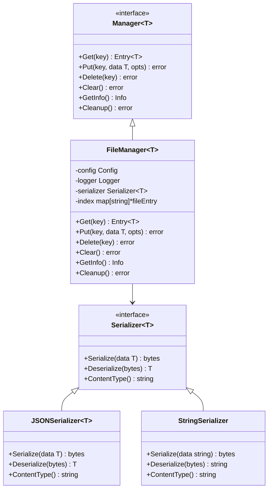

# Cache Component

## Overview

The Cache component provides a type-safe, file-based caching system that serves as foundational infrastructure for all Zen components. This component implements a sophisticated persistent storage strategy with LRU eviction policies, TTL-based expiration, and thread-safe concurrent access patterns.

## Purpose

The cache component addresses the critical need for consistent, high-performance data caching across the entire Zen CLI ecosystem. It enables type-safe caching using Go generics while supporting pluggable serialization strategies and implementing efficient file-based storage with automatic cleanup mechanisms.

## Architecture

The cache component follows a layered architecture with clear separation of concerns. The interface layer defines a generic Manager interface with type parameters, providing standardized operations across all cache implementations while maintaining strong error handling with specific error codes.

The implementation layer centers around file-based storage with a persistent index, utilizing an LRU eviction policy for memory management and TTL-based expiration for ensuring data freshness. All operations are designed to be thread-safe with proper concurrent access patterns.

The serialization layer provides pluggable serialization strategies, including JSON serialization for complex types and string serialization for text data. This design allows for extensibility when custom serialization needs arise.

Finally, the adapter layer enables domain-specific adapters for seamless integration, providing error code translation between layers while maintaining interface compatibility with existing systems.

## Key Features

The cache component delivers type safety through Go generics, providing compile-time type checking that prevents runtime type errors and enables safe reuse across different data types throughout the Zen ecosystem.

Storage management capabilities include persistent file-based storage with automatic index management, configurable size limits with LRU eviction, and TTL-based expiration policies that ensure optimal resource utilization.

Concurrency support encompasses thread-safe operations with proper locking mechanisms, comprehensive race condition prevention, and optimized concurrent access patterns that maintain performance under load.

Integration capabilities provide factory pattern integration for easy access across all commands, adapter pattern support for domain-specific interfaces, and sophisticated error translation for consistent error handling throughout the system.

## Usage Patterns

The cache component supports multiple usage patterns to accommodate different architectural needs within the Zen ecosystem. Command-level caching enables commands to access simple string caching through the factory pattern, providing efficient temporary data storage without complex setup requirements.

Service-level caching allows services to create specialized cache managers for complex domain objects with appropriate serialization strategies. This pattern supports sophisticated caching scenarios where domain-specific logic and data structures require specialized handling.

Adapter integration preserves existing interfaces while leveraging the generic cache infrastructure through well-defined adapter patterns. This approach ensures backward compatibility while enabling migration to the improved caching infrastructure.

## Configuration Management

The cache component provides comprehensive configuration options to support diverse deployment scenarios and performance requirements. Storage configuration encompasses base path specification for cache storage, configurable size limits with automatic eviction policies, and TTL settings for data expiration management.

Performance tuning options include cleanup intervals for maintenance operations, compression options for storage efficiency optimization, and concurrent access optimization parameters that ensure optimal performance under varying load conditions.

## Error Handling Strategy

The cache component implements a sophisticated error handling strategy with comprehensive error categorization and translation capabilities. Error categories include not found errors for missing cache entries, invalid key errors for malformed keys, storage errors for filesystem issues, corruption errors for data integrity problems, permission errors for access issues, and serialization errors for data format problems.

Error translation mechanisms convert generic cache errors to domain-specific errors, ensuring consistent error handling across all components while providing proper error context and details for effective debugging and monitoring.

## Testing Approach

The cache component maintains rigorous testing standards with comprehensive coverage requirements. The component achieves 85.9% test coverage, exceeding the minimum 80% requirement through comprehensive unit tests for all operations, integration tests with filesystem interactions, and thorough error condition testing for all error paths.

Test categories encompass interface compliance testing to ensure proper implementation of contracts, implementation-specific testing for file-based storage logic, serialization strategy testing for data conversion accuracy, adapter pattern testing for integration scenarios, and performance and concurrency testing to validate thread safety and performance characteristics.

## Performance Characteristics

Storage efficiency mechanisms include LRU eviction policies that prevent unbounded growth, TTL expiration that removes stale data automatically, configurable size limits that adapt to deployment constraints, and efficient file-based persistence that balances performance with durability.

Access performance optimizations feature fast in-memory indexing for metadata operations, lazy loading of cache content to minimize memory usage, optimized concurrent access patterns that reduce contention, and minimal lock contention through careful synchronization design.

Maintenance operations provide automatic cleanup of expired entries, background maintenance scheduling that minimizes performance impact, and graceful degradation on storage errors to maintain system stability.

## Integration Points

Factory integration makes the cache component available through the cmdutil.Factory.Cache method, providing consistent configuration and setup across all components while ensuring easy access for all commands through a standardized interface.

Service integration demonstrates the cache component's role in asset management for content caching, integration with the configuration system for cache settings management, and coordination with the logging system for operational visibility and monitoring.

Adapter integration showcases how the AssetCacheManager adapts the generic cache for asset-specific requirements, implements error code translation to maintain interface compatibility, and provides seamless integration with existing asset management infrastructure.

## Related Components

- [Factory Component](factory.md) - Provides cache instances
- [Asset Management](assets.md) - Uses cache for asset storage
- [Configuration](configuration.md) - Cache configuration management

## Related ADRs

- [ADR-0024: File-Based Cache Architecture](../decisions/ADR-0024-generic-cache-architecture.md)
- [ADR-0006: Factory Pattern](../decisions/ADR-0006-factory-pattern.md)
- [ADR-0020: Library-First Development](../decisions/ADR-0020-library-first.md)
