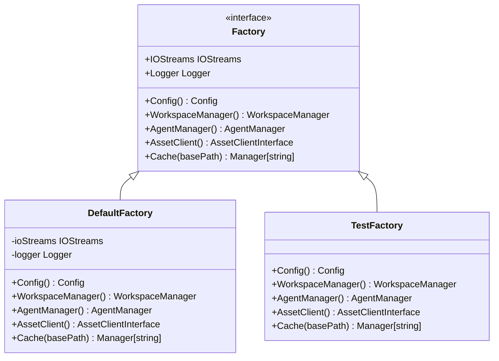

# Factory Component

## Overview

The Factory component serves as the central dependency injection mechanism for the Zen CLI architecture. It provides a standardized approach to dependency management, ensuring consistent initialization patterns and enabling comprehensive testing through mock implementations.

## Purpose

The Factory component addresses the critical architectural need for loose coupling between CLI commands and core services. It eliminates direct service instantiation within commands, provides lazy initialization for optimal performance, and enables comprehensive testing through dependency injection patterns.

## Architecture

The Factory component implements a sophisticated dependency injection pattern with clear separation between production and testing implementations. The DefaultFactory manages real service instances with proper initialization chains, while the TestFactory provides mock implementations for comprehensive testing scenarios.

## Dependency Chain Management

The Factory component manages a carefully orchestrated dependency chain where order of initialization matters significantly. Configuration services initialize first as they have no dependencies, followed by IOStreams and Logger services that depend on configuration. Subsequently, higher-level services like WorkspaceManager, AgentManager, and AssetClient initialize with dependencies on configuration and logging infrastructure.

This hierarchical initialization ensures that all dependencies are properly established before services that require them attempt to initialize, preventing circular dependencies and ensuring predictable startup behavior.

## Lazy Initialization Strategy

The Factory component employs lazy initialization patterns to optimize performance and resource utilization. Services are not instantiated until first accessed, allowing for faster application startup and reduced memory footprint for unused services.

This approach enables the factory to provide comprehensive service access while maintaining efficient resource management, particularly important for CLI applications where not all services may be required for every command execution.

## Testing Infrastructure

The Factory component provides sophisticated testing infrastructure through the TestFactory implementation. This specialized factory provides mock implementations of all services, enabling comprehensive unit testing without external dependencies or complex setup requirements.

The testing infrastructure includes configurable mock behaviors, allowing tests to simulate various success and failure scenarios. This capability ensures that command logic can be thoroughly tested in isolation from external service dependencies.

## Interface Abstractions

The Factory component defines and manages key interface abstractions that enable loose coupling throughout the Zen architecture. WorkspaceManager abstractions handle workspace initialization and status operations, AgentManager abstractions manage AI agent operations, and AssetClient abstractions provide asset management capabilities.

These interface abstractions enable the factory to provide consistent service access while allowing for different implementations in production and testing scenarios. The abstraction layer also facilitates future extensibility and service replacement without affecting command implementations.

## Error Handling Integration

The Factory component integrates comprehensive error handling patterns throughout the dependency injection process. Configuration loading errors are properly propagated and contextualized, service initialization failures are handled gracefully with appropriate error wrapping, and resource cleanup is managed consistently across all service types.

This error handling integration ensures that command implementations receive clear, actionable error information when dependency injection fails, enabling appropriate error responses and user feedback.

## Related Components

- [Cache Component](cache.md) - Provided through factory cache method
- [Configuration Component](configuration.md) - Manages factory configuration
- [Command Architecture](../patterns/design-patterns.md#command-architecture-pattern) - Uses factory for dependency injection

## Related ADRs

- [ADR-0006: Factory Pattern](../decisions/ADR-0006-factory-pattern.md)
- [ADR-0003: Project Structure](../decisions/ADR-0003-project-structure.md)
- [ADR-0024: Generic Cache Architecture](../decisions/ADR-0024-generic-cache-architecture.md)
