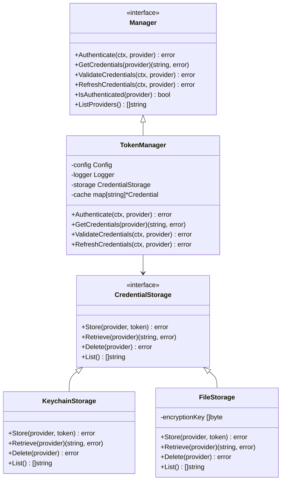

# ADR-0026: Shared Authentication Architecture

## Status
Proposed

## Context

During UAT testing of asset commands, we discovered critical authentication integration issues:

1. **Authentication Disconnect**: `zen assets auth github` successfully stores credentials, but `zen assets status` and `zen assets sync` report "not authenticated"
2. **Component Isolation**: Each component (assets, future Git operations) creates its own `TokenAuthProvider` instance
3. **No Credential Sharing**: Authentication state is not shared between commands/sessions
4. **Inconsistent Auth State**: Auth commands succeed but other commands can't access stored credentials

The current architecture has authentication scattered across components rather than being a shared, centralized service.

## Decision

Move authentication to a shared `pkg/auth/` package following the same architectural patterns as `pkg/cache/`.

### Architecture



### Package Structure

```
pkg/auth/
├── auth.go           # Manager interface and core types
├── token.go          # TokenManager implementation
├── storage.go        # CredentialStorage interface
├── keychain.go       # OS keychain storage (macOS/Windows/Linux)
├── file.go           # Encrypted file storage fallback
├── providers.go      # Provider-specific validation logic
├── config.go         # Configuration types
├── errors.go         # Authentication error types
└── *_test.go         # Comprehensive tests
```

### Factory Integration

```go
// In pkg/cmd/factory/default.go
func authFunc(f *cmdutil.Factory) func() (auth.Manager, error) {
    var cachedAuth auth.Manager
    var authError error
    
    return func() (auth.Manager, error) {
        if cachedAuth != nil || authError != nil {
            return cachedAuth, authError
        }
        
        cfg, err := f.Config()
        if err != nil {
            authError = err
            return nil, authError
        }
        
        // Create auth manager with proper storage
        authConfig := getAuthConfig(cfg)
        storage := auth.NewKeychainStorage(authConfig, f.Logger)
        cachedAuth = auth.NewTokenManager(authConfig, f.Logger, storage)
        
        return cachedAuth, nil
    }
}
```

### Component Integration

```go
// Assets client uses shared auth
func assetClientFunc(f *cmdutil.Factory) func() (assets.AssetClientInterface, error) {
    return func() (assets.AssetClientInterface, error) {
        // Get shared auth manager from factory
        authManager, err := f.AuthManager()
        if err != nil {
            return nil, err
        }
        
        // Create asset client with shared auth
        return assets.NewClient(config, logger, authManager, cache, gitRepo, parser)
    }
}
```

## Benefits

### 1. **Centralized Authentication State**
- Single source of truth for all authentication
- Consistent auth state across all commands
- Proper credential caching and session management

### 2. **Secure Credential Storage**
- OS-native credential storage (Keychain, Credential Manager, Secret Service)
- Encrypted file storage fallback for environments without keychain access
- Proper credential lifecycle management

### 3. **Factory Pattern Integration**
- Follows established patterns from cache component
- Lazy initialization with proper error handling
- Dependency injection for testability

### 4. **Provider Extensibility**
- Support for GitHub, GitLab, and custom providers
- Pluggable validation strategies per provider
- Easy addition of new authentication methods (OAuth, SSH keys, etc.)

### 5. **Enhanced Security**
- Credential encryption at rest
- Secure credential retrieval with proper error handling
- Audit logging for authentication events

### 6. **Testing & Debugging**
- Mock storage for unit tests
- Comprehensive error reporting
- Debug modes for troubleshooting auth issues

## Implementation Plan

### Phase 1: Core Infrastructure
1. Create `pkg/auth/` package structure
2. Implement `Manager` interface and `TokenManager`
3. Add keychain storage for macOS/Windows/Linux
4. Implement encrypted file storage fallback

### Phase 2: Factory Integration
1. Add `AuthManager()` method to `cmdutil.Factory`
2. Update factory to provide shared auth instance
3. Add configuration support for auth settings

### Phase 3: Component Migration
1. Update assets package to use shared auth
2. Migrate existing `TokenAuthProvider` logic
3. Update all asset commands to use factory auth

### Phase 4: Enhanced Features
1. Add provider-specific configuration
2. Implement credential refresh mechanisms
3. Add authentication status reporting
4. Enhanced error handling and logging

## Migration Strategy

### Backward Compatibility
- Keep existing `assets.TokenAuthProvider` as deprecated wrapper
- Gradual migration of components to shared auth
- Clear deprecation warnings and migration path

### Testing Strategy
- Comprehensive unit tests for all auth components
- Integration tests with real credential storage
- Mock storage for automated testing
- UAT validation of all authentication flows

## Related ADRs

- [ADR-0024: Generic Cache Architecture](ADR-0024-generic-cache-architecture.md) - Similar shared component pattern
- [ADR-0006: Factory Pattern](ADR-0006-factory-pattern.md) - Dependency injection approach
- [ADR-0020: Library-First Development](ADR-0020-library-first.md) - Use established auth libraries

## Consequences

### Positive
- Resolves authentication disconnect issues discovered in UAT
- Provides secure, centralized credential management
- Enables consistent authentication across all components
- Follows established architectural patterns
- Improves testability and debugging

### Negative
- Requires refactoring existing authentication code
- Additional complexity in factory setup
- Need to handle multiple credential storage backends
- Migration effort for existing components

### Neutral
- Maintains compatibility with existing credential sources (env vars, config)
- Follows security best practices for credential management
- Aligns with industry standards for CLI authentication
