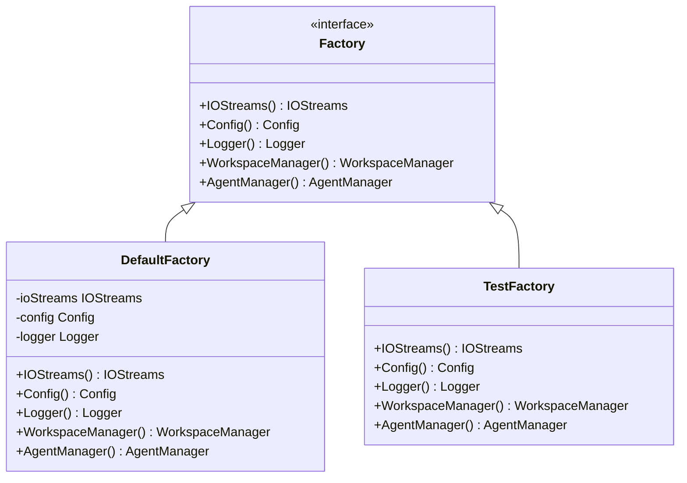
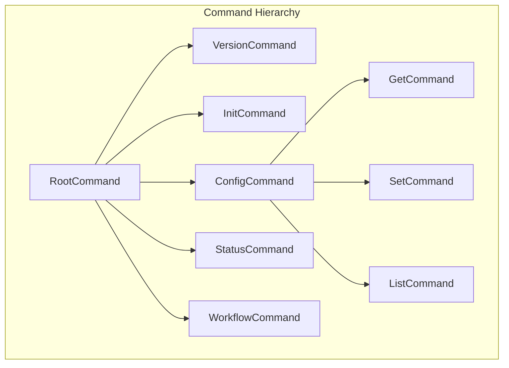
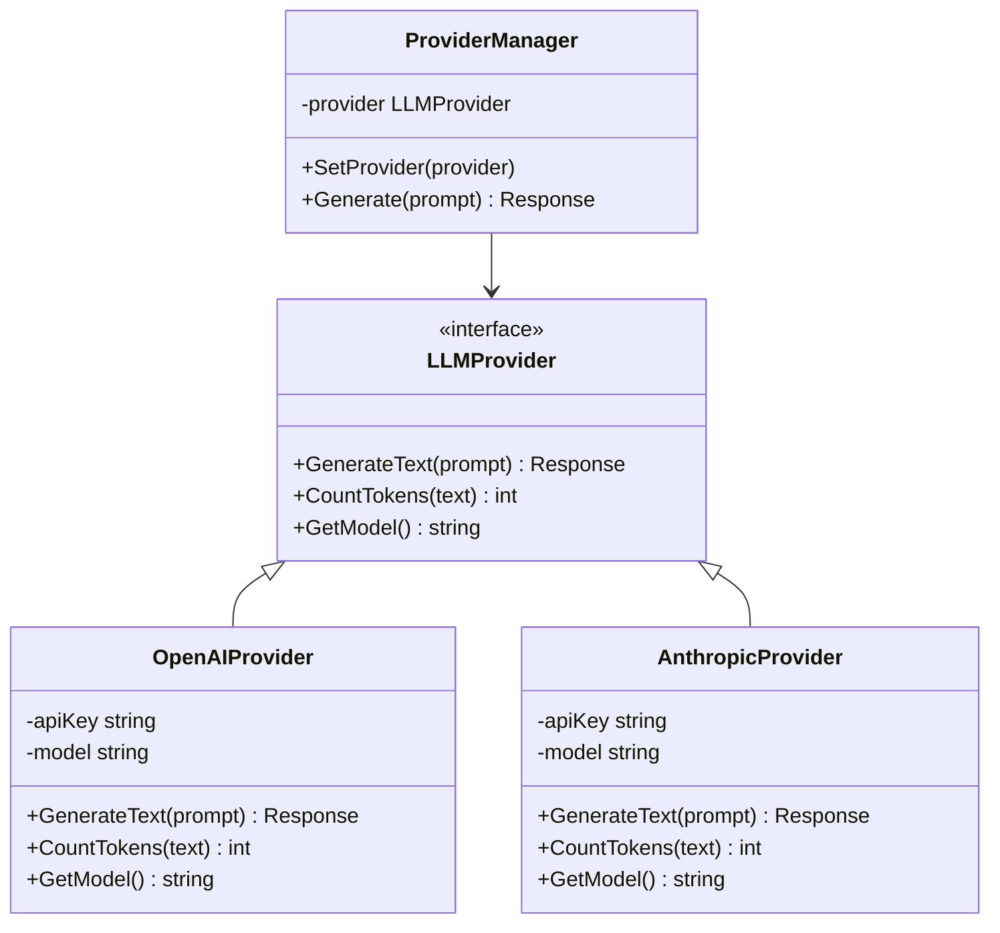
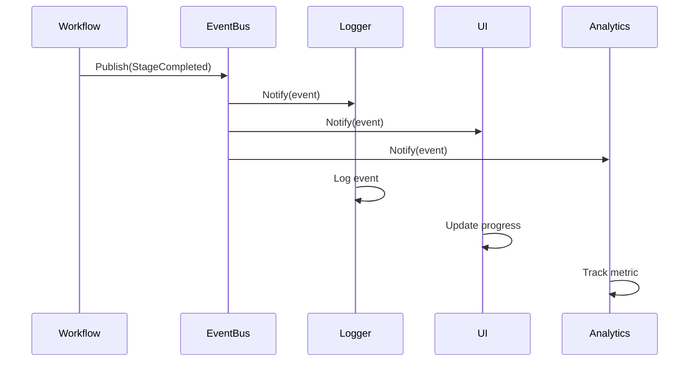
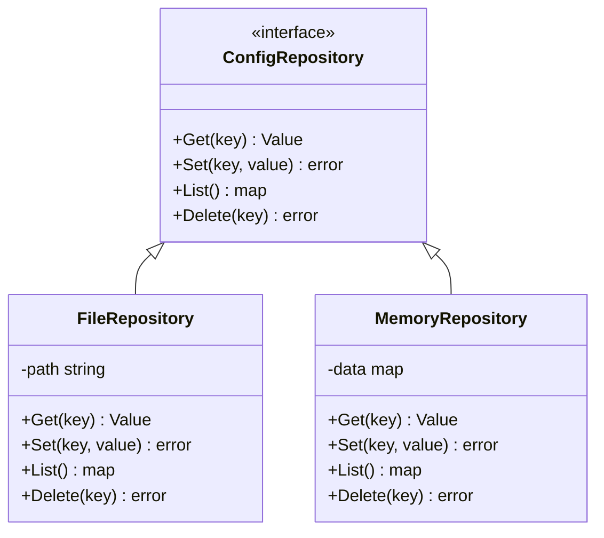
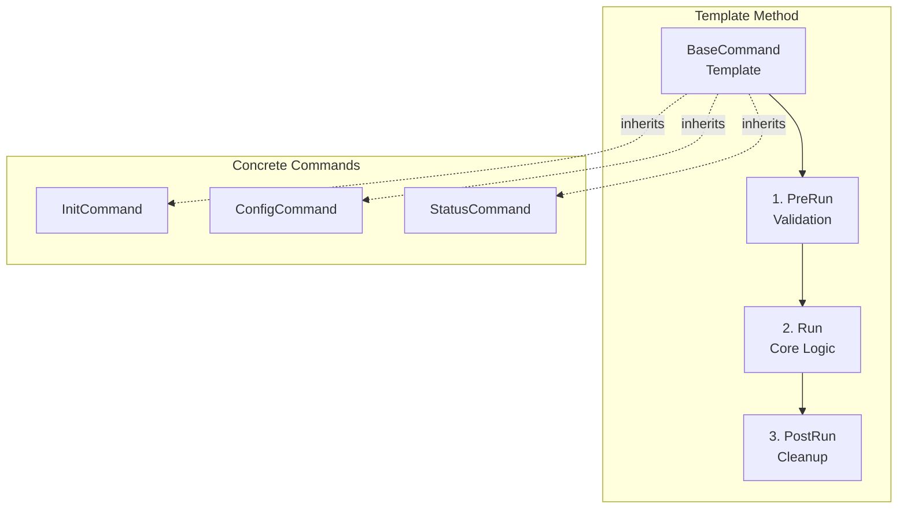
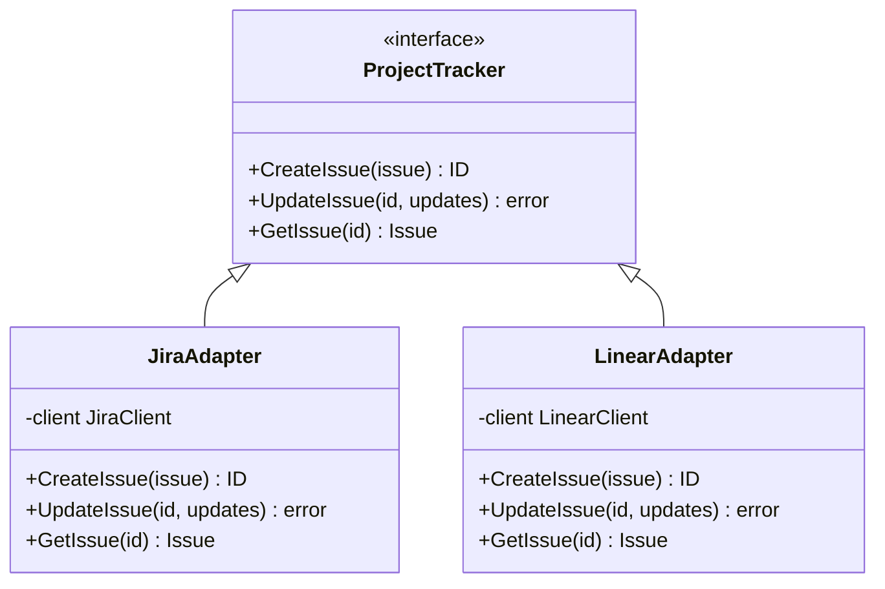
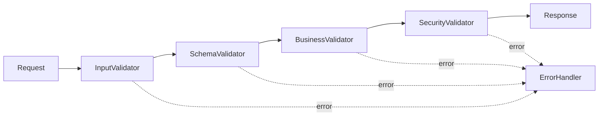

# Design Patterns

## Overview

Zen CLI employs several well-established design patterns to ensure maintainability, testability, and extensibility. This document details the key patterns used throughout the codebase and their specific implementations.

## Core Design Patterns

### 1. Factory Pattern

The Factory Pattern is central to Zen's dependency injection and component initialization strategy.



**Implementation Example:**
```go
// pkg/cmd/factory/default.go
func New() *cmdutil.Factory {
    f := &cmdutil.Factory{
        AppVersion: getVersion(),
        ExecutableName: "zen",
    }
    
    // Lazy initialization functions
    f.Config = configFunc()
    f.IOStreams = ioStreams(f)
    f.Logger = loggerFunc(f)
    f.WorkspaceManager = workspaceFunc(f)
    f.AgentManager = agentFunc(f)
    
    return f
}
```

**Benefits:**
- Centralized dependency management
- Lazy initialization for performance
- Easy mocking for testing
- Clean separation of concerns

### 2. Command Pattern

Cobra CLI framework naturally implements the Command Pattern for organizing CLI operations.



**Implementation:**
```go
// Each command encapsulates its operation
type InitCommand struct {
    Factory cmdutil.Factory
    IO      *iostreams.IOStreams
}

func (c *InitCommand) Execute(args []string) error {
    // Command-specific logic
    return c.initializeWorkspace()
}
```

### 3. Strategy Pattern

Used extensively for LLM provider abstraction and algorithm selection.



**Use Cases:**
- LLM provider selection
- Output format strategies (text, JSON, YAML)
- Prioritization algorithms
- Template rendering strategies

### 4. Observer Pattern

Implemented for event-driven workflows and progress monitoring.



**Implementation:**
```go
type EventBus struct {
    subscribers []EventSubscriber
}

type EventSubscriber interface {
    OnEvent(event Event)
}

func (eb *EventBus) Publish(event Event) {
    for _, subscriber := range eb.subscribers {
        go subscriber.OnEvent(event)
    }
}
```

### 5. Repository Pattern

Abstracts data access for configuration and state management.



### 6. Template Method Pattern

Used in command structure for common initialization and cleanup.



### 7. Singleton Pattern

Used sparingly for global configuration and logger instances.

```go
var (
    instance *Config
    once     sync.Once
)

func GetConfig() *Config {
    once.Do(func() {
        instance = loadConfig()
    })
    return instance
}
```

### 8. Builder Pattern

Applied for complex object construction, especially in test fixtures.

```go
type WorkflowBuilder struct {
    workflow *Workflow
}

func NewWorkflowBuilder() *WorkflowBuilder {
    return &WorkflowBuilder{
        workflow: &Workflow{},
    }
}

func (b *WorkflowBuilder) WithName(name string) *WorkflowBuilder {
    b.workflow.Name = name
    return b
}

func (b *WorkflowBuilder) WithStages(stages []Stage) *WorkflowBuilder {
    b.workflow.Stages = stages
    return b
}

func (b *WorkflowBuilder) Build() *Workflow {
    return b.workflow
}
```

### 9. Adapter Pattern

Used for integrating external services with different APIs.



### 10. Chain of Responsibility

Implemented in the validation and error handling pipeline.



## Pattern Combinations

### Factory + Strategy
The Factory creates different strategy implementations based on configuration:

```go
func (f *Factory) AgentManager() (AgentManager, error) {
    config, _ := f.Config()
    
    // Select strategy based on configuration
    switch config.AIProvider {
    case "openai":
        return NewOpenAIManager(config.OpenAIKey), nil
    case "anthropic":
        return NewAnthropicManager(config.AnthropicKey), nil
    default:
        return NewDefaultManager(), nil
    }
}
```

### Command + Template Method
Commands follow a template structure with hooks:

```go
type Command struct {
    PreRunE  func(cmd *cobra.Command, args []string) error
    RunE     func(cmd *cobra.Command, args []string) error
    PostRunE func(cmd *cobra.Command, args []string) error
}
```

### Observer + Repository
State changes trigger events:

```go
func (r *WorkflowRepository) UpdateState(id string, state State) error {
    if err := r.save(id, state); err != nil {
        return err
    }
    
    r.eventBus.Publish(StateChangedEvent{
        WorkflowID: id,
        NewState:   state,
    })
    
    return nil
}
```

## Best Practices

### 1. Interface Segregation
Keep interfaces small and focused:

```go
// Good: Focused interfaces
type Reader interface {
    Read(key string) (Value, error)
}

type Writer interface {
    Write(key string, value Value) error
}

// Bad: Fat interface
type Storage interface {
    Read(key string) (Value, error)
    Write(key string, value Value) error
    Delete(key string) error
    List() ([]string, error)
    Backup() error
    Restore() error
}
```

### 2. Dependency Inversion
Depend on abstractions, not concretions:

```go
// Good: Depends on interface
type Service struct {
    logger Logger
    config ConfigReader
}

// Bad: Depends on concrete types
type Service struct {
    logger *logrus.Logger
    config *viper.Viper
}
```

### 3. Open-Closed Principle
Open for extension, closed for modification:

```go
// Extensible through interface implementation
type Plugin interface {
    Execute(context.Context) error
}

// New plugins can be added without modifying existing code
func RegisterPlugin(name string, plugin Plugin) {
    plugins[name] = plugin
}
```

## Anti-Patterns to Avoid

1. **God Object**: Avoid classes/structs that do too much
2. **Circular Dependencies**: Use interfaces to break cycles
3. **Premature Optimization**: Don't over-engineer patterns
4. **Pattern Overuse**: Not every problem needs a pattern
5. **Tight Coupling**: Use dependency injection and interfaces
