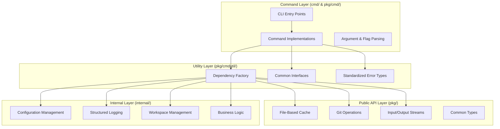

# Design Patterns

## Overview

Zen CLI employs several well-established design patterns to ensure maintainability, testability, and extensibility. This document details the overarching architectural patterns that govern the entire system structure and guide development decisions.

## System Architecture Pattern

Zen follows a layered architecture pattern with clear separation between command interface, utility services, and core business logic.

This layered architecture ensures clear separation of concerns where each layer has specific responsibilities and well-defined interfaces. The command layer handles user interaction and CLI concerns, the utility layer provides dependency injection and common abstractions, the public API layer offers reusable components, and the internal layer manages core business logic and system services.

## Dependency Injection Pattern

Zen employs a comprehensive dependency injection pattern centered around the Factory abstraction. This pattern eliminates direct service instantiation within commands, provides consistent dependency management across all components, and enables comprehensive testing through mock implementations.

The dependency injection pattern ensures that all commands receive their dependencies through a standardized factory interface, promoting loose coupling and enabling easy substitution of implementations for testing or different deployment scenarios.

## Type-Safe Infrastructure Pattern

Zen leverages Go generics to create reusable infrastructure components that maintain type safety while providing broad applicability across different use cases. This pattern enables the creation of type-safe file-based cache systems, strongly-typed error handling, and reusable utility functions that work across different data types.

The type-safe infrastructure pattern reduces code duplication, improves type safety, and enables consistent behavior across different components while maintaining the flexibility to handle diverse data types and use cases.

## Configuration Management Pattern

Zen implements a hierarchical configuration management pattern with multiple sources and validation layers. Configuration precedence follows CLI flags, environment variables, configuration files, and default values, ensuring predictable behavior while supporting diverse deployment scenarios.

The configuration management pattern provides centralized configuration with distributed access, comprehensive validation with clear error messages, and extensible configuration options that can be added without affecting existing functionality.

## Error Handling Pattern

Zen employs a standardized error handling pattern with typed errors, context preservation, and consistent error propagation throughout the system. This pattern ensures that errors contain sufficient context for debugging while providing clear, actionable error messages for users.

The error handling pattern includes error wrapping for context preservation, typed errors for programmatic handling, and standardized error codes that enable consistent error responses across all components.

## Testing Architecture Pattern

Zen implements a comprehensive testing architecture pattern with unit, integration, and end-to-end testing layers. The testing pattern leverages dependency injection for comprehensive mocking, provides test factories for consistent test setup, and maintains high coverage standards across all components.

The testing architecture pattern ensures that all components can be tested in isolation, integration scenarios are validated comprehensively, and the entire system behavior is verified through end-to-end testing scenarios.

## Plugin Architecture Pattern

Zen employs a plugin architecture pattern that enables extensibility while maintaining system stability and security. The plugin pattern provides well-defined interfaces for extensions, sandboxed execution environments, and standardized plugin lifecycle management.

The plugin architecture pattern ensures that the core system remains stable while enabling customization and extension through well-controlled interfaces and execution environments.

## Security Architecture Pattern

Zen implements a defense-in-depth security architecture pattern with multiple layers of security controls. This pattern includes input validation at all boundaries, secure credential management through platform keystores, and comprehensive audit logging for security-relevant operations.

The security architecture pattern ensures that security is considered at every layer of the system, from user input validation to external service communication, maintaining security posture throughout the entire application lifecycle.

## Integration Architecture Pattern

Zen employs a standardized integration architecture pattern for external system communication. This pattern includes adapter implementations for different external APIs, consistent error handling across all integrations, and standardized authentication and authorization mechanisms.

The integration architecture pattern ensures that external system integrations follow consistent patterns, maintain proper error handling, and provide reliable communication channels while abstracting integration complexity from core business logic.

## Best Practices

The Zen architecture emphasizes interface segregation with small, focused interfaces that serve specific purposes. Dependency inversion ensures that components depend on abstractions rather than concrete implementations, promoting flexibility and testability.

The open-closed principle guides extension mechanisms, allowing for system extension without modification of existing components. Clean separation of concerns ensures that each component has a single, well-defined responsibility.

Comprehensive error handling with context preservation enables effective debugging and monitoring. Consistent patterns across all components reduce cognitive load and improve maintainability.

## Anti-Patterns to Avoid

Zen architecture explicitly avoids several anti-patterns that can compromise system quality. God objects that attempt to handle too many responsibilities are prevented through careful interface design and separation of concerns.

Circular dependencies are avoided through proper interface abstractions and dependency ordering. Premature optimization is discouraged in favor of clear, maintainable code that can be optimized when performance requirements are clearly established.

Pattern overuse is avoided by applying patterns only when they provide clear value. Tight coupling is prevented through consistent use of dependency injection and interface abstractions.

Direct service instantiation within commands is prohibited in favor of factory-based dependency injection. Mixed concerns between CLI logic, business logic, and infrastructure are prevented through clear layering.

Hardcoded dependencies are avoided through comprehensive configuration management and dependency injection. Error context is always preserved through proper error wrapping and propagation.

## Related Documentation

- [Cache Component](../components/cache.md) - File-based caching infrastructure
- [Factory Component](../components/factory.md) - Dependency injection implementation
- [Configuration Component](../components/configuration.md) - Configuration management
- [ADR Register](../decisions/register.md) - Architectural decisions
