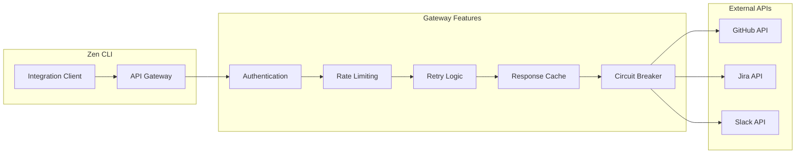
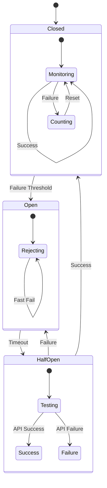
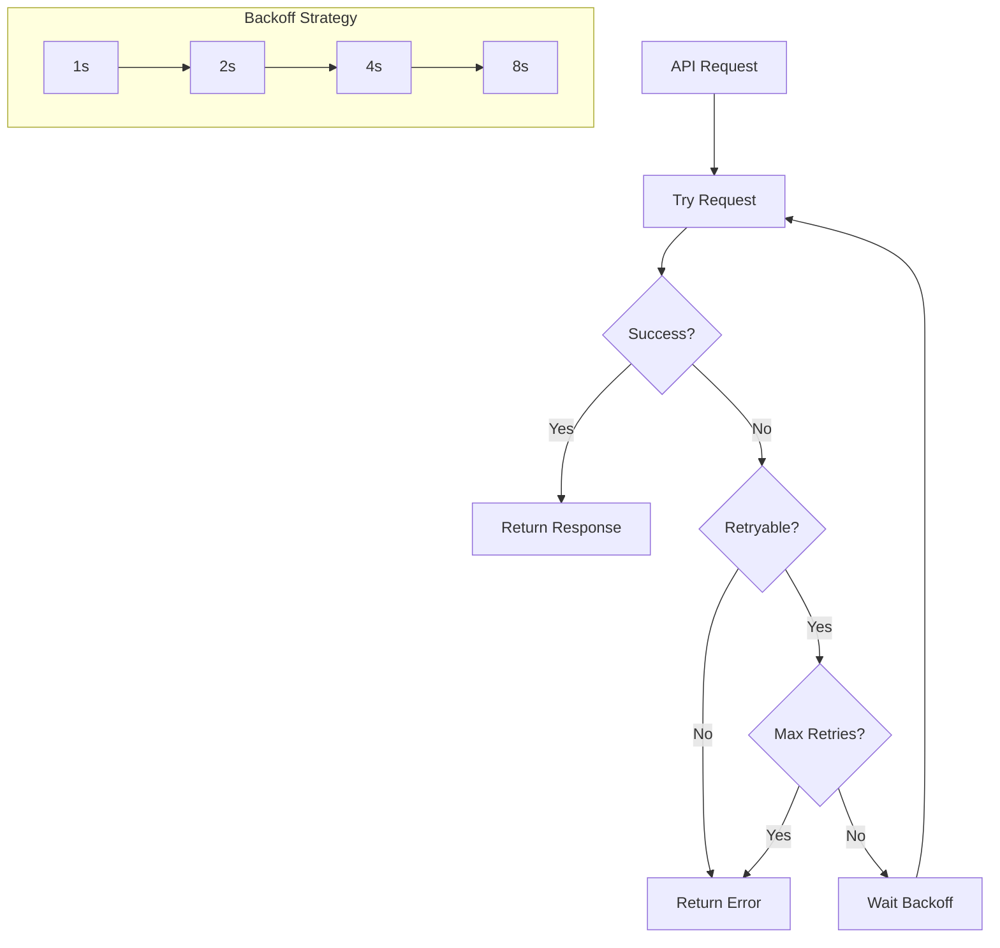
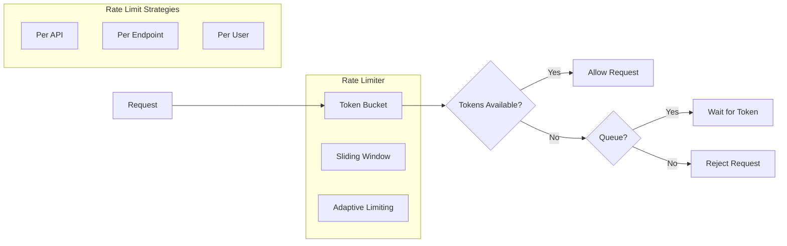
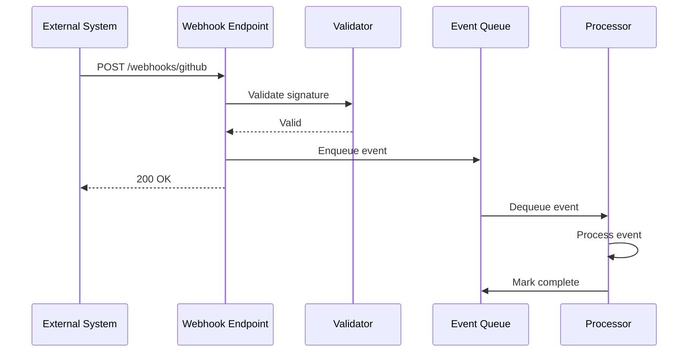
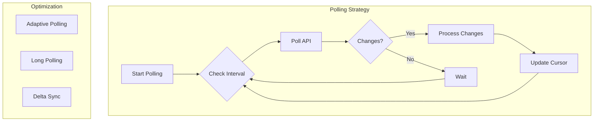
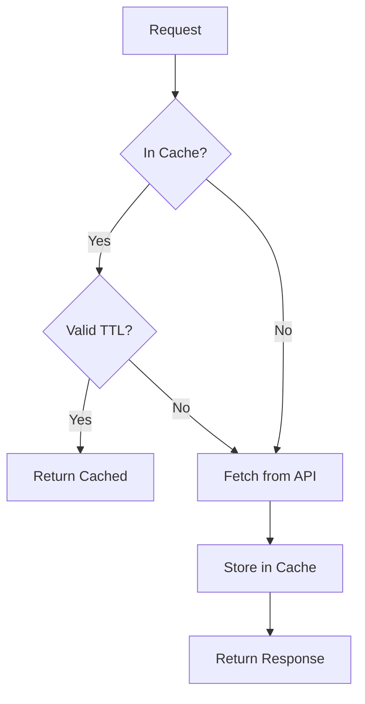
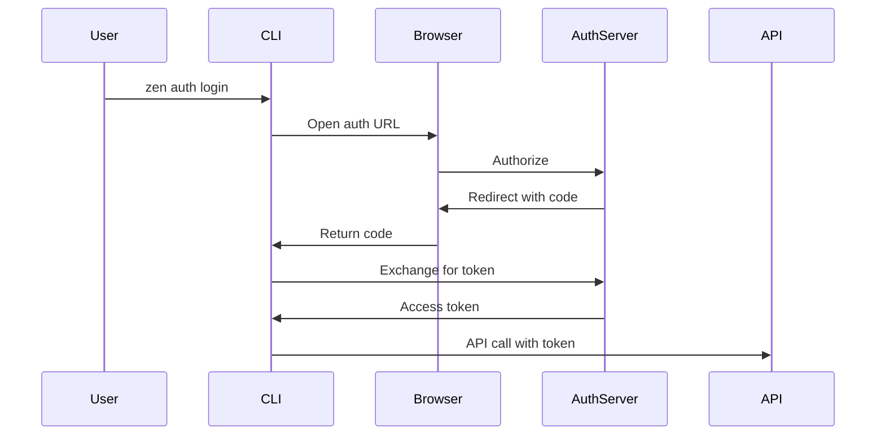

# Integration Patterns

## Overview

This document describes the patterns and strategies used for integrating Zen CLI with external systems, APIs, and services. These patterns ensure reliable, secure, and maintainable integrations.

## Core Integration Patterns

### 1. API Gateway Pattern

Centralized entry point for all external API calls with cross-cutting concerns.



**Implementation:**
```go
type APIGateway struct {
    rateLimiter *RateLimiter
    cache       *ResponseCache
    circuit     *CircuitBreaker
    retry       *RetryManager
}

func (g *APIGateway) Call(request Request) (Response, error) {
    // Apply cross-cutting concerns
    if err := g.rateLimiter.Check(request); err != nil {
        return nil, err
    }
    
    if cached := g.cache.Get(request); cached != nil {
        return cached, nil
    }
    
    response, err := g.circuit.Execute(func() (Response, error) {
        return g.retry.Execute(request)
    })
    
    if err == nil {
        g.cache.Set(request, response)
    }
    
    return response, err
}
```

### 2. Circuit Breaker Pattern

Prevents cascading failures when external services are unavailable.



**Configuration:**
```go
type CircuitBreaker struct {
    failureThreshold uint32
    successThreshold uint32
    timeout          time.Duration
    maxHalfOpen      uint32
}

// Per-service configuration
var breakers = map[string]*CircuitBreaker{
    "github": {
        failureThreshold: 5,
        successThreshold: 2,
        timeout:          30 * time.Second,
        maxHalfOpen:      3,
    },
    "jira": {
        failureThreshold: 3,
        successThreshold: 1,
        timeout:          60 * time.Second,
        maxHalfOpen:      1,
    },
}
```

### 3. Retry Pattern with Backoff

Intelligent retry logic with exponential backoff for transient failures.



**Implementation:**
```go
type RetryStrategy struct {
    MaxRetries  int
    InitialWait time.Duration
    MaxWait     time.Duration
    Multiplier  float64
    Jitter      float64
}

func (r *RetryStrategy) Execute(fn func() error) error {
    wait := r.InitialWait
    
    for i := 0; i <= r.MaxRetries; i++ {
        err := fn()
        if err == nil {
            return nil
        }
        
        if !isRetryable(err) {
            return err
        }
        
        if i < r.MaxRetries {
            jitter := time.Duration(rand.Float64() * r.Jitter * float64(wait))
            time.Sleep(wait + jitter)
            wait = time.Duration(float64(wait) * r.Multiplier)
            if wait > r.MaxWait {
                wait = r.MaxWait
            }
        }
    }
    
    return ErrMaxRetriesExceeded
}
```

### 4. Rate Limiting Pattern

Respect API rate limits and prevent quota exhaustion.



**Token Bucket Implementation:**
```go
type TokenBucket struct {
    capacity    int64
    tokens      int64
    refillRate  time.Duration
    lastRefill  time.Time
    mu          sync.Mutex
}

func (tb *TokenBucket) Allow() bool {
    tb.mu.Lock()
    defer tb.mu.Unlock()
    
    tb.refill()
    
    if tb.tokens > 0 {
        tb.tokens--
        return true
    }
    
    return false
}
```

### 5. Webhook Pattern

Asynchronous event handling from external systems.



### 6. Polling Pattern

For systems without webhook support.



### 7. Bulk Operation Pattern

Optimize API calls through batching.

```go
type BulkProcessor struct {
    batchSize    int
    flushInterval time.Duration
    buffer       []Request
}

func (bp *BulkProcessor) Add(request Request) {
    bp.buffer = append(bp.buffer, request)
    
    if len(bp.buffer) >= bp.batchSize {
        bp.flush()
    }
}

func (bp *BulkProcessor) flush() {
    if len(bp.buffer) == 0 {
        return
    }
    
    batch := bp.buffer
    bp.buffer = nil
    
    // Process batch
    bp.processBatch(batch)
}
```

### 8. Cache-Aside Pattern

Intelligent caching for external API responses.



**Cache Strategy:**
```go
type CacheEntry struct {
    Data      interface{}
    ExpiresAt time.Time
    ETag      string
}

type CacheStrategy struct {
    TTL           time.Duration
    MaxSize       int
    EvictionPolicy string // LRU, LFU, FIFO
}

// Different TTLs for different data types
var cacheConfigs = map[string]CacheStrategy{
    "user_info":     {TTL: 1 * time.Hour},
    "project_list":  {TTL: 5 * time.Minute},
    "issue_details": {TTL: 30 * time.Second},
}
```

### 9. Authentication Patterns

#### OAuth 2.0 Flow


#### API Key Management
```go
type CredentialStore interface {
    Store(service string, credential Credential) error
    Retrieve(service string) (Credential, error)
    Delete(service string) error
}

// Platform-specific implementations
type KeychainStore struct{}  // macOS
type CredManStore struct{}   // Windows
type SecretService struct{} // Linux
```

### 10. Error Recovery Patterns

#### Graceful Degradation
```go
func GetUserInfo(id string) (*User, error) {
    // Try primary source
    user, err := api.GetUser(id)
    if err == nil {
        return user, nil
    }
    
    // Fallback to cache
    if cached := cache.GetUser(id); cached != nil {
        log.Warn("Using cached user data due to API error")
        return cached, nil
    }
    
    // Fallback to local data
    if local := db.GetUser(id); local != nil {
        log.Warn("Using local user data due to API error")
        return local, nil
    }
    
    return nil, err
}
```

## Integration Testing Patterns

### Mock Service Pattern
```go
type MockGitHubAPI struct {
    mock.Mock
}

func (m *MockGitHubAPI) CreatePullRequest(pr PullRequest) (*PullRequest, error) {
    args := m.Called(pr)
    return args.Get(0).(*PullRequest), args.Error(1)
}
```

### Contract Testing
```go
func TestGitHubContract(t *testing.T) {
    // Test against contract, not implementation
    client := NewGitHubClient()
    
    // Verify contract
    assert.Implements(t, (*VersionControl)(nil), client)
    
    // Test contract behavior
    pr, err := client.CreatePullRequest(testPR)
    assert.NoError(t, err)
    assert.NotEmpty(t, pr.ID)
}
```

## Best Practices

1. **Idempotency**: Make operations idempotent where possible
2. **Pagination**: Always handle paginated responses
3. **Timeouts**: Set appropriate timeouts for all external calls
4. **Monitoring**: Log and metric all integration points
5. **Documentation**: Keep API documentation current
6. **Versioning**: Handle API version changes gracefully
7. **Testing**: Comprehensive integration tests with mocks
8. **Security**: Never log sensitive data (tokens, keys)
9. **Error Context**: Provide detailed error context
10. **Graceful Degradation**: Have fallback strategies
