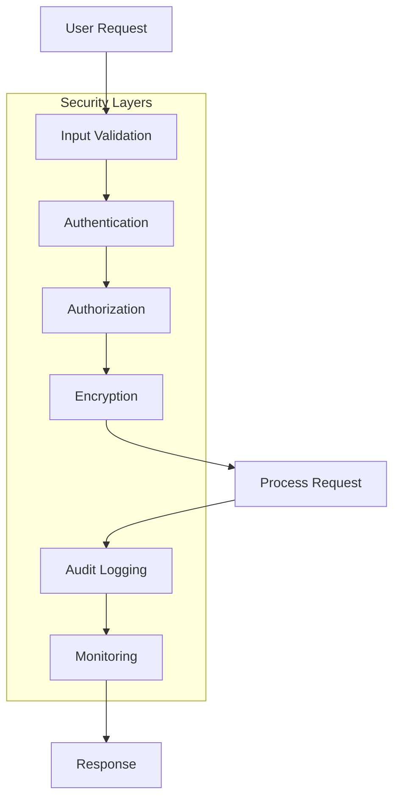
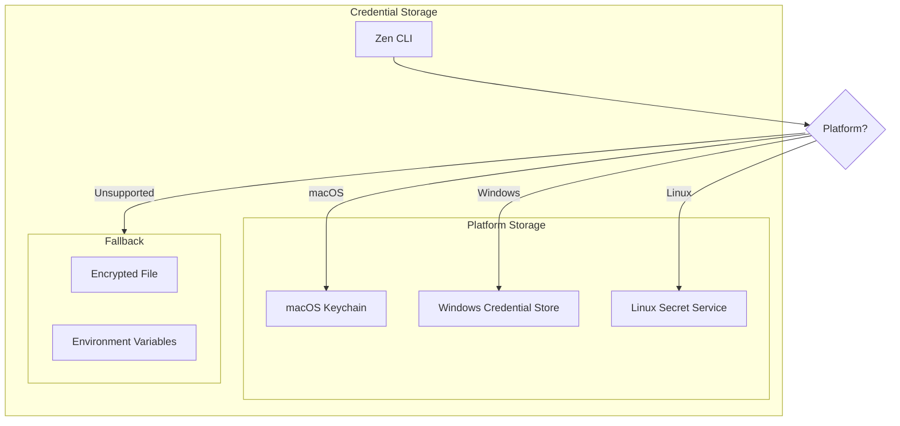
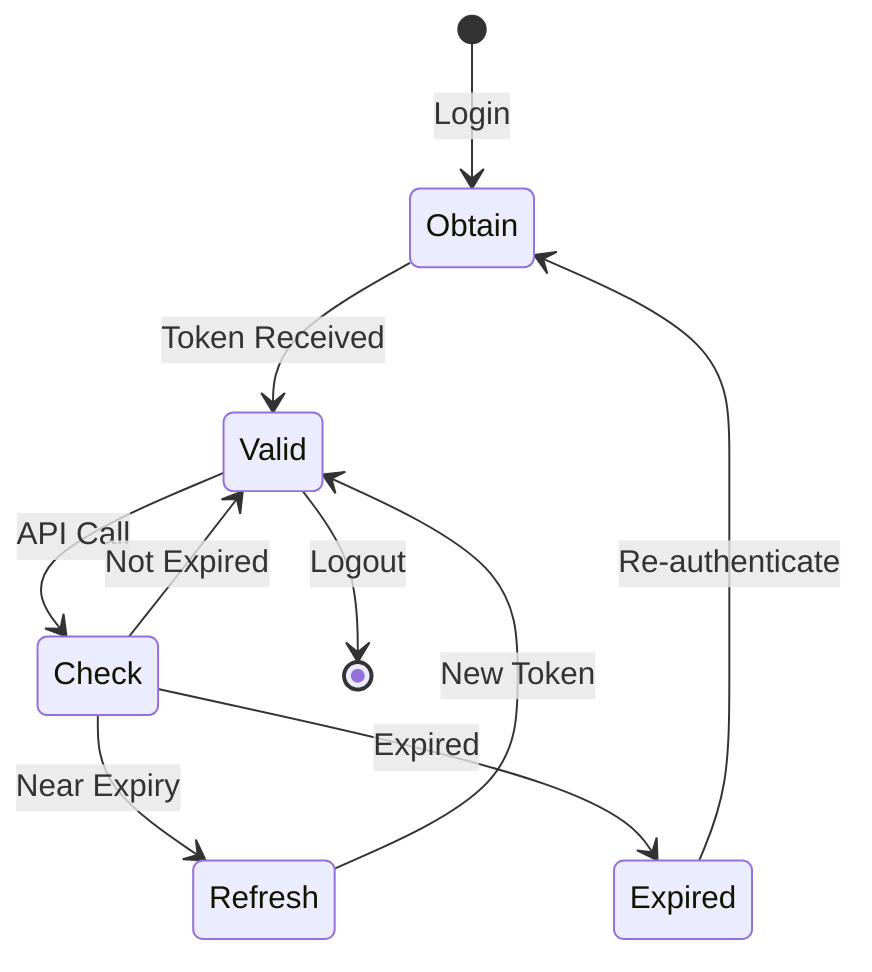
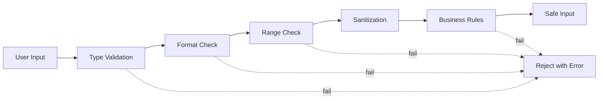
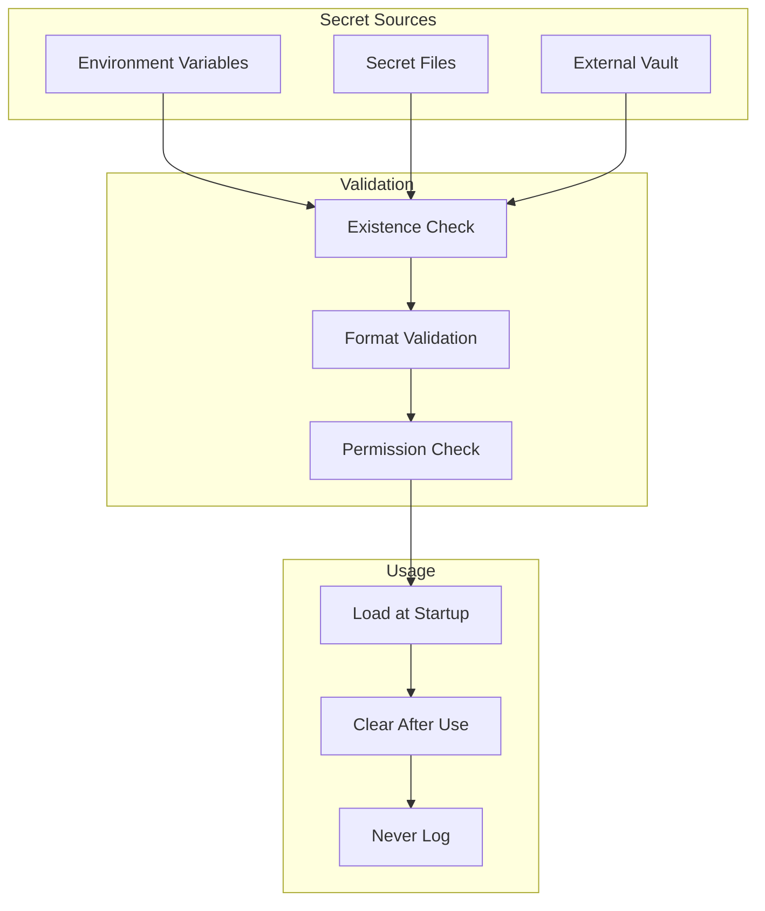
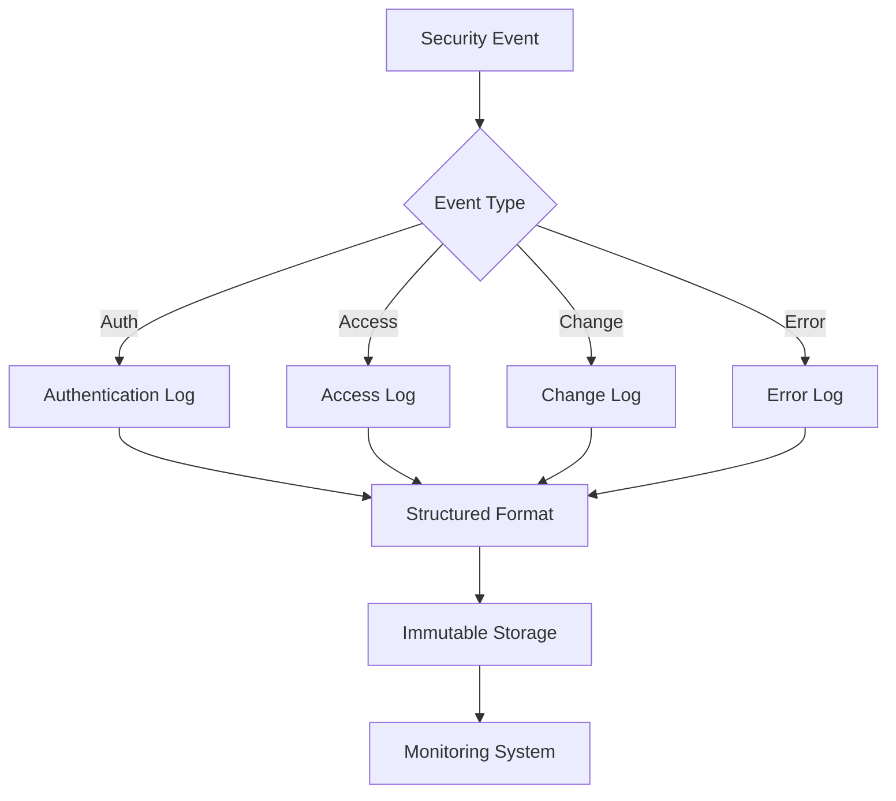
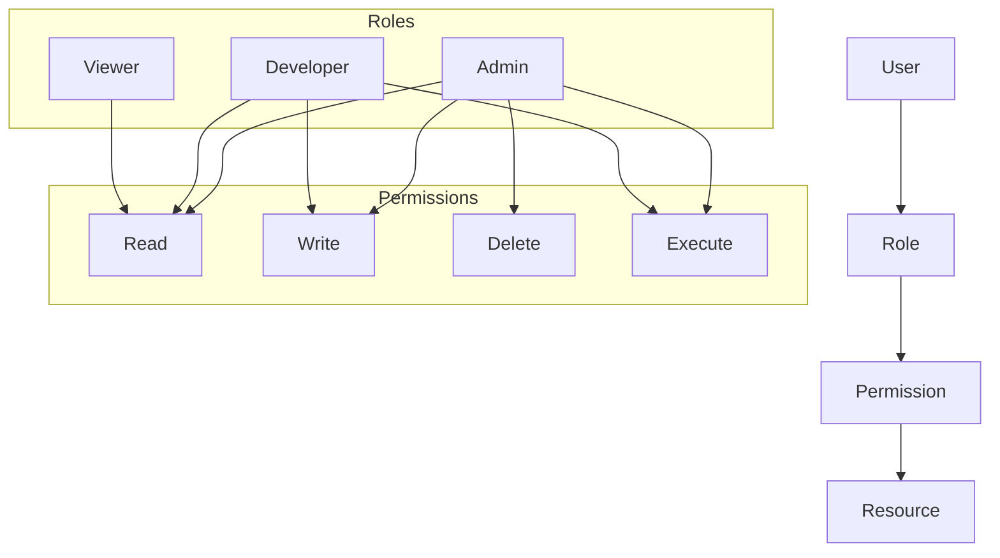

# Security Patterns

## Overview

This document outlines the security patterns and practices implemented in Zen CLI to protect against common vulnerabilities and ensure safe operation in enterprise environments.

## Defense in Depth

Zen CLI implements multiple layers of security controls.



## Authentication Patterns

### 1. Secure Credential Storage

Never store credentials in plain text. Use platform-specific secure storage.



**Implementation:**
```go
type SecureCredentialStore struct {
    backend CredentialBackend
}

type CredentialBackend interface {
    Store(service, username, password string) error
    Retrieve(service, username string) (string, error)
    Delete(service, username string) error
}

func NewSecureStore() *SecureCredentialStore {
    switch runtime.GOOS {
    case "darwin":
        return &SecureCredentialStore{backend: &KeychainBackend{}}
    case "windows":
        return &SecureCredentialStore{backend: &CredManBackend{}}
    case "linux":
        return &SecureCredentialStore{backend: &SecretServiceBackend{}}
    default:
        return &SecureCredentialStore{backend: &EncryptedFileBackend{}}
    }
}
```

### 2. Token Management

Secure handling of authentication tokens with rotation and expiration.



**Token Security:**
```go
type TokenManager struct {
    store  SecureStore
    tokens map[string]*Token
    mu     sync.RWMutex
}

type Token struct {
    Value     string
    ExpiresAt time.Time
    Scope     []string
}

func (tm *TokenManager) GetToken(service string) (string, error) {
    tm.mu.RLock()
    token, exists := tm.tokens[service]
    tm.mu.RUnlock()
    
    if !exists || token.IsExpired() {
        return tm.refreshToken(service)
    }
    
    if token.NearExpiry() {
        go tm.refreshToken(service) // Refresh in background
    }
    
    return token.Value, nil
}
```

## Input Validation Patterns

### 1. Sanitization Pipeline

All input goes through multiple validation layers.



### 2. Path Traversal Prevention

```go
func SafePath(base, userPath string) (string, error) {
    // Clean the path
    cleaned := filepath.Clean(userPath)
    
    // Resolve to absolute
    absolute, err := filepath.Abs(filepath.Join(base, cleaned))
    if err != nil {
        return "", err
    }
    
    // Ensure it's within base directory
    if !strings.HasPrefix(absolute, base) {
        return "", ErrPathTraversal
    }
    
    return absolute, nil
}
```

### 3. Command Injection Prevention

```go
func SafeCommand(cmd string, args ...string) *exec.Cmd {
    // Never use shell interpretation
    command := exec.Command(cmd, args...)
    
    // Set security options
    command.Env = sanitizedEnv()
    command.Dir = safeWorkingDir()
    
    // Drop unnecessary capabilities
    if runtime.GOOS == "linux" {
        command.SysProcAttr = &syscall.SysProcAttr{
            Cloneflags: syscall.CLONE_NEWNS,
        }
    }
    
    return command
}
```

## Secrets Management

### 1. Environment Variable Pattern



**Secret Loading:**
```go
type SecretLoader struct {
    sources []SecretSource
}

func (sl *SecretLoader) Load() error {
    for _, source := range sl.sources {
        secrets, err := source.Load()
        if err != nil {
            log.Error("Failed to load secrets", "source", source.Name())
            continue
        }
        
        for key, value := range secrets {
            // Never log the actual secret value
            log.Debug("Loaded secret", "key", key, "source", source.Name())
            
            // Store in memory with automatic clearing
            SecureMemory.Store(key, value)
        }
    }
    
    return nil
}
```

### 2. Secret Rotation

```go
type RotatableSecret struct {
    Current  string
    Previous string
    RotateAt time.Time
}

func (rs *RotatableSecret) Rotate() error {
    rs.Previous = rs.Current
    rs.Current = generateNewSecret()
    rs.RotateAt = time.Now().Add(rotationInterval)
    
    // Notify dependent services
    notifyRotation(rs)
    
    return nil
}
```

## Encryption Patterns

### 1. Data at Rest

```go
type EncryptedStorage struct {
    key cipher.Block
}

func (es *EncryptedStorage) Save(filename string, data []byte) error {
    // Generate nonce
    nonce := make([]byte, 12)
    if _, err := io.ReadFull(rand.Reader, nonce); err != nil {
        return err
    }
    
    // Encrypt data
    gcm, _ := cipher.NewGCM(es.key)
    encrypted := gcm.Seal(nonce, nonce, data, nil)
    
    // Save with restricted permissions
    return os.WriteFile(filename, encrypted, 0600)
}
```

### 2. Data in Transit

```go
func SecureHTTPClient() *http.Client {
    return &http.Client{
        Transport: &http.Transport{
            TLSClientConfig: &tls.Config{
                MinVersion: tls.VersionTLS13,
                CipherSuites: []uint16{
                    tls.TLS_AES_256_GCM_SHA384,
                    tls.TLS_CHACHA20_POLY1305_SHA256,
                },
                PreferServerCipherSuites: true,
                InsecureSkipVerify: false,
            },
        },
        Timeout: 30 * time.Second,
    }
}
```

## Audit Logging

### 1. Security Event Logging



**Implementation:**
```go
type AuditLogger struct {
    writer io.Writer
    signer Signer
}

type AuditEvent struct {
    Timestamp   time.Time              `json:"timestamp"`
    EventType   string                 `json:"event_type"`
    UserID      string                 `json:"user_id"`
    Action      string                 `json:"action"`
    Resource    string                 `json:"resource"`
    Result      string                 `json:"result"`
    Metadata    map[string]interface{} `json:"metadata"`
    Signature   string                 `json:"signature"`
}

func (al *AuditLogger) Log(event AuditEvent) error {
    // Never log sensitive data
    event = sanitizeEvent(event)
    
    // Add signature for tamper detection
    event.Signature = al.signer.Sign(event)
    
    // Write to immutable log
    return json.NewEncoder(al.writer).Encode(event)
}
```

## Authorization Patterns

### 1. Role-Based Access Control (RBAC)



### 2. Policy-Based Authorization

```go
type Policy struct {
    Effect    string   // Allow or Deny
    Principal string   // User or Role
    Actions   []string // Operations
    Resources []string // Resources
    Conditions map[string]Condition
}

func (p *Policy) Evaluate(context Context) bool {
    if !p.matchPrincipal(context.User) {
        return false
    }
    
    if !p.matchAction(context.Action) {
        return false
    }
    
    if !p.matchResource(context.Resource) {
        return false
    }
    
    for _, condition := range p.Conditions {
        if !condition.Evaluate(context) {
            return false
        }
    }
    
    return p.Effect == "Allow"
}
```

## Security Headers and Configuration

### 1. Secure Defaults

```go
var SecureDefaults = Config{
    TLS: TLSConfig{
        MinVersion: "1.3",
        Required:   true,
    },
    Auth: AuthConfig{
        TokenExpiry:      15 * time.Minute,
        RefreshExpiry:    7 * 24 * time.Hour,
        MaxLoginAttempts: 5,
        LockoutDuration:  30 * time.Minute,
    },
    Audit: AuditConfig{
        Enabled:       true,
        RotationSize:  100 * 1024 * 1024, // 100MB
        RetentionDays: 90,
    },
}
```

### 2. Security Headers for Web Interfaces

```go
func SecurityMiddleware(next http.Handler) http.Handler {
    return http.HandlerFunc(func(w http.ResponseWriter, r *http.Request) {
        // Security headers
        w.Header().Set("X-Content-Type-Options", "nosniff")
        w.Header().Set("X-Frame-Options", "DENY")
        w.Header().Set("X-XSS-Protection", "1; mode=block")
        w.Header().Set("Strict-Transport-Security", "max-age=31536000")
        w.Header().Set("Content-Security-Policy", "default-src 'self'")
        
        next.ServeHTTP(w, r)
    })
}
```

## Vulnerability Prevention

### 1. SQL Injection Prevention

```go
// Always use parameterized queries
func GetUser(db *sql.DB, id string) (*User, error) {
    // Good: Parameterized query
    row := db.QueryRow("SELECT * FROM users WHERE id = ?", id)
    
    // Bad: String concatenation
    // row := db.QueryRow("SELECT * FROM users WHERE id = " + id)
    
    var user User
    err := row.Scan(&user.ID, &user.Name, &user.Email)
    return &user, err
}
```

### 2. XML External Entity (XXE) Prevention

```go
func SafeXMLDecoder(r io.Reader) *xml.Decoder {
    decoder := xml.NewDecoder(r)
    decoder.Strict = true
    decoder.Entity = xml.HTMLEntity // Limit to known HTML entities
    return decoder
}
```

## Security Testing Patterns

### 1. Security Test Suite

```go
func TestSecurityVulnerabilities(t *testing.T) {
    tests := []struct {
        name  string
        input string
        want  error
    }{
        {"Path Traversal", "../../../etc/passwd", ErrPathTraversal},
        {"Command Injection", "ls; rm -rf /", ErrInvalidInput},
        {"SQL Injection", "'; DROP TABLE users; --", ErrInvalidInput},
        {"XSS Attempt", "<script>alert('xss')</script>", ErrInvalidInput},
    }
    
    for _, tt := range tests {
        t.Run(tt.name, func(t *testing.T) {
            err := ValidateInput(tt.input)
            assert.Equal(t, tt.want, err)
        })
    }
}
```

## Best Practices Summary

1. **Principle of Least Privilege**: Grant minimum necessary permissions
2. **Defense in Depth**: Multiple security layers
3. **Fail Securely**: Secure defaults and fail closed
4. **Zero Trust**: Verify everything, trust nothing
5. **Audit Everything**: Comprehensive security logging
6. **Encrypt Sensitive Data**: Both at rest and in transit
7. **Regular Updates**: Keep dependencies current
8. **Security Testing**: Regular penetration testing
9. **Input Validation**: Never trust user input
10. **Secret Management**: Never hardcode secrets
