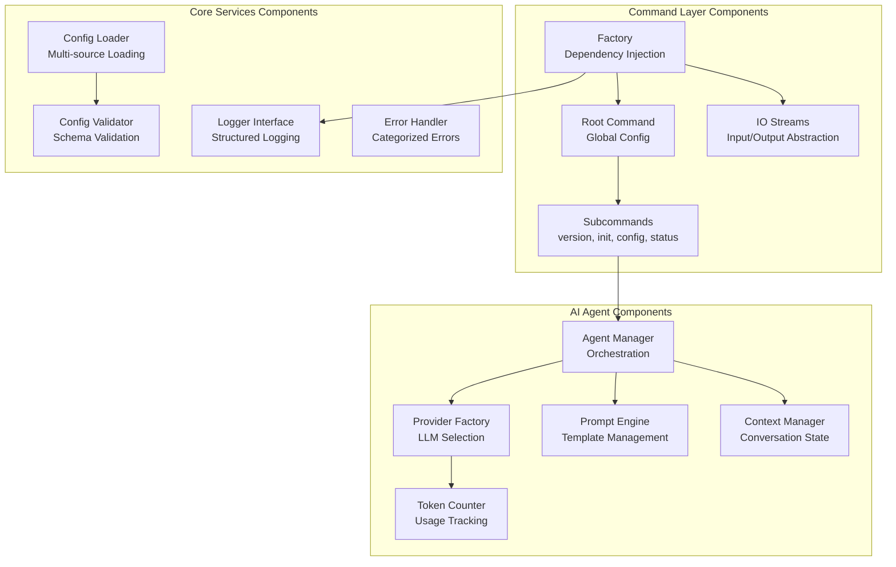
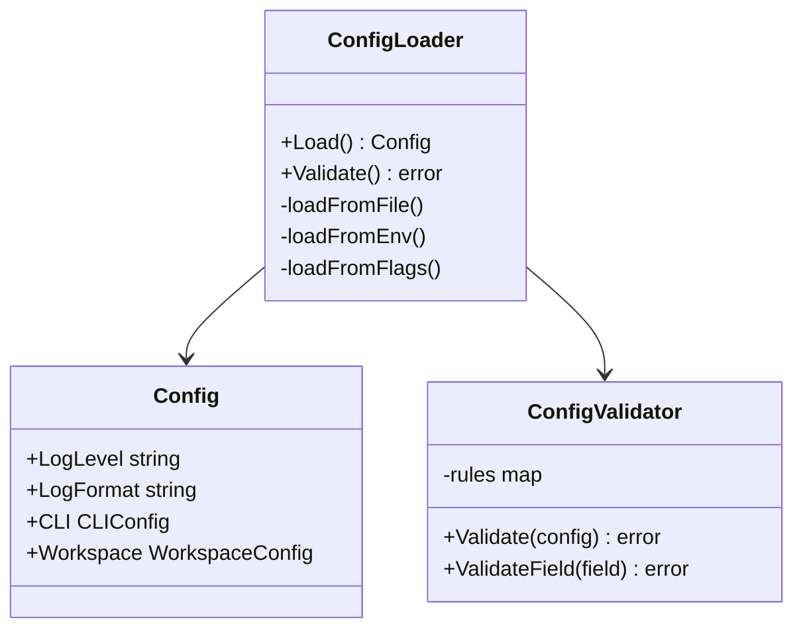
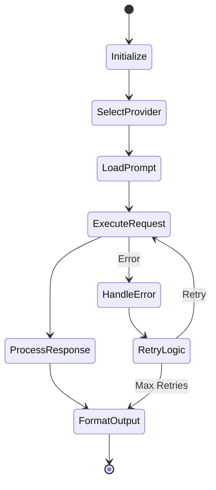
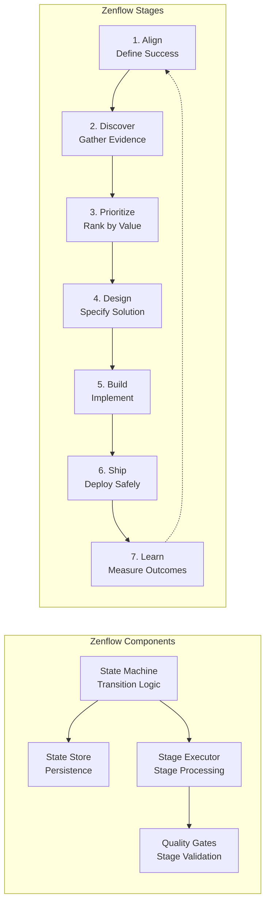
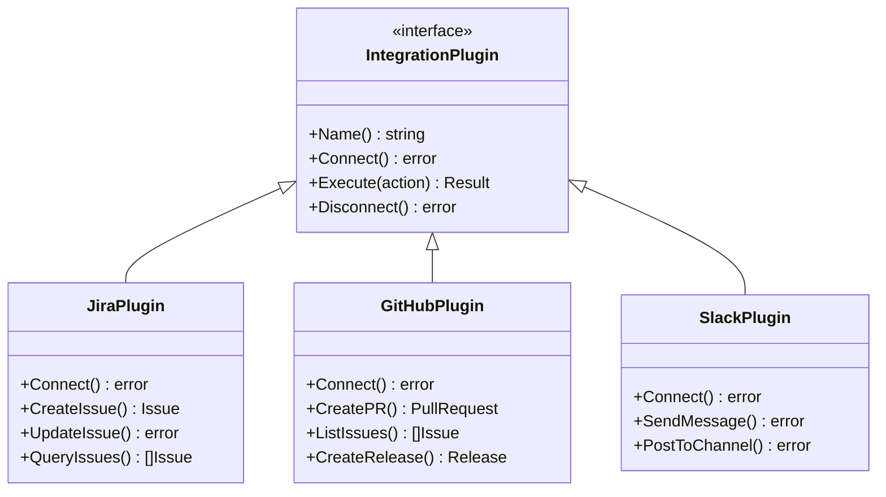
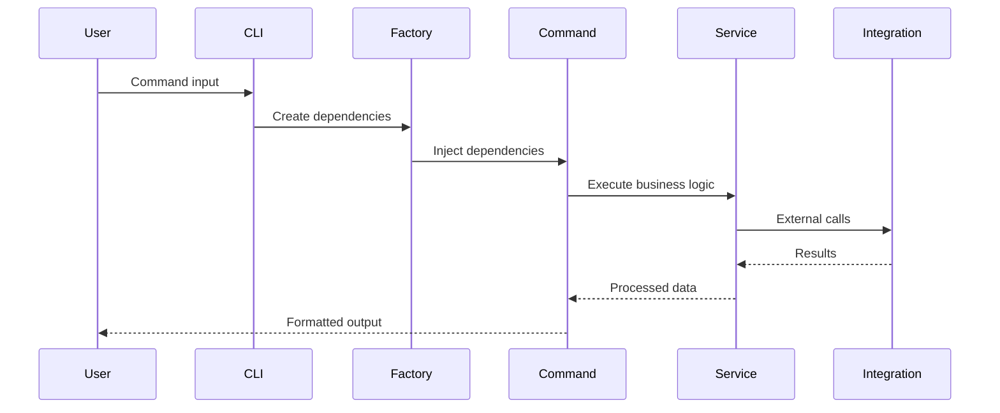
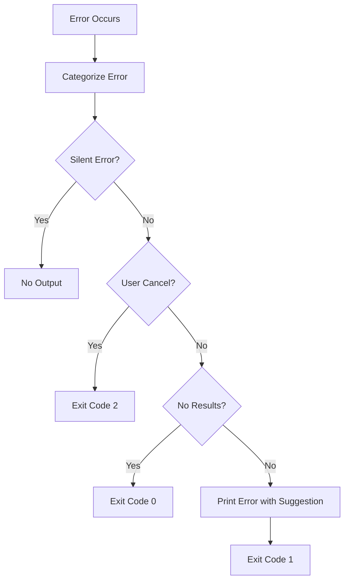

# Component View

## Overview

The Component view (C4 Level 3) shows the internal structure of key containers, their components, and how they interact. This view focuses on the main architectural components within the Zen CLI system.

## Core Components Architecture



## Component Details

### Command Layer (`pkg/cmd/`)

#### Factory Component
```go
type Factory interface {
    IOStreams() *iostreams.IOStreams
    Config() (*config.Config, error)
    Logger() logging.Logger
    WorkspaceManager() (WorkspaceManager, error)
    AgentManager() (AgentManager, error)
}
```
- **Pattern**: Abstract Factory
- **Purpose**: Centralized dependency injection
- **Benefits**: Testability, lazy initialization, clean dependencies

#### Command Components
- **Root Command**: Global flags, help system, subcommand routing
- **Version Command**: Build info, dependencies, platform details
- **Init Command**: Workspace setup, configuration initialization
- **Config Command**: Configuration management (get, set, list)
- **Status Command**: System health, integration status

### Core Services (`internal/`)

#### Configuration Components


#### Logging Components
- **Logger Interface**: Abstract logging interface
- **Logrus Implementation**: Concrete implementation
- **Formatters**: Text and JSON output formatters
- **Hooks**: Custom log processing hooks

### AI Agent System (`internal/agents/`)

#### Agent Manager


#### Provider Components
- **Provider Interface**: Common LLM interface
- **OpenAI Provider**: OpenAI API implementation
- **Anthropic Provider**: Claude API implementation  
- **Azure Provider**: Azure OpenAI implementation
- **Local Provider**: Local model support

#### Context Management
```go
type ContextManager struct {
    conversations map[string]*Conversation
    maxTokens     int
    windowSize    int
}

type Conversation struct {
    ID       string
    Messages []Message
    Tokens   int
    Metadata map[string]interface{}
}
```

### Zenflow Engine (`internal/workflow/`)

The Zenflow Engine orchestrates the 7-stage unified workflow that standardizes how teams move from strategy to shipped value. For detailed documentation, see the [Zenflow Guide](../../zen-workflow/).



#### Key Features
- **Cross-functional support**: Product managers, designers, engineers, and analysts use the same workflow
- **Quality gates**: Automated and manual checkpoints ensure standards before progression
- **Workflow streams**: Specialized implementations (I2D, C2M, D2S) for different work types
- **State persistence**: Reliable state storage with crash recovery capabilities

### Integration Components (`internal/integrations/`)

#### Plugin Architecture


### Template Engine (`internal/templates/`)

#### Template Components
- **Template Registry**: Template discovery and management
- **Parser**: Go template parsing with custom functions
- **Executor**: Template execution with context
- **Custom Functions**: Domain-specific template functions

```go
type TemplateEngine struct {
    registry  *TemplateRegistry
    parser    *template.Template
    functions template.FuncMap
}

type Template struct {
    Name     string
    Content  string
    Type     TemplateType
    Metadata map[string]interface{}
}
```

## Component Interactions

### Command Execution Flow


### Error Handling Flow


## Key Design Decisions

### Dependency Injection
- Factory pattern for clean dependency management
- Lazy initialization for performance
- Interface-based design for testability

### Error Management  
- Categorized error types
- Structured exit codes
- Helpful error suggestions

### Plugin System
- Interface-based plugin contracts
- Dynamic plugin loading
- Isolated plugin execution

### Configuration
- Multi-source configuration with clear precedence
- Schema validation at load time
- Environment-specific profiles
