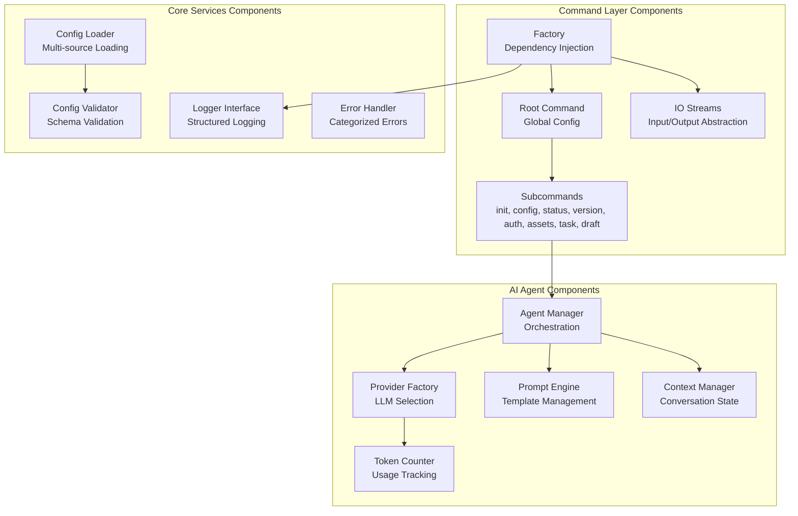
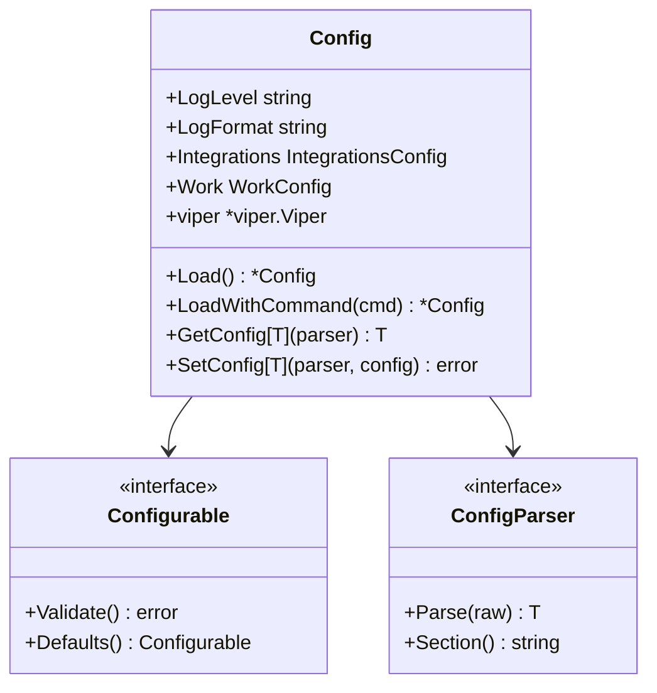
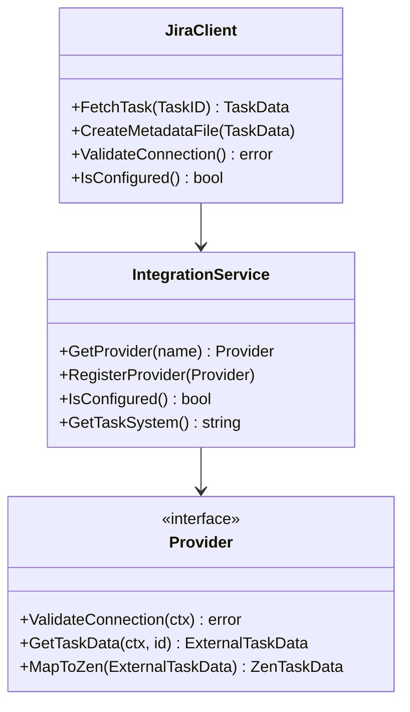
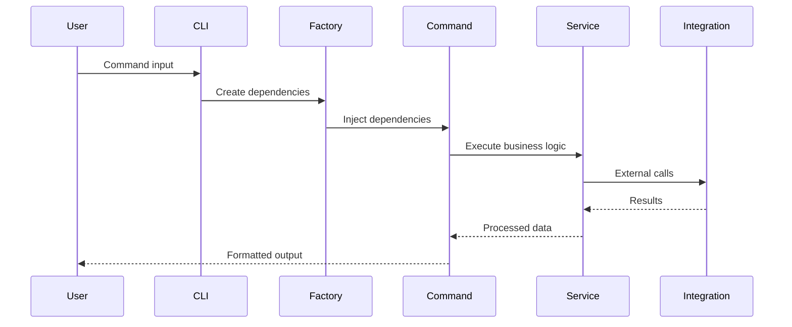
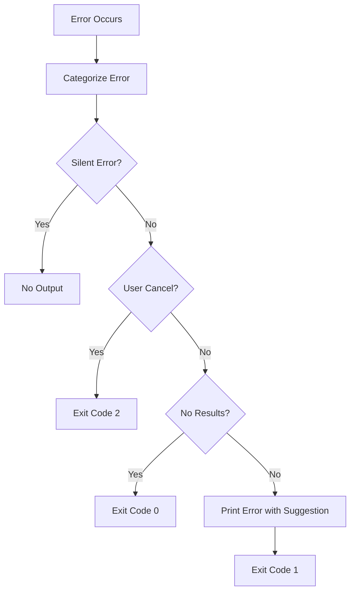

# Component View

## Overview

The Component view (C4 Level 3) shows the internal structure of key containers, their components, and how they interact. This view focuses on the main architectural components within the Zen CLI system.

## Core Components Architecture



## Component Details

### Command Layer (`pkg/cmd/`)

#### Factory Component
```go
type Factory struct {
    IOStreams        *iostreams.IOStreams
    Config          func() (*config.Config, error)
    Logger          logging.Logger
    WorkspaceManager func() (WorkspaceManager, error)
    TemplateEngine   func() (TemplateEngine, error)
    Verbose         bool
    ConfigFile      string
    DryRun          bool
}
```
- **Pattern**: Concrete Factory with Dependency Injection
- **Purpose**: Centralized dependency management and configuration
- **Benefits**: Testability, lazy initialization, clean dependencies

#### Command Components

**Core Commands** (Fully Implemented):
- **Root Command**: Global flags, help system, subcommand routing with command groups
- **Init Command**: Workspace setup, configuration initialization, project detection
- **Config Command**: Configuration management (get, set, list) with typed configuration
- **Status Command**: System health, integration status, workspace validation
- **Version Command**: Build info, dependencies, platform details
- **Completion Command**: Shell completion script generation

**Integration Commands** (Implemented):
- **Auth Command**: Authentication management for external systems
- **Assets Command**: Asset library management (auth, info, list, status, sync)
- **Task Command**: Task management with Zenflow workflow (create subcommand)

**Utility Commands** (Implemented):
- **Draft Command**: Content generation utilities using template engine

#### Command Architecture
```go
// Factory pattern for dependency injection
type Factory struct {
    IOStreams        *iostreams.IOStreams
    Config          func() (*config.Config, error)
    Logger          logging.Logger
    WorkspaceManager func() (WorkspaceManager, error)
    TemplateEngine   func() (TemplateEngine, error)
    Verbose         bool
    ConfigFile      string
    DryRun          bool
}
```

### Core Services (`internal/`)

#### Configuration Components


#### Logging Components
- **Logger Interface**: Abstract logging interface
- **Logrus Implementation**: Concrete implementation
- **Formatters**: Text and JSON output formatters
- **Hooks**: Custom log processing hooks

### AI Agent System (Future Implementation)

**Status**: Planned for future implementation

The AI Agent System is designed to provide LLM orchestration and management capabilities. This system is referenced in the architecture but not yet implemented in the current codebase.

#### Planned Components
- **Agent Manager**: LLM orchestration and lifecycle management
- **Provider Factory**: Multi-provider AI support (OpenAI, Anthropic, Azure)
- **Prompt Engine**: Template management for AI interactions
- **Context Manager**: Conversation state and token management
- **Token Counter**: Usage tracking and optimization

#### Implementation Status
- **Current**: Configuration placeholders exist in config system
- **Next Phase**: Core agent infrastructure and provider interfaces
- **Future**: Advanced features like context management and prompt optimization

### Zenflow Engine (Conceptual Implementation)

**Status**: Conceptual framework implemented through task management

The Zenflow Engine represents Zen's 7-stage unified workflow methodology. Currently implemented through the task management system with structured directories and templates.

#### Current Implementation
- **Task Structure**: Organized directories for each workflow stage
- **Task Types**: Different workflows optimized for story, bug, epic, spike, task
- **Template System**: Stage-specific templates and documentation
- **Metadata Management**: YAML-based task configuration and state

#### Zenflow Stages (Implemented via Task Structure)
1. **Align**: Define success criteria and stakeholder alignment
2. **Discover**: Gather evidence and validate assumptions  
3. **Prioritize**: Rank work by value vs effort
4. **Design**: Specify implementation approach
5. **Build**: Deliver working software increment
6. **Ship**: Deploy safely to production
7. **Learn**: Measure outcomes and iterate

#### Task Directory Structure
```
.zen/work/tasks/<task-id>/
├── index.md              # Human-readable overview
├── manifest.yaml         # Machine-readable metadata
├── .taskrc.yaml         # Task-specific configuration
├── research/            # Stage 1-2: Align & Discover
├── spikes/              # Stage 2-3: Discover & Prioritize
├── design/              # Stage 4: Design
├── execution/           # Stage 5: Build
└── outcomes/            # Stage 6-7: Ship & Learn
```

#### Integration with External Systems
- **Jira Integration**: Sync task metadata and status
- **GitHub Integration**: Link with issues and pull requests
- **Template Engine**: Generate stage-specific content

### Integration Components (`internal/integration/`, `pkg/clients/`)

#### Current Implementation

**Integration Service** (`internal/integration/service.go`):
- Centralized integration management
- Provider registration and lifecycle
- Data mapping between external systems and Zen format

**Client Libraries** (`pkg/clients/`):
- **Jira Client**: Task synchronization, metadata management, connection validation
- **Git Client**: Repository operations and version control integration
- **HTTP Client**: Generic HTTP client for API interactions

#### Integration Architecture


#### Supported Integrations
- **Jira**: Issue tracking and task management
  - Task fetching and synchronization
  - Metadata file generation
  - Status and priority mapping
- **GitHub**: Repository and issue management (planned)
- **Git**: Local repository operations

### Template Engine (`pkg/template/`)

#### Current Implementation

**Template Engine** (`pkg/template/engine.go`):
- Asset-based template loading via Asset Client
- Go template compilation with custom functions
- Variable validation and default value application
- Caching system for compiled templates
- Configurable delimiters and strict mode

#### Template Components
```go
type Engine struct {
    logger    logging.Logger
    loader    TemplateLoader      // Asset-based template loading
    validator VariableValidator   // Variable validation and defaults
    functions FunctionRegistry    // Custom template functions
    cache     CacheManager       // Template caching
    config    Config            // Engine configuration
}

type Template struct {
    Name       string
    Content    string
    Compiled   *template.Template
    Metadata   *TemplateMetadata
    Variables  []VariableSpec
    CompiledAt time.Time
    Checksum   string
}
```

#### Key Features
- **Asset Integration**: Templates loaded from Asset Library
- **Variable Validation**: Type checking and required field validation
- **Custom Functions**: Zen-specific template functions (file operations, formatting)
- **Caching**: Memory-based caching with TTL
- **Error Handling**: Detailed error reporting with error codes
- **Concurrent Safety**: Thread-safe template operations

## Component Interactions

### Command Execution Flow


### Error Handling Flow


## Key Design Decisions

### Dependency Injection
- Factory pattern for clean dependency management
- Lazy initialization for performance
- Interface-based design for testability

### Error Management  
- Categorized error types
- Structured exit codes
- Helpful error suggestions

### Plugin System
- Interface-based plugin contracts
- Dynamic plugin loading
- Isolated plugin execution

### Configuration
- Multi-source configuration with clear precedence
- Schema validation at load time
- Environment-specific profiles
