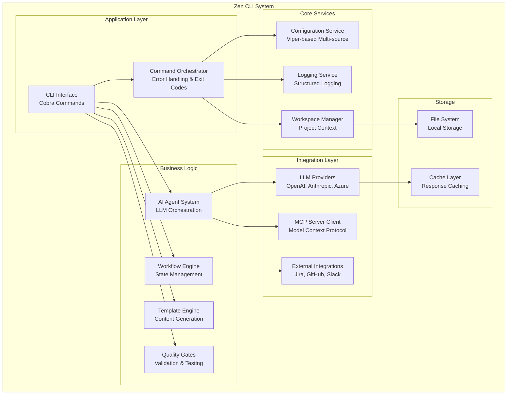
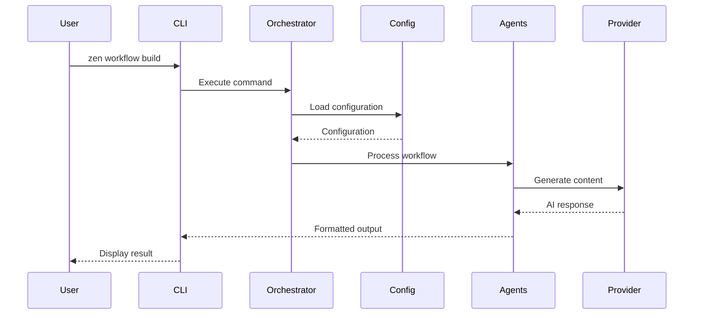
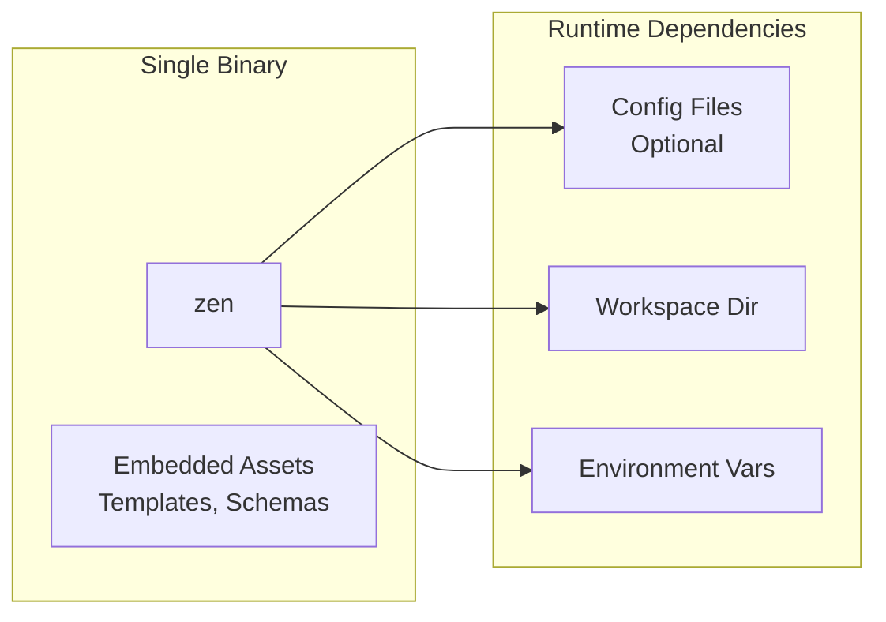

# Container View

## Overview

The Container view (C4 Level 2) shows the high-level shape of the Zen CLI system architecture and how responsibilities are distributed across containers. A container represents an application or data store.

## Container Diagram

## Container Responsibilities

### Application Layer

#### CLI Interface
- **Technology**: Go, Cobra Framework
- **Responsibility**: Command parsing, flag handling, user interaction
- **Key Components**: Root command, subcommands, flag definitions

#### Command Orchestrator
- **Technology**: Go
- **Responsibility**: Error handling, exit codes, signal handling
- **Location**: `internal/zencmd`

### Core Services

#### Configuration Service
- **Technology**: Viper
- **Responsibility**: Multi-source configuration management
- **Sources**: CLI flags > Environment > Files > Defaults
- **Location**: `internal/config`

#### Logging Service
- **Technology**: Logrus
- **Responsibility**: Structured logging with multiple outputs
- **Formats**: Text, JSON
- **Location**: `internal/logging`

#### Workspace Manager
- **Responsibility**: Project context, file operations, workspace state
- **Location**: `internal/workspace`

### Business Logic

#### AI Agent System
- **Responsibility**: LLM orchestration, prompt management, context handling
- **Key Features**: Multi-provider support, token management, cost tracking
- **Location**: `internal/agents`

#### Workflow Engine
- **Responsibility**: 12-stage engineering workflow state management
- **Pattern**: State machine with persistent storage
- **Location**: `internal/workflow`

#### Template Engine
- **Technology**: Go Templates
- **Responsibility**: Dynamic content generation for various outputs
- **Location**: `internal/templates`

#### Quality Gates
- **Responsibility**: Code quality, security scanning, test validation
- **Location**: `internal/quality`

### Integration Layer

#### LLM Providers
- **Supported**: OpenAI, Anthropic, Azure OpenAI, Local models
- **Pattern**: Strategy pattern with unified interface
- **Location**: `internal/agents/providers`

#### External Integrations
- **Categories**: Project Management, Version Control, Communication
- **Pattern**: Plugin-based architecture
- **Location**: `internal/integrations`

#### MCP Server Client
- **Responsibility**: Model Context Protocol for AI tool access
- **Location**: `internal/mcp`

### Storage

#### File System
- **Responsibility**: Local file operations, workspace persistence
- **Security**: Path validation, permission checks

#### Cache Layer
- **Responsibility**: Response caching, performance optimization
- **Types**: In-memory, file-based

## Inter-Container Communication

## Technology Stack Summary

| Container | Technology | Purpose |
|-----------|------------|---------|
| CLI Interface | Cobra | Command structure |
| Configuration | Viper | Config management |
| Logging | Logrus | Structured logs |
| AI Agents | Custom + SDKs | LLM orchestration |
| Workflow | State Machine | Workflow management |
| Templates | Go Templates | Content generation |
| Storage | File System | Local persistence |
| Cache | In-memory | Performance |

## Deployment Model

The entire Zen CLI is distributed as a single Go binary with all dependencies compiled in. This enables:
- Zero runtime dependencies
- Simple installation and distribution
- Cross-platform compatibility
- Embedded templates and resources
