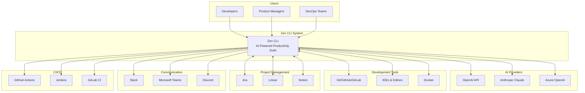
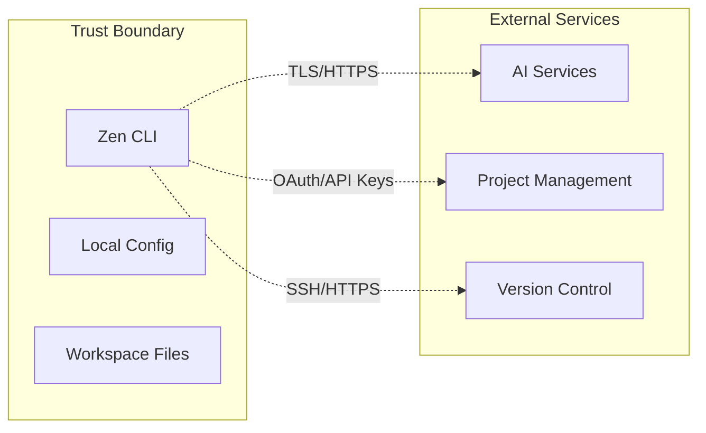

# System Context View

## Overview

The System Context view shows how Zen CLI fits within the larger ecosystem of tools, services, and users. This is the highest level view (C4 Level 1) showing external actors and systems that interact with Zen.

## Context Diagram

## External Systems

### Users
- **Developers**: Primary users who leverage Zen for code generation, workflow automation, and productivity
- **Product Managers**: Use Zen for requirements analysis, story creation, and product planning
- **DevOps Teams**: Utilize Zen for infrastructure automation and deployment workflows

### AI Providers
- **OpenAI**: GPT models for code generation and analysis
- **Anthropic Claude**: Advanced reasoning and code understanding
- **Azure OpenAI**: Enterprise-grade AI services with compliance

### Development Tools
- **Git/GitHub/GitLab**: Version control and code collaboration
- **IDEs**: Integration with development environments
- **Docker**: Container management and deployment

### Project Management
- **Jira**: Enterprise project tracking and agile management
- **Linear**: Modern issue tracking for software teams
- **Notion**: Collaborative documentation and knowledge base

### Communication
- **Slack**: Team communication and notifications
- **Teams**: Enterprise collaboration platform
- **Discord**: Community and developer communication

### CI/CD Systems
- **GitHub Actions**: Automated workflows and deployments
- **Jenkins**: Enterprise CI/CD automation
- **GitLab CI**: Integrated CI/CD pipelines

## Key Interactions

### Inbound
- User commands and queries via CLI interface
- Configuration files and workspace settings
- Authentication credentials and API keys

### Outbound
- AI API requests for content generation
- Integration API calls to external services
- File system operations for code generation
- Notifications to communication channels

## Security Boundaries

## Data Flow

### Sensitive Data Handling
- API keys stored in environment variables or secure keystores
- No plaintext secrets in configuration files
- Encrypted communication with all external services
- Audit logging for compliance

### Performance Considerations
- Local caching of AI responses
- Rate limiting for external API calls
- Concurrent request handling for multiple integrations
- Connection pooling for efficiency
