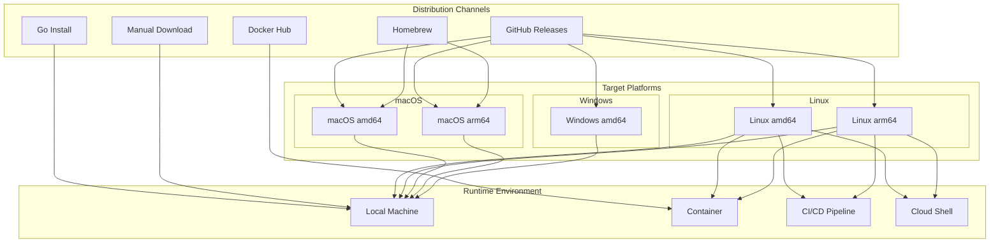
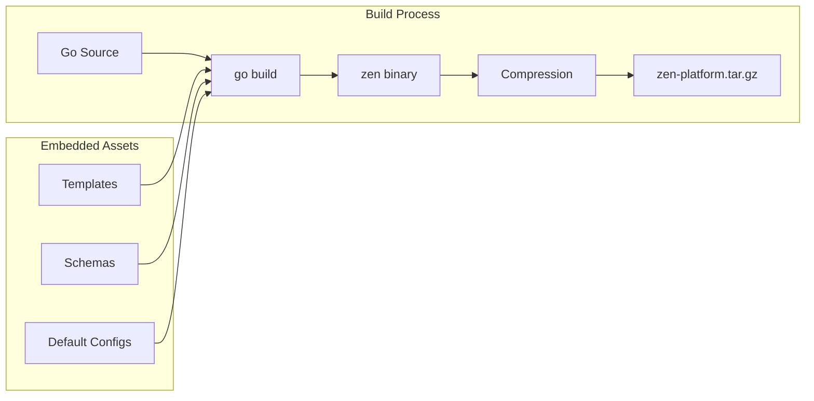
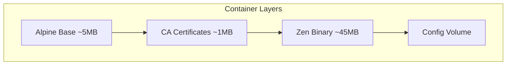
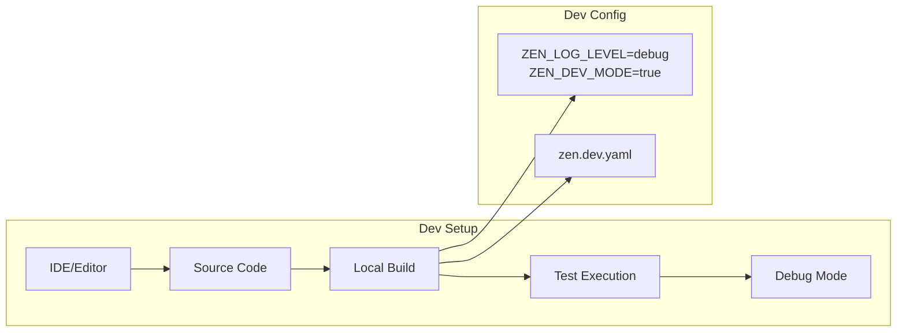
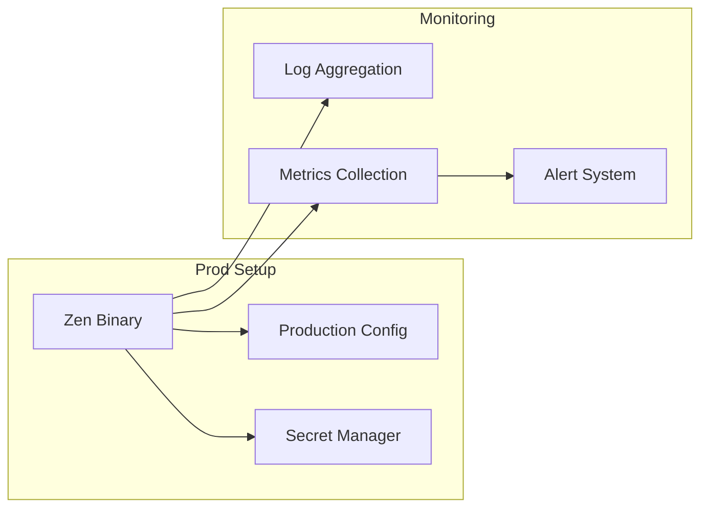
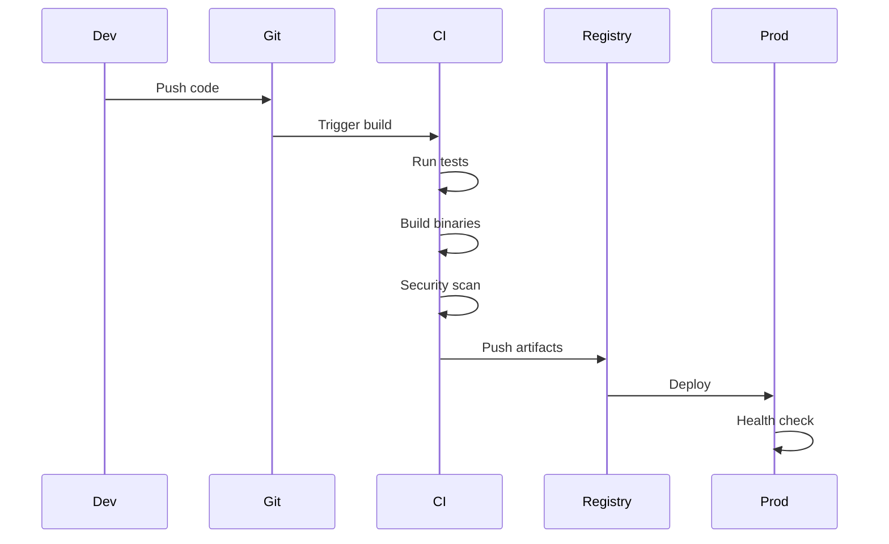
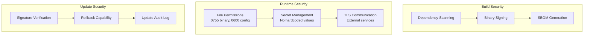
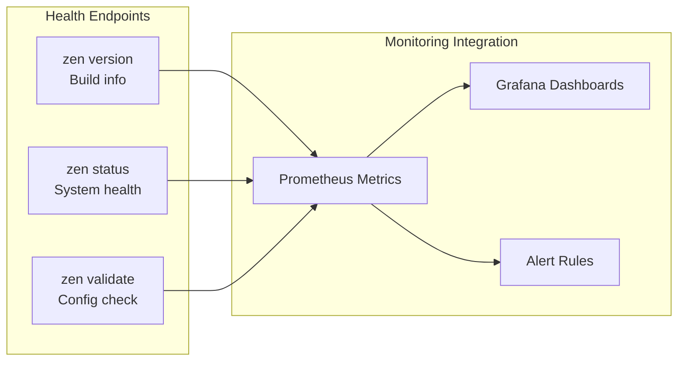
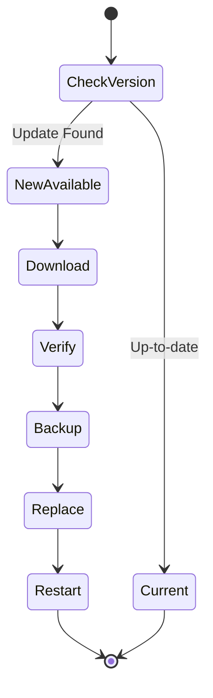

# Deployment View

## Overview

The Deployment view shows how Zen CLI is distributed, installed, and operated across different environments and platforms. This view addresses operational concerns and deployment scenarios.

## Deployment Architecture



## Distribution Models

### 1. Single Binary Distribution



**Characteristics:**
- No runtime dependencies required
- All assets embedded at compile time
- Single file to distribute and manage
- ~45MB compressed, ~15MB after compression

### 2. Container Distribution

```dockerfile
# Multi-stage Docker build
FROM golang:1.25-alpine AS builder
WORKDIR /app
COPY . .
RUN go build -o zen cmd/zen/main.go

FROM alpine:latest
RUN apk --no-cache add ca-certificates
COPY --from=builder /app/zen /usr/local/bin/
ENTRYPOINT ["zen"]
```

**Container Architecture:**


### 3. Package Manager Distribution

#### Homebrew (macOS/Linux)
```bash
brew tap zen-cli/zen
brew install zen
```

#### Go Install
```bash
go install github.com/zen-org/zen/cmd/zen@latest
```

## Installation Locations

```mermaid
graph TB
    subgraph "System Paths"
        Bin[/usr/local/bin/zen<br/>Executable]
        Config[~/.zen/<br/>User Config]
        Cache[~/.cache/zen/<br/>Cache Data]
    end
    
    subgraph "Project Paths"
        Workspace[./zen.yaml<br/>Project Config]
        Generated[./generated/<br/>Output Files]
        Logs[./.zen/logs/<br/>Local Logs]
    end
    
    Bin --> Config
    Bin --> Workspace
    Config --> Cache
    Workspace --> Generated
    Workspace --> Logs
```

## Environment Configuration

### Development Environment


### Production Environment


## CI/CD Integration

### Pipeline Deployment


### CI/CD Environments
```yaml
# GitHub Actions example
name: Deploy Zen CLI
on:
  push:
    tags: ['v*']

jobs:
  build:
    strategy:
      matrix:
        os: [ubuntu, macos, windows]
        arch: [amd64, arm64]
    steps:
      - name: Build
        run: |
          GOOS=${{ matrix.os }}
          GOARCH=${{ matrix.arch }}
          go build -o zen-${{ matrix.os }}-${{ matrix.arch }}
```

## Security Considerations

### Deployment Security


## Platform-Specific Considerations

### Linux Deployment
- System service integration (systemd)
- Package manager integration (apt, yum, dnf)
- XDG base directory compliance
- SELinux/AppArmor profiles

### macOS Deployment
- Code signing requirements
- Gatekeeper compliance
- Keychain integration for secrets
- Homebrew formula maintenance

### Windows Deployment
- Code signing with Authenticode
- Windows Credential Store integration
- PowerShell completion support
- Chocolatey package maintenance

## Monitoring and Operations

### Health Checks


### Operational Metrics
- Binary version and build info
- Configuration validation status
- Integration connectivity
- API rate limit status
- Error rates and types
- Performance metrics (latency, throughput)

## Update Strategy

### Auto-Update Flow


### Rolling Updates
- Backward compatibility guarantee
- Configuration migration support
- Graceful shutdown and restart
- Rollback capability
- Update notification system
